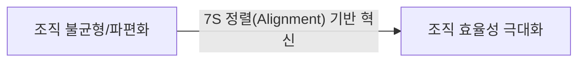
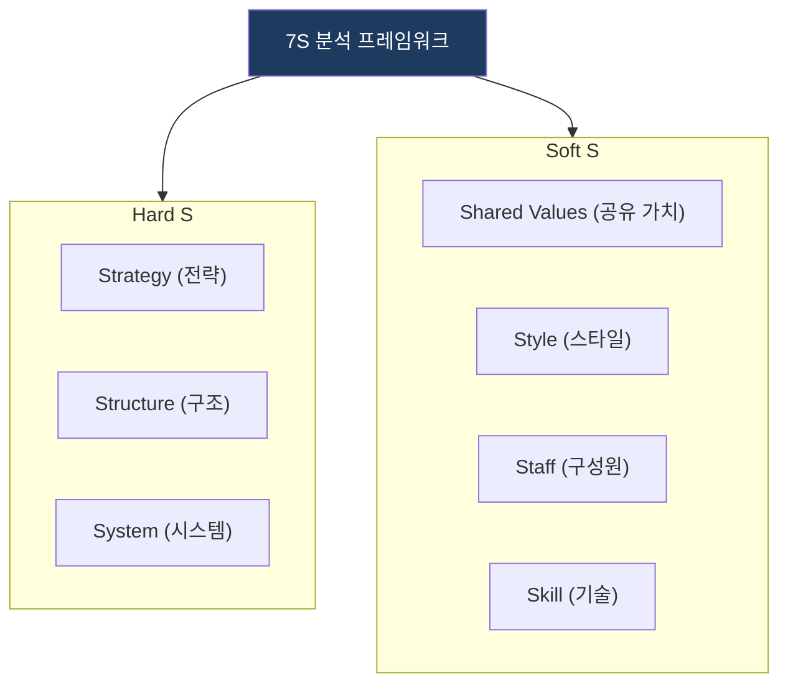
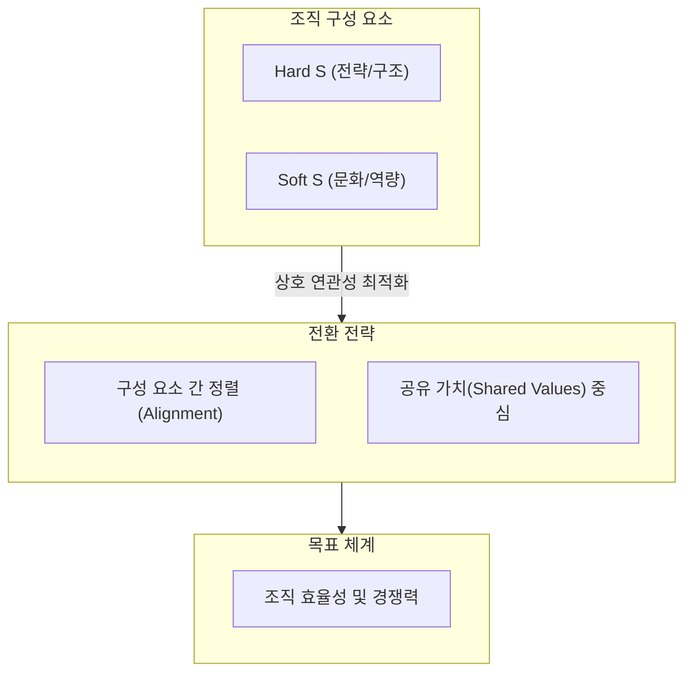

# 7S Model (McKinsey)

## 1. 개요

**개념**: 맥킨지에서 개발한 조직 진단 모델로, 조직의 유효성을 분석하기 위한 7가지 상호 연관된 요소를 제시.

**특징**: 
- 하드웨어적 요소와 소프트웨어적 요소의 조화 강조.
- 조직의 변화 관리 및 전략 정렬의 필수 도구.

---

## 2. 7S 조직 분석 모델 및 전략 체계

### 가. 7S 조직 구성 요소
(조직의 7가지 핵심 구성 요소간 상호작용)

* **Hard S**: 조직의 공식적 구조, 전략, 프로세스 체계.
* **Soft S**: 조직 구성원의 문화, 역량, 가치관 등 무형의 역량.

### 나. 조직 정렬 메커니즘
(상호 연관성을 기반으로 한 조직 유효성 강화 메커니즘)

| 구분 | 전략 방향 | 상세 대응 메커니즘 |
|---|---|---|
| **Hard S 정렬** | 효율 중심 정렬 | 전략과 조직 구조, 업무 프로세스의 논리적 합치 |
| **Soft S 변화** | 문화 중심 변화 | 공유 가치(Values)를 중심으로 구성원 역량 결집 |
| **통합 정렬** | 시너지 창출 | 하드와 소프트 요소 간의 상호 보완적 피드백 루프 |

---

## 3. 기대효과 및 활용 방안
| 구분 | 기대효과 | 활용 방안 |
|---|---|---|
| **전략** | 조직 유효성 진단 | 전사 변화 관리 추진 시 취약 요소 식별 |
| **운영** | 의사소통 효율화 | 조직 구성원 간 공통된 가치관 및 목표 공유 |
| **기술** | 경영 자원 통합 | 조직의 역량(Skill)과 인프라(System) 간 정렬 |
