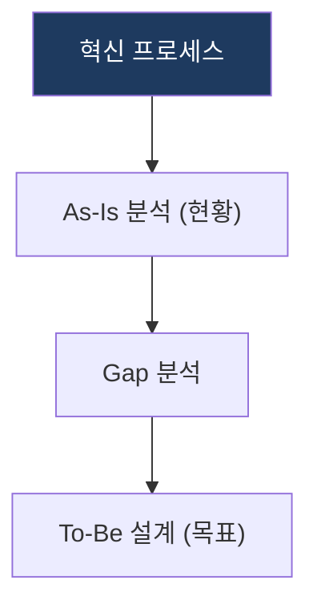

# BPR / PI (Business Process Reengineering / Process Innovation)

## 1. 개요

**개념**: 기업의 업무 프로세스를 비용, 품질, 서비스 등 핵심 지표를 기준으로 근본적으로 재설계하여 극적인 성과를 달성하는 경영 혁신 기법.

**특징**: 
- **근본적 변화**: 점진적 개선이 아닌 업무 프로세스의 근본적 재설계.
- **성과지표 기반**: 비용, 품질, 서비스 속도 등 핵심 성과 달성.

---

## 2. BPR/PI의 혁신 모델 및 이행 체계

### 가. As-Is 분석 및 To-Be 설계
(프로세스 진단 및 목표 모델 수립 프로세스)

* **As-Is 분석**: 현행 프로세스의 가치 사슬 및 자원 투입 현황 진단.
* **Gap 분석**: 현행 프로세스와 비즈니스 목표 간의 차이점 식별.
* **To-Be 설계**: 혁신을 통한 목표 프로세스 정의 및 설계.

### 나. 이행 체계
(재설계된 프로세스의 성공적 안착을 위한 실행 메커니즘)

| 구분 | 과제 유형 | 이행 메커니즘 |
|---|---|---|
| **프로세스** | 업무 재설계 과제 | 표준 운영 절차(SOP) 수립 및 자동화 적용 |
| **조직/인력** | 역량 강화 과제 | 업무 기반의 조직 구조 재편 및 변화 관리(Change Mgmt) |
| **시스템** | IT 고도화 과제 | 신규 프로세스 지원을 위한 IT 시스템 연계 |

---

## 3. 기대효과 및 활용 방안
| 구분 | 기대효과 | 활용 방안 |
|---|---|---|
| **전략** | 경영 혁신 달성 | 기업 핵심 경쟁력 확보를 위한 프로세스 혁신 기반 제공 |
| **운영** | 비용/시간 절감 | 리드 타임 단축 및 불필요한 작업 제거를 통한 생산성 제고 |
| **기술** | 시스템 최적화 | 프로세스 중심의 IT 아키텍처 재설계 및 서비스 정렬 |
