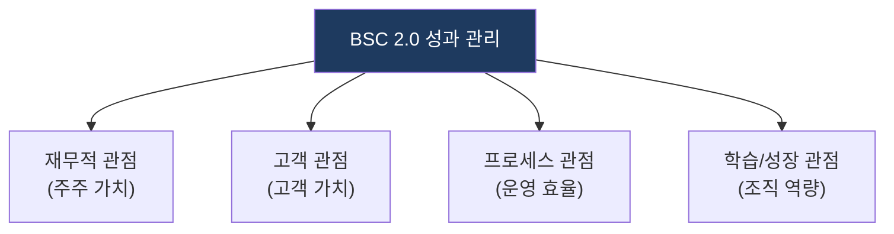
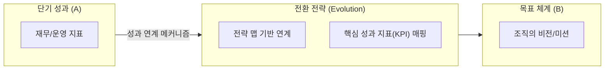

# BSC 2.0 (Balanced Scorecard 2.0)

## 1. BSC 2.0: 전략·디지털 성과 통합 및 정렬을 통한 성과 관리 혁신

**핵심**: 디지털 전환(DX) 시대의 요구에 맞춰 기존 BSC를 고도화하고, 전략-성과-실행 간의 정렬을 강화한 차세대 성과 관리 프레임워크.

**특징**:  
 **(전략 중심)** 전사 전략과 성과 지표 간의 인과관계 명확화.  
 **(DX 정렬)** 디지털 성숙도 및 민첩성 지표를 통합적으로 반영.  

---

## 2. BSC 2.0의 성과 관리 모델 및 전략 체계

### 가. 성과 관리 4대 관점 체계
(전사 전략을 균형 있게 관리하는 4가지 핵심 영역 도식)

* **재무적 관점**: 매출 성장, ROI 등 단기적 재무 성과 지표.
* **고객 관점**: 고객 경험(CX), 서비스 만족도 등 시장 경쟁력.
* **프로세스/학습 관점**: 디지털 역량, 프로세스 효율성 등 내부 동인(Driver).

### 나. 전략 맵 기반 성과 연계 메커니즘
(성과와 전략의 인과관계를 정의하는 전략적 메커니즘)

| 구분 | 전략 방향 | 상세 대응 메커니즘 |
|---|---|---|
| **연계** | 전략 맵 매핑 | 조직의 비전과 각 관점의 KPI를 인과관계로 연결 |
| **운영** | 성과 추적 | 실시간 대시보드 기반의 KPI 달성도 모니터링 |
| **개선** | 피드백 루프 | 성과 미달성 항목 분석을 통한 전략 수정 및 보완 |

---

## 3. 기대효과 및 활용 방안
| 구분 | 기대효과 | 활용 방안 |
|---|---|---|
| **전략** | 비전 실행력 강화 | 전략 맵을 통한 조직 구성원의 방향성 일치 |
| **운영** | 데이터 기반 성과 관리 | 정량적 지표 분석을 통한 IT 조직 운영 효율화 |
| **기술** | 디지털 역량 내재화 | 성과 지표에 디지털 성숙도 항목 포함하여 DX 촉진 |
