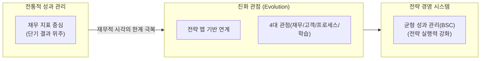
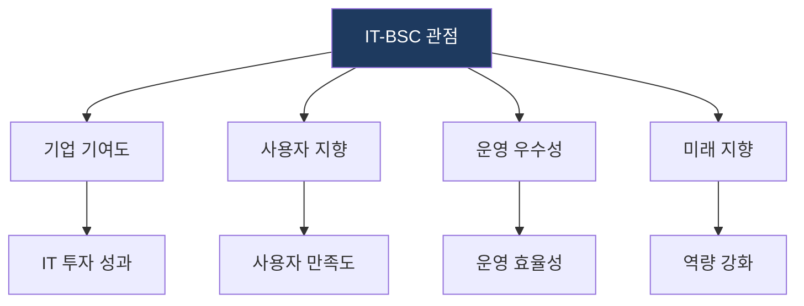

# BSC (Balanced Scorecard)
**Balanced Scorecard / IT-BSC**

## 1. 다각적 성과 관리 체계, BSC의 개요

**개념**: 재무적 지표 중심의 성과 측정에서 벗어나, 고객, 내부 프로세스, 학습과 성장 등 비재무적 관점을 포함하여 조직의 전략을 균형 있게 관리하는 전략 경영 시스템.

**특징**: 전략 맵(Strategy Map)을 통한 인과관계 가시화, 핵심 성과 지표(KPI) 도출, 비전과 전략의 실행력 강화.

---

## 2. BSC의 4대 관점 및 IT-BSC 확장 모델

### 나. 성과 관리 체계의 진화 (BSC)

| 관점 | 주요 질문 | 성과 지표 예시 |
|---|---|---|
| **재무 (Financial)** | 주주 가치 극대화 | ROI, 매출 성장률, 순이익, TCO 절감 |
| **고객 (Customer)** | 고객 만족 및 시장 점유 | 고객 만족도, 시장 점유율, 신규 고객 확보율 |
| **내부 프로세스** | 핵심 프로세스 최적화 | 사이클 타임, 품질 불량률, 생산성 지표 |
| **학습과 성장** | 조직 역량 및 인프라 | 직원 숙련도, 이직률, 정보시스템 활용도, 조직 문화 |

---

### 나. IT-BSC: IT 조직을 위한 성과 관리 모델

| IT-BSC 관점 | 기존 BSC 대응 | 주요 관리 항목 |
|---|---|---|
| **기업 기여도** | 재무적 관점 | IT 투자 대비 성과, 예산 준수율 |
| **사용자 지향** | 고객 관점 | 서비스 가용성, 헬프데스크 만족도 |
| **운영 우수성** | 내부 프로세스 | 장애 복구 시간, 보안 사고 건수 |
| **미래 지향** | 학습과 성장 | IT 교육 시간, 최신 기술 도입률 |

---

## 3. BSC 도입 시 기대효과 및 성공 전략

| 구분 | 주요 기대효과 | 활용 및 실무 적용 방안 |
|---|---|---|
| **전략 정렬** | 비전의 실행력 강화 | 전략 맵을 활용하여 하부 조직 KPI와 전사 전략 동기화 |
| **균형 관리** | 단기-장기 성과 균형 | 재무적 결과와 비재무적 동인(Driver) 간의 균형적 시각 확보 |
| **지속 개선** | 성과 피드백 루프 | 주기적인 KPI 모니터링을 통한 비즈니스 프로세스 개선 유도 |
