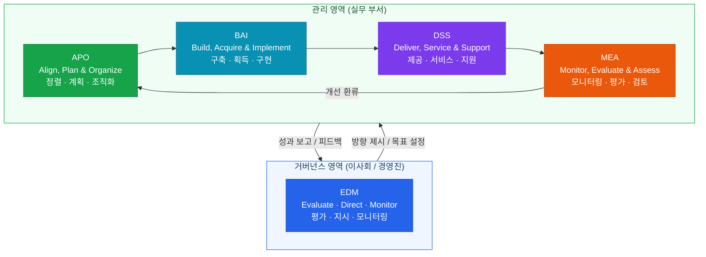
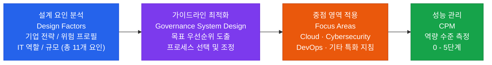
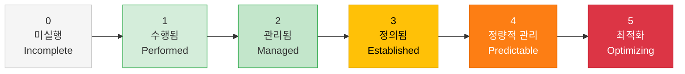
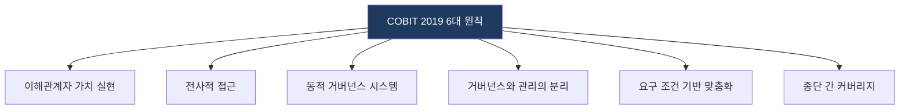
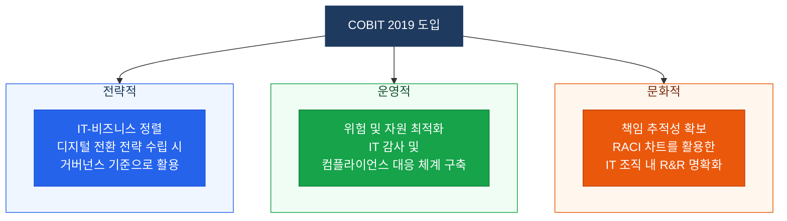

# COBIT 2019
**Control Objectives for Information and Related Technologies 2019**

## 1. 맞춤형 IT 거버넌스 설계를 위한 프레임워크, COBIT 2019의 개요

**개념**: 기업의 정보와 기술(I&T) 거버넌스 체계 구축을 위해 비즈니스 목적과 IT 관리를 정렬하는 EGIT(Enterprise Governance of IT) 프레임워크.

**특징**: COBIT 5 기반에 **Design Factors(설계 요인)** 를 도입하여 조직 특성에 맞는 Tailoring(맞춤화)을 강화하고, CMMI 기반 성능 관리를 적용.

---

## 2. COBIT 2019의 구성 체계 및 핵심 메커니즘

### 가. 핵심 구성도 (Core Model)

| 영역 | 주요 내용 | 비고 |
|---|---|---|
| **EDM** (거버넌스) | Evaluate(평가), Direct(지시), Monitor(모니터링) | 이사회/경영진 수준 |
| **APO/BAI/DSS/MEA** | 계획, 구축, 운영, 성과 평가 | 실무 부서 수준 |

---

### 나. 맞춤형 거버넌스 구현을 위한 주요 구성 요소

#### 맞춤형 설계 흐름 (Tailoring Process)

#### 성능 관리 수준 (CPM: Capability and Performance Management)

| 수준 | 명칭 | 의미 |
|---|---|---|
| **0** | Incomplete | 프로세스 미실행 또는 목적 미달성 |
| **1** | Performed | 목적을 달성하나 관리 체계 미흡 |
| **2** | Managed | 계획·모니터링·조정이 이루어지는 관리 상태 |
| **3** | Established | 프로세스로 정의되어 조직 전반에 적용 |
| **4** | Predictable | 정량적 지표로 예측·통제 가능 |
| **5** | Optimizing | 지속적 개선이 이루어지는 최적화 상태 |

---

#### 6대 원칙

---

## 3. COBIT 2019 도입을 통한 기대효과 및 활용 방안

| 구분 | 주요 기대효과 | 활용 및 실무 적용 방안 |
|---|---|---|
| **전략적** | IT-비즈니스 정렬 | 디지털 전환(DX) 전략 수립 시 거버넌스 기준으로 활용 |
| **운영적** | 위험 및 자원 최적화 | IT 감사(Audit) 및 컴플라이언스 대응 체계 구축 |
| **문화적** | 책임 추적성 확보 | RACI 차트를 활용한 IT 조직 내 R&R 명확화 |
