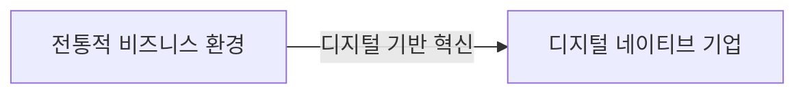
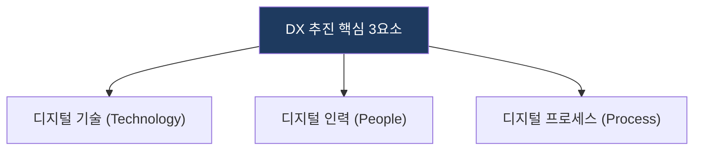
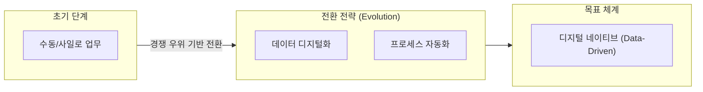

# 디지털 전환 (Digital Transformation, DX)

## 1. 개요

**개념**: 디지털 기술을 사회 전반에 적용하여 전통적인 운영 방식과 비즈니스 모델을 근본적으로 변화시키는 과정.

**특징**: 
- **기술**: 클라우드, AI, IoT 등 디지털 기술의 융합.
- **인력**: 디지털 역량 확보 및 일하는 방식의 변화.
- **프로세스**: 데이터 기반 의사결정 체계로의 전환.

---

## 2. DX 프레임워크의 도메인 모델 및 성숙도 체계

### 가. DX 추진 핵심 3요소
(기술, 인력, 프로세스의 융합적 구성 체계)

* **기술(Technology)**: 데이터 기반 플랫폼, 인프라 혁신(클라우드 등).
* **인력(People)**: 디지털 리터러시, 애자일 조직 문화.
* **프로세스(Process)**: 데이터 기반 의사결정, 고객 경험 최적화.

### 나. 디지털 전환 성숙도 모델 (전략적 진화 체계)
(조직의 DX 수준을 단계별로 진단하고 발전시키는 메커니즘)

| 구분 | 성숙도 단계 | 상세 대응 메커니즘 |
|---|---|---|
| **기반 조성** | 기초 단계 | 레거시 시스템의 디지털화 및 데이터 수집 환경 구축 |
| **운영 최적화** | 연결/통합 단계 | 프로세스 자동화(RPA 등) 및 부서 간 데이터 공유 기반 마련 |
| **비즈니스 혁신** | 데이터 기반 단계 | 데이터 분석 및 AI 모델을 활용한 신규 비즈니스 모델 창출 |

---

## 3. 기대효과 및 활용 방안
| 구분 | 기대효과 | 활용 방안 |
|---|---|---|
| **전략** | 비즈니스 모델 혁신 | 데이터 기반의 신규 서비스 및 시장 창출 |
| **운영** | 업무 생산성 향상 | 자동화를 통한 휴먼 에러 제거 및 프로세스 효율화 |
| **기술** | 유연한 확장성 | 클라우드 기반 아키텍처를 통한 비즈니스 민첩성 확보 |
