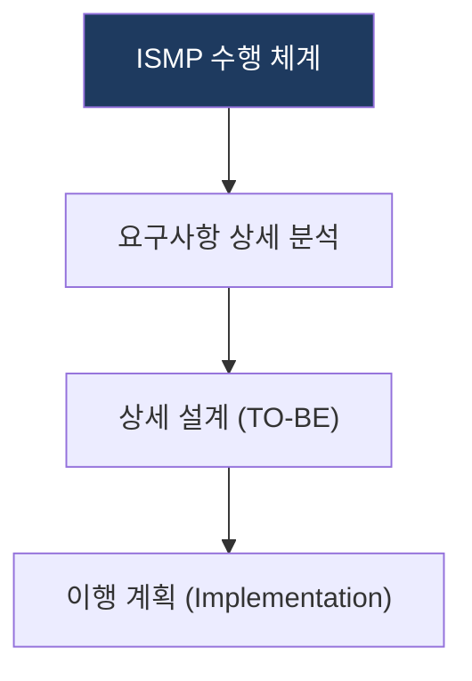
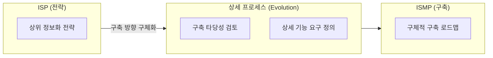

## 1. ISMP: ISP 기반 통합 정보시스템 구축 계획

**핵심**: 정보화 전략 수립(ISP)의 후속 단계로, 특정 시스템 구축을 위한 상세 요구사항 정의 및 실행 계획을 수립하는 방법론.

**특징**:  
 **(마스터플랜 수립)** ISP의 전략 방향성을 구체화하는 상세 마스터플랜 수립.  
 **(타당성·요구사항)** 사업 타당성 검토 및 상세 요구사항 정의.  

---

## 2. ISMP 수립 모델 및 전략 체계

### 가. ISMP 추진 체계 (핵심 구성 요소)
(구축 상세 설계 중심의 마스터플랜 프로세스)

* **요구사항 분석**: 현행 시스템 분석 및 구축하고자 하는 시스템의 상세 요구사항 정의.
* **상세 설계**: 목표 시스템의 기능, 데이터, 기술 아키텍처 상세 정의.
* **이행 계획**: 사업 기간, 예산, 인력, 산출물 정의 등 사업 실행 계획 수립.

### 나. ISP와의 비교 및 상세 프로세스 (전략적 메커니즘)
(상위 전략과 구축 로드맵 간의 연계 체계)

| 구분 | 상세 내용 | 이행 전략 |
|---|---|---|
| **비교항목** | 목적: 전략 수립 vs 상세 구현 | ISP(방향) → ISMP(수단) 연계 강화 |
| **상세 프로세스** | 프로젝트 요구사항 명세화 | 사용자 스토리 및 기능 명세 중심의 이행 계획 |
| **이행 전략** | 예산/인력 최적화 | 상세 설계 기반의 프로젝트 성공률 제고 전략 |

---

## 3. 기대효과 및 활용 방안
| 구분 | 기대효과 | 활용 방안 |
|---|---|---|
| **전략** | 구축 방향성 확립 | 명확한 요구사항 기반의 개발 착수 |
| **운영** | 사업 리스크 최소화 | 예산 및 기간의 정교한 산정을 통한 리스크 완화 |
| **기술** | 시스템 완성도 향상 | 상세 설계 기반의 아키텍처 표준 준수 |
