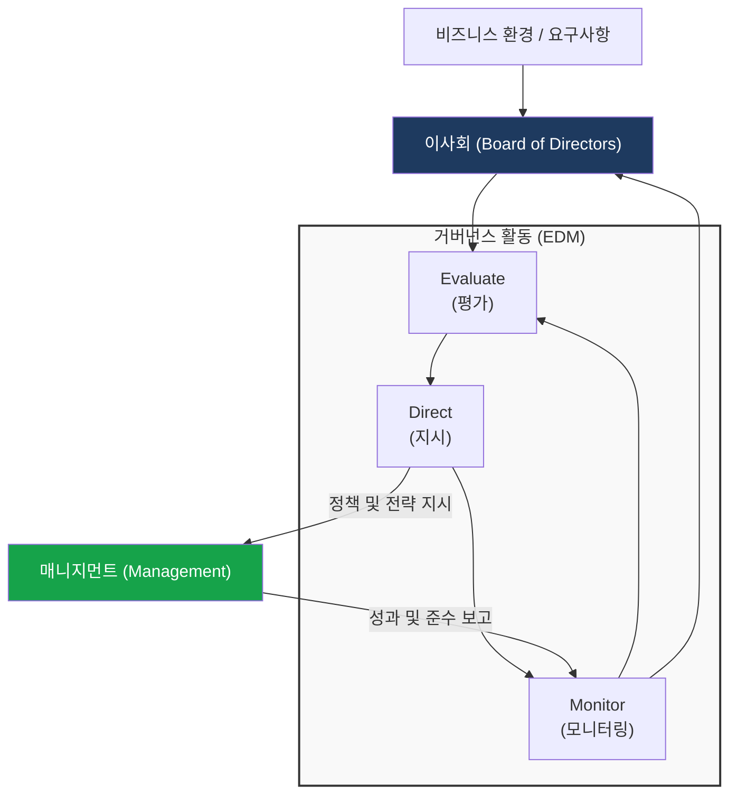
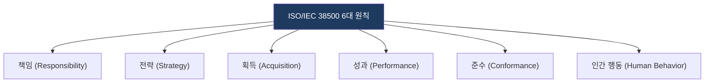

# ISO/IEC 38500
**International Standard for Corporate Governance of IT**

## 1. IT 거버넌스의 국제 표준, ISO/IEC 38500의 개요

**개념**: 조직의 의사결정권자(이사회)가 IT 활용을 효과적, 효율적, 수용 가능하게 관리할 수 있도록 지원하는 IT 거버넌스 표준 모델.

**특징**: 비즈니스 중심의 상향식(Top-down) 접근, 6대 원칙과 3가지 활동(EDM) 모델을 제시하여 거버넌스와 관리의 책임을 명확화.

---

## 2. ISO/IEC 38500의 거버넌스 모델 및 핵심 원칙

### 가. IT 거버넌스 프레임워크 (EDM 모델)

| 활동 | 설명 | 주요 역할 |
|---|---|---|
| **Evaluate** | IT의 현재와 미래 사용에 대한 지속적 평가 | 비즈니스 가치 창출 및 위험 수준 평가 |
| **Direct** | 비즈니스 목적 달성을 위한 전략 및 정책 지시 | IT 자산 활용에 대한 가이드라인 및 정책 수립 |
| **Monitor** | 정책 준수 여부 및 성과 측정(모니터링) | 지시 사항 이행 여부 및 위험 통제 확인 |

---

### 나. 성공적인 IT 거버넌스 구현을 위한 6대 원칙

| 원칙 | 주요 내용 |
|---|---|
| **책임 (Responsibility)** | 조직 내 개인 및 그룹의 IT 공급/수요에 대한 권한과 책임 명확화 |
| **전략 (Strategy)** | 비즈니스 전략과 IT 역량의 정렬(Alignment) 및 목표 달성 지원 |
| **획득 (Acquisition)** | 투자 분석을 통한 합리적 IT 자산 획득 및 위험 기반 의사결정 |
| **성과 (Performance)** | 비즈니스 프로세스 지원을 위한 IT 시스템의 성능 및 서비스 수준 보장 |
| **준수 (Conformance)** | 법규, 규정, 계약 사항 등 외부 및 내부 정책 준수 여부 보장 |
| **인간 행동 (Human Behavior)** | 사용자의 행동 양식 및 사회적 욕구를 고려한 IT 정책 수립 |

---

## 3. ISO/IEC 38500 도입 효과 및 활용 방안

| 구분 | 주요 기대효과 | 활용 및 실무 적용 방안 |
|---|---|---|
| **경영진 관점** | 의사결정 투명성 확보 | IT 투자에 대한 책임 추적성 강화 및 거버넌스 체계 확립 |
| **비즈니스 관점** | 가치 극대화 | IT 프로젝트의 성공률 제고 및 비즈니스 변화 대응력 강화 |
| **위험 관리** | 리스크 통제 및 준거성 | 컴플라이언스 대응 및 IT 운영 리스크의 사전적 관리 |
