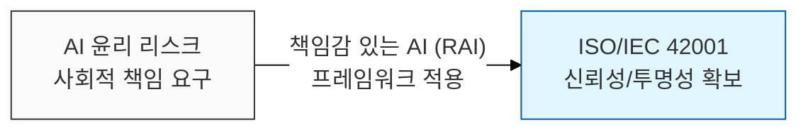
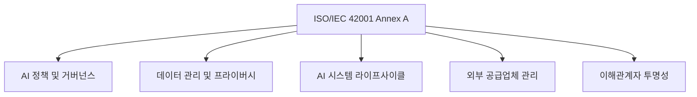

# "**신뢰할 수 있는 AI를 위한 관리 체계, ISO/IEC 42001 (AIMS)**"

## I. AI 거버넌스의 국제 표준, ISO/IEC 42001

**정의**: 조직이 AI 시스템을 책임감 있게 개발·배포·운용할 수 있도록 체계적인 프로세스와 통제 항목을 제공하는 **AI 관리 체계**(AIMS)에 대한 국제 표준  

**특징**:  
( **신뢰성 확보** ) AI 시스템의 편향성·불투명성 문제를 해결하고 이해관계자의 신뢰 구축  
( **규제 대응** ) EU AI Act 등 글로벌 AI 규제 준수를 위한 객관적 증거 및 컴플라이언스 대응  
( **리스크 관리** ) AI 특화 리스크(환각, 데이터 오염 등)를 식별하고 전사적 관리 체계 내 내재화  

---

## II. ISO/IEC 42001의 상세 메커니즘 및 주요 구성

### 가. ISO/IEC 42001의 주요 구성 요소 (HLS 기반)
ISO/IEC 42001은 **HLS**(High Level Structure)를 준수하며 AI 시스템 라이프사이클 전반을 관리합니다.

| 구분 | 주요 항목 | 상세 내용 |
|---|---|---|
| **조직 상황** | 조직 맥락 파악 | AI 사용 목적, 이해관계자 요구사항, AIMS 범위 정의 |
| **리더십** | 경영진 의지 | AI 정책 수립, 조직 내 역할·책임·권한 부여 |
| **기획** | 리스크 평가 | AI 리스크 식별 및 평가, AI 목표 수립 및 달성 계획 |
| **지원** | 자원 및 역량 | 인적·기술적 자원 확보, 인식 제고, 문서화된 정보 관리 |
| **운영** | 운영 통제 | AI 시스템 수명주기 관리, 데이터 품질 관리, AI 리스크 처리 |
| **성과 평가** | 모니터링 | 내부 심사, 경영 검토, AI 시스템 성능 및 윤리성 측정 |

### 나. AI 리스크 관리 및 통제 항목 (Annex A)
Annex A는 AI 시스템의 신뢰성을 보장하기 위한 **38**개의 통제 항목을 제시합니다.

| 핵심 통제 분야 | 주요 내용 |
|---|---|
| **데이터 관리** | 학습 데이터의 출처·품질 관리, 데이터 수집 시 프라이버시 보호 |
| **투명성 및 설명 가능성** | AI 모델의 의사결정 과정에 대한 설명력 확보, 로깅 및 추적성 유지 |
| **공정성 관리** | 모델 개발 시 편향성 탐지 및 제거 프로세스 운영 |
| **안전성 및 보안** | 적대적 공격 대응, 견고성(Robustness) 확보, 오작동 방지 |

---

## III. ISO/IEC 42001과 ISO/IEC 27001의 비교 및 도입 전략

### 가. ISO/IEC 42001 vs ISO/IEC 27001 비교
| 비교 항목 | ISO/IEC 27001 (ISMS) | ISO/IEC 42001 (AIMS) |
|---|---|---|
| **중심 가치** | 정보의 기밀성·무결성·가용성 | AI의 신뢰성·투명성·책임성·안전성 |
| **핵심 자산** | 정보 자산 (Data, IT HW/SW) | AI 모델, 데이터셋, AI 시스템 프로세스 |
| **리스크 유형** | 유출, 변조, 서비스 중단 | 편향성, 설명 불능, 환각, 데이터 오염 |
| **주요 대상** | 전사 정보보호 조직 | AI 개발·운영 조직 및 AI 비즈니스 부서 |

### 나. 효과적인 도입 전략
1. **통합 관리 체계 구축**: 기존 ISO 27001(정보보호) 및 ISO 27701(개인정보)과 통합하여 중복 프로세스 제거  
2. **AI 라이프사이클 정합성**: 설계 단계부터 **Privacy/Ethics by Design**을 적용하여 개발 전 과정에 가이드라인 내재화  
3. **지속적 모니터링**: 정적 인증에 그치지 않고 AI 모델의 성능 저하(Drift) 및 새로운 위협에 대한 상시 모니터링 체계 강화  

---
이 콘텐츠는 ISO/IEC 42001에 대한 기술사 1교시형 형식으로 작성되었습니다.

