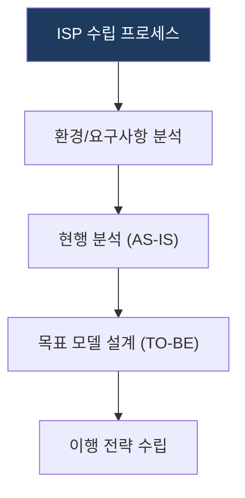

## 1. ISP: 경영 전략과 IT를 통합하는 정보화 계획

**핵심**: 조직의 중장기 비즈니스 목표 달성을 위해 IT 최적화 전략 및 로드맵을 수립하는 방법론.

**특징**:  
 **(전략 정렬)** 경영 전략과 IT 전략의 정렬(Alignment)로 투자 효율과 방향성을 일치시킴.  
 **(통합 청사진)** 기술/프로세스/데이터에 대한 통합 청사진 제시.  

---

## 2. ISP 수립 모델 및 전략 체계

### 가. ISP 수립 프로세스 (핵심 구성 요소)
(현황 분석부터 전략 도출까지의 순차적 프레임워크)

* **현황 분석**: 조직의 전략 방향성 및 내부/외부 정보화 요구사항 분석.
* **목표 모델 설계**: 비즈니스 목표 달성을 위한 최적의 정보시스템 표준 아키텍처 정의.
* **이행 전략**: 단계적 실행을 위한 투자 계획 및 로드맵 도출.

### 나. 정보화 전략 수립 메커니즘 (전략적 메커니즘)
(성공적인 전략 수립을 위한 3대 핵심 체계)

| 구분 | 전략 방향 | 상세 대응 메커니즘 |
|---|---|---|
| **분석** | 비즈니스 정렬 | 경영 전략과 IT 프로세스의 연관성(Matrix) 분석 |
| **설계** | 아키텍처 정립 | 데이터, 애플리케이션, 기술의 통합 아키텍처(EA) 설계 |
| **이행** | 로드맵 전략 | 단계별 우선순위 및 자원 투입 기반의 로드맵 수립 |

---

## 3. 기대효과 및 활용 방안
| 구분 | 기대효과 | 활용 방안 |
|---|---|---|
| **전략** | 정보화 목표 명확화 | 조직 내 IT 자산의 효율적 배치 근거 확보 |
| **운영** | 중복 투자 제거 | 부서별/기능별 파편화된 IT 시스템 통합 추진 |
| **기술** | 표준화된 인프라 | 비즈니스 변화에 대응 가능한 확장성 있는 IT 구조 수립 |
