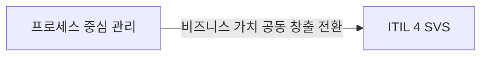
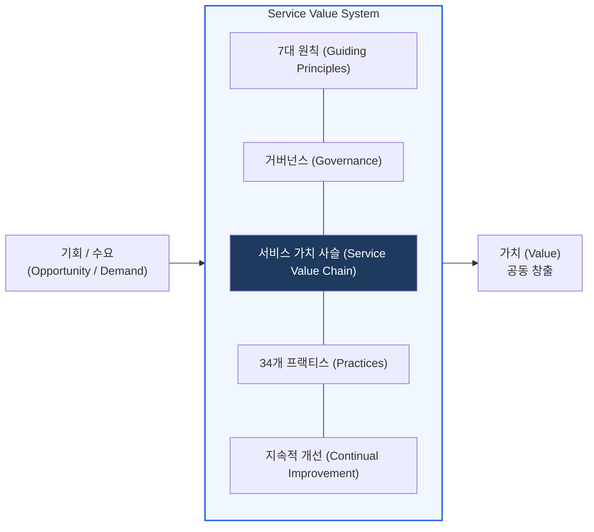
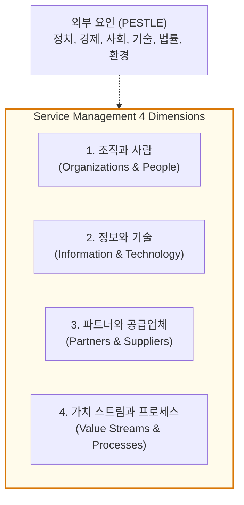

# ITIL 4
**Information Technology Infrastructure Library 4**

## 1. 디지털 전환 시대의 IT 서비스 관리, ITIL 4의 개요

**개념**: 현대적 비즈니스 환경에서 공동 가치 창출(Co-creation of Value)을 지원하기 위해 설계된 IT 서비스 관리(ITSM) 프레임워크.

**특징**: ITIL v3의 프로세스 중심에서 **서비스 가치 시스템(SVS)** 및 **4차원 모델**로 패러다임 전환, Agile, DevOps, Lean과의 통합 강조.

---

## 2. ITIL 4의 구성 체계 및 핵심 메커니즘

### 가. 서비스 가치 시스템 (SVS: Service Value System)

| 구성 요소 | 설명 |
|---|---|
| **Guiding Principles** | 다양한 상황에서 조직을 가이드하는 7가지 핵심 권장 사항 |
| **Governance** | 조직이 방향을 설정하고 통제하는 방식 |
| **Service Value Chain** | 가치 창출을 위해 결합된 6가지 핵심 활동 (Plan, Improve, Engage, etc.) |
| **Practices** | 업무 수행을 위해 구성된 조직 자원의 집합 (34개) |
| **Continual Improvement** | 모든 수준에서 서비스 및 제품을 지속적으로 정렬하고 개선 |

---

### 나. 서비스 관리를 위한 4차원 모델 (4 Dimensions)

| 차원 | 주요 내용 |
|---|---|
| **조직과 사람** | 조직 구조, 문화, 역량, 역할 및 책임 정의 |
| **정보와 기술** | 서비스 관리에 필요한 데이터, 지식, 워크플로우 및 기술 도구 |
| **파트너와 공급업체** | 서비스 설계, 구축, 운영에 참여하는 외부 파트너와의 관계 |
| **가치 스트림과 프로세스** | 가치 창출을 위해 필요한 일련의 활동과 워크플로우 최적화 |

---

## 3. ITIL 4의 기대효과 및 실무 적용 방안

| 구분 | 주요 기대효과 | 활용 및 실무 적용 방안 |
|---|---|---|
| **비즈니스 가치** | 공동 가치 창출 (Co-creation) | 비즈니스 부서와의 파트너십 강화를 통한 비즈니스 성과 직결 |
| **유연성 확보** | 현대적 방법론과의 정렬 | DevOps, Agile 환경에서 ITSM 실무를 유연하게 적용 |
| **지속적 개선** | 품질 및 효율성 제고 | Continual Improvement 모델을 활용한 서비스 생애주기 전반의 혁신 |
