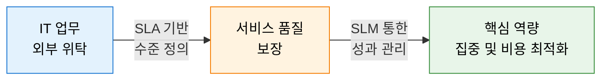
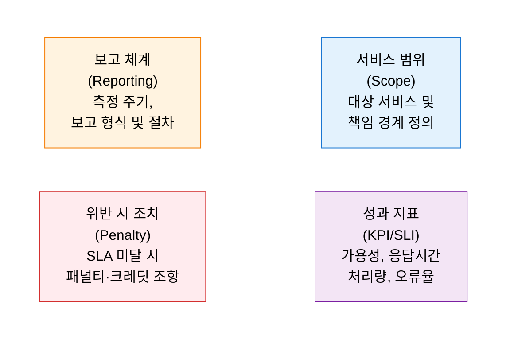
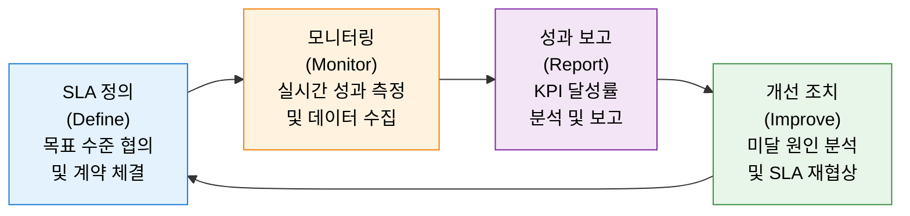

# IT 아웃소싱 (ITO)
**IT Outsourcing**

## 1. 핵심 역량 집중을 위한 IT 업무 외부 위탁 전략, IT 아웃소싱(ITO)의 개요

**정의**: 기업이 IT 인프라, 애플리케이션, 운영 등 IT 기능 전부 또는 일부를 외부 전문 서비스 제공자에게 위탁하고, SLA(서비스 수준 합약)를 통해 서비스 품질을 보장받으며 핵심 비즈니스에 집중하는 전략적 IT 관리 방식.

**특징**:
- 비용 절감, 전문성 확보, 유연한 자원 확장을 위해 IT 기능을 외부로 이전.
- SLA를 계약의 핵심 도구로 활용하여 서비스 수준의 정량적 관리 가능.
- 완전 아웃소싱(Total), 선택적 아웃소싱(Selective), 공동 소싱(Co-sourcing) 등 다양한 방식 존재.

---

## 2. IT 아웃소싱의 서비스 수준 관리 체계

### 가. SLA (Service Level Agreement) — 서비스 수준 합약

| 구성 요소 | 주요 내용 | 예시 |
|---|---|---|
| **서비스 범위** | 위탁 대상 IT 서비스와 제공자·수요자 간 책임 경계 명확화 | 인프라 운영, 헬프데스크, 애플리케이션 유지보수 |
| **성과 지표 (KPI)** | 서비스 품질을 정량적으로 측정하는 핵심 지표 설정 | 가용성 99.9%, 응답시간 3초 이내, 장애 복구 4시간 이내 |
| **보고 체계** | 측정 결과의 주기적 보고 및 검토 절차 | 월간 성과 보고서, 분기 SLA 검토 회의 |
| **패널티 조항** | SLA 미달 시 서비스 크레딧 또는 계약 해지권 부여 | 가용성 99% 미달 시 월 요금 10% 환급 |

---

### 나. SLM (Service Level Management) — 서비스 수준 관리

| 단계 | 주요 활동 | 관리 포인트 |
|---|---|---|
| **SLA 정의** | 비즈니스 요구사항 기반의 서비스 목표 수준 설정 및 문서화 | 측정 가능하고 현실적인 지표 설정 여부 |
| **모니터링** | 실시간 성과 측정 도구를 통한 KPI 수집 및 임계치 초과 알람 | 자동화된 모니터링 체계 구축 |
| **성과 보고** | 정기적 SLA 달성률 보고 및 이해관계자 공유 | 수요자·공급자 간 투명한 데이터 공유 |
| **개선 조치** | 미달 원인 분석(RCA) 및 재발 방지 계획 수립, SLA 재협상 | 지속적 서비스 품질 향상 사이클 유지 |

---

## 3. IT 아웃소싱 도입의 기대효과 및 활용 방안

| 구분 | 주요 기대효과 | 활용 및 실무 적용 방안 |
|---|---|---|
| **비용 효율화** | CapEx→OpEx 전환 및 운영 비용 절감 | 클라우드 기반 아웃소싱 전환으로 인프라 고정비 유연화 |
| **전문성 확보** | 외부 전문 인력 및 기술 즉시 활용 | 특화 기술(AI, 보안, 클라우드) 분야 선택적 아웃소싱 적용 |
| **리스크 관리** | SLA 기반 서비스 품질 보장 및 책임 분산 | 계약 시 OLA(운영수준합약), UC(계약서) 연계 체계 구축 |
| **핵심 집중** | 비핵심 IT 운영 부담 제거로 전략 업무 집중 | 선택적 아웃소싱으로 핵심 역량은 내재화, 범용 운영만 위탁 |
