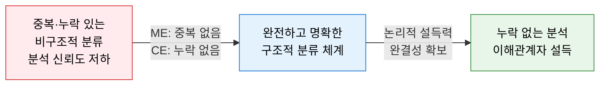
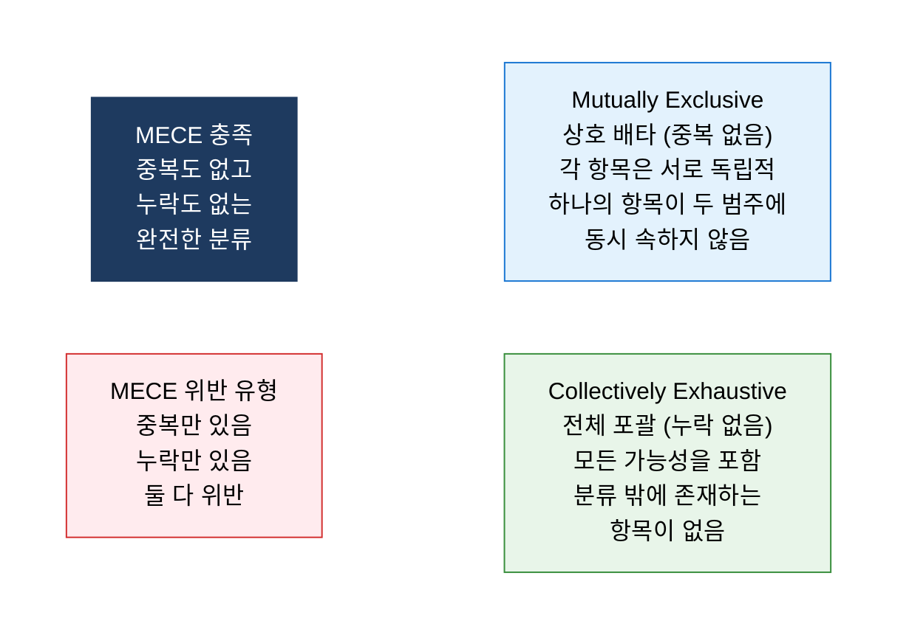
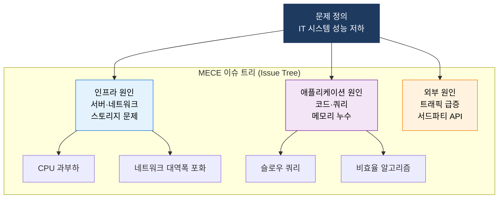
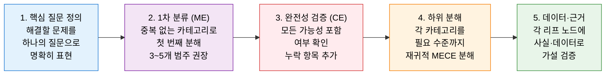

# MECE
**Mutually Exclusive Collectively Exhaustive — 상호 배타·전체 포괄**

## 1. 문제나 항목을 중복 없이, 누락 없이 분해하여 구조적으로 사고하는 원칙, MECE의 개요

**정의**: McKinsey & Company에서 체계화한 구조적 사고 원칙으로, 어떤 문제·항목의 집합을 분류할 때 **ME(Mutually Exclusive, 상호 배타)** — 항목 간 중복이 없고, **CE(Collectively Exhaustive, 전체 포괄)** — 모든 가능성이 빠짐없이 포함되도록 구조화하는 논리적 사고 방법.

**특징**:  
 **(ME 상호 배타)** 각 항목이 서로 겹치지 않아 이중 계산·혼동이 없음.  
 **(CE 전체 포괄)** 모든 경우의 수를 포함하여 분석의 맹점(Blind Spot)이 없음.  
 **(범용 적용성)** 컨설팅·보고서·IT 아키텍처·요구사항 분석·위험 분류 등 구조적 사고가 필요한 모든 분야에 적용.  

---

## 2. MECE의 핵심 구성 체계

### 가. 상호 배타·전체 포괄 구조화 원칙

**MECE 충족·위반 사례 비교**

| 분류 시도 | ME | CE | MECE 여부 | 문제점 |
|---|:---:|:---:|:---:|---|
| IT 비용 = 하드웨어 + 소프트웨어 + **기타** | O | O | **충족** | 완전한 분류 |
| IT 비용 = 서버 + 클라우드 (PC·SW 누락) | O | X | **위반** | 누락 존재 |
| IT 직원 = 개발자 + 시니어 개발자 | X | ? | **위반** | 시니어가 개발자에 포함 (중복) |
| 보안 위협 = 내부 위협 + 외부 위협 + 복합 위협 | O | O | **충족** | 모든 위협 유형 포괄 |
| 프로젝트 상태 = 정상 + 지연 | O | X | **위반** | 완료·취소 상태 누락 |

**MECE 구조화 대표 프레임워크**

| 프레임워크 | 분류 구조 | MECE 원칙 적용 방식 |
|---|---|---|
| **3C** | 고객·경쟁사·자사 | 시장 참여자를 3개 관점으로 완전 분류 |
| **4P** | 제품·가격·유통·촉진 | 마케팅 믹스를 중복 없이 4개로 구조화 |
| **PEST** | 정치·경제·사회·기술 | 거시 환경 요인을 4개 범주로 포괄 |
| **Porter 5 Forces** | 5가지 경쟁 세력 | 산업 경쟁 구조를 완전히 포괄하는 분류 |
| **SWOT** | 강점·약점·기회·위협 | 내부/외부 × 긍정/부정으로 MECE 매트릭스 |

---

### 나. 문제 분해 및 IT 분석 적용

**IT 분야 MECE 적용 사례**

| 적용 영역 | MECE 분류 구조 | 효과 |
|---|---|---|
| **IT 아키텍처 계층** | 프레젠테이션·비즈니스·데이터·인프라 계층 | 책임 영역 중복 없이 명확히 분리 |
| **보안 위협 분류** | 기밀성·무결성·가용성(CIA) 위협 | 모든 보안 위협을 3가지로 완전 포괄 |
| **SW 테스트 유형** | 단위·통합·시스템·인수 테스트 | 테스트 범위를 누락 없이 계층 분류 |
| **IT 비용 구조** | CapEx(자본 지출) vs OpEx(운영 지출) | 모든 IT 지출을 두 범주로 완전 포괄 |
| **장애 원인 분류** | Man·Machine·Method·Material·Environment(5M) | 장애 원인 전체를 MECE로 구조화 |
| **프로젝트 리스크** | 기술·일정·비용·품질·인력 리스크 | 프로젝트 리스크 영역 완전 포괄 |

**MECE 이슈 트리 작성 절차**

---

## 3. MECE 원칙 적용의 기대효과 및 활용 방안

| 구분 | 주요 기대효과 | 활용 및 실무 적용 방안 |
|---|---|---|
| **분석 완결성** | 맹점 없는 전체 포괄 분석으로 놓치는 원인·해결책 방지 | 장애 원인 분석·위험 평가 시 이슈 트리로 완전 분해 |
| **보고 설득력** | 중복·누락 없는 논리로 이해관계자 신뢰·설득력 향상 | 경영진 보고서·제안서 목차를 MECE로 구조화 |
| **요구사항 관리** | 기능 요구사항을 MECE로 분류하여 이중 개발·누락 방지 | 사용자 스토리·백로그를 MECE 기준으로 그룹화 |
| **프레임워크 설계** | EA·보안·거버넌스 프레임워크의 영역 분류에 MECE 적용 | TOGAF ADM 단계·COBIT 도메인 설계 시 MECE 검증 |
