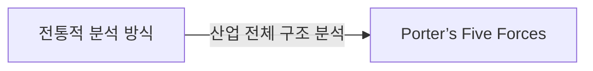
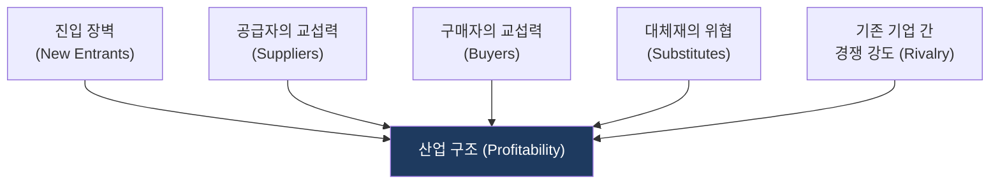
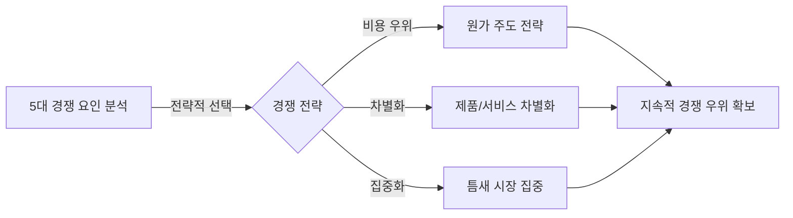

# Porter’s Five Forces

## 1. Porter’s Five Forces: 전통적 분석 방식에서 산업 구조 분석으로

**핵심**: 산업 전체의 구조를 분석하여 경쟁 환경을 이해하고 전략적 포지셔닝을 결정하는 프레임워크.

**특징**:  
 **(수익성·경쟁 강도)** 산업의 수익성과 경쟁 강도를 분석.  
 **(5대 경쟁 요인)** 진입 장벽·공급자/구매자 교섭력·대체재 위협·기존 경쟁 5대 요인을 체계적으로 분석.  

---

## 2. Porter’s Five Forces의 산업 경쟁 분석 모델

### 가. 산업 매력도 결정을 위한 5대 경쟁 요인
(산업 경쟁력을 결정하는 5가지 구조적 힘의 도식화)

* **진입 장벽**: 신규 기업 진입 시 기존 시장 점유율 및 비용 구조 위협.
* **교섭력**: 공급자와 구매자의 협상 우위에 따른 가격 결정권 영향.
* **경쟁 강도**: 동종 업계 내 기업 간의 가격, 마케팅, 기술 경쟁 정도.

### 나. 산업 경쟁 환경 변화에 따른 전략적 대응 체계
(5가지 경쟁요인 분석 결과를 기반으로 한 전략 포지셔닝 메커니즘)

| 구분 | 전략 방향 | 상세 대응 메커니즘 |
|---|---|---|
| **원가 주도** | 비용 우위 전략 | 규모의 경제 확보 및 운영 효율화로 가격 경쟁력 주도 |
| **차별화** | 제품/서비스 차별화 | 브랜드, 기술, 품질 등 고유 가치 창출을 통한 경쟁 회피 |
| **집중화** | 틈새 시장 집중 | 특정 세그먼트의 특수 요구사항을 충족하여 우위 확보 |

---

## 3. 기대효과 및 활용 방안
| 구분 | 기대효과 | 활용 방안 |
|---|---|---|
| **전략** | 시장 포지셔닝 명확화 | 산업 내 수익성 예측 및 진입/철수 의사결정 |
| **운영** | 외부 환경 리스크 통제 | 공급망 및 고객 관계 재정립을 통한 협상력 제고 |
| **기술** | 경쟁력 강화 | 차별화 전략 수립을 위한 핵심 IT 투자 요소 식별 |
