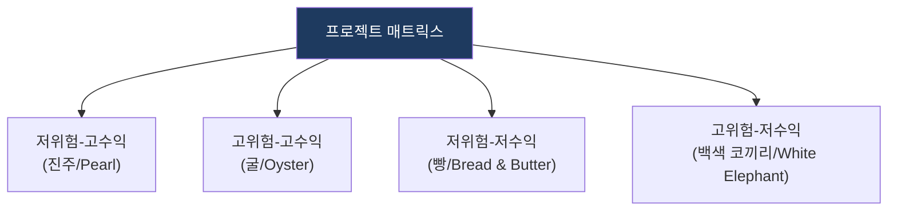

# PPM (Project Portfolio Management)

## 1. 개요

**개념**: 기업의 전체 프로젝트를 하나의 포트폴리오로 관리하여, 비즈니스 가치를 극대화하고 리스크를 최소화하도록 자원을 배분하는 관리 체계.

**특징**: 
- 프로젝트 우선순위 선정 및 자원 배분 최적화.
- 개별 프로젝트를 넘어 전사적 관점의 IT 투자 효율 관리.

---

## 2. PPM 관리 체계 및 성과 메커니즘

### 가. 프로젝트 포트폴리오 매트릭스
(위험과 수익성에 기반한 프로젝트 전략적 배치)

* **Pearl**: 핵심 전략 프로젝트로 우선 투자 대상.
* **Oyster**: 신규 시장 개척용 프로젝트로 단계적 투자.
* **White Elephant**: 중단 또는 재구조화 고려.

### 나. 투자 배분 전략 메커니즘
(성과 기반의 자원 배분 및 환류 체계)

| 구분 | 전략 방향 | 상세 대응 메커니즘 |
|---|---|---|
| **선정** | 가치 기반 필터링 | 전략적 가치와 실행 가능성을 기반으로 후보군 필터링 |
| **운영** | 자원 최적화 | 한정된 자원을 성과 높은 프로젝트에 우선 배분 |
| **환류** | 성과 추적 | 프로젝트 중간 평가를 통한 포트폴리오 재조정 |

---

## 3. 기대효과 및 활용 방안
| 구분 | 기대효과 | 활용 방안 |
|---|---|---|
| **전략** | 투자 우선순위 결정 | 비즈니스 로드맵 기반의 IT 자산 포트폴리오 관리 |
| **운영** | 리스크 분산 | 고위험-고수익과 저위험-안정 자산 간의 균형 유지 |
| **기술** | 자원 효율화 | 중복 프로젝트 제거 및 자원 가동률 최적화 |
