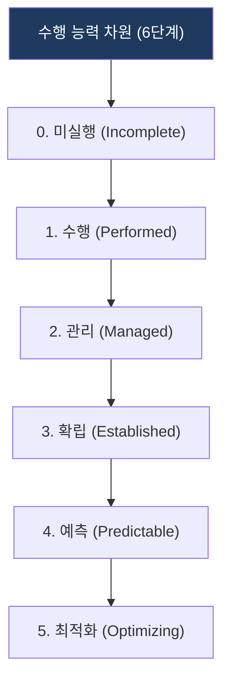
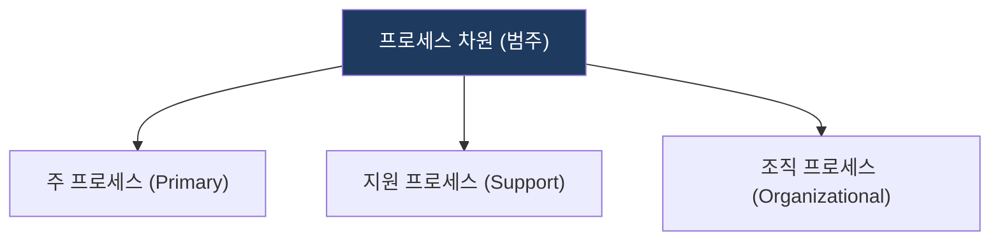

# SPICE (ISO/IEC 15504)

## 1. SW 프로세스 역량을 6단계로 평가하여 체계적 개선을 이끄는 국제 표준, SPICE의 개요

**정의**: 소프트웨어 프로세스 개선과 능력 결정을 위한 국제 표준으로, 조직의 프로세스 수행 능력을 평가하는 기준.

**특징**: 
- **수행 능력 차원**: 프로세스 성숙도를 6단계로 정의.
- **프로세스 차원**: 조직의 프로세스 범위를 분류.

---

## 2. SPICE의 프로세스 평가 모델

### 가. 수행 능력 차원 (Capability Levels)
(프로세스 수행 역량을 결정하는 6단계 체계)

* **0~1단계**: 프로세스 미수행 및 단순히 수행되는 수준.
* **2~3단계**: 프로세스가 관리되고 표준화되어 확립된 수준.
* **4~5단계**: 데이터 기반의 정량적 예측 및 지속적 최적화 수준.

### 나. 프로세스 차원
(조직 내 프로세스 분류 및 영역별 수행 메커니즘)

| 프로세스 범주 | 상세 분류 | 주요 수행 메커니즘 |
|---|---|---|
| **주 프로세스** | 획득, 공급, 개발, 운영, 유지보수 | 고객 요구사항으로부터 제품/서비스를 실현하는 핵심 가치 사슬 메커니즘 |
| **지원 프로세스** | 품질보증, 형상관리, 문서화, 검증 | 수행되는 프로세스의 품질을 보장하고 오류를 조기에 탐지하는 관리 메커니즘 |
| **조직 프로세스** | 조직 관리, 프로세스 개선, 기반 관리 | 조직 차원의 표준 프로세스 수립 및 지속적 개선 지원 메커니즘 |

---

## 3. 기대효과 및 활용 방안
| 구분 | 기대효과 | 활용 방안 |
|---|---|---|
| **품질** | 프로세스 품질 향상 | 결함 예방 및 일관된 소프트웨어 개발 품질 확보 |
| **운영** | 프로세스 체계화 | 조직의 프로세스 역량 수준(CMMI 등) 진단 및 개선 |
| **기술** | 상호운용성 강화 | 표준 프로세스 준수를 통한 시스템 간 정합성 제고 |
