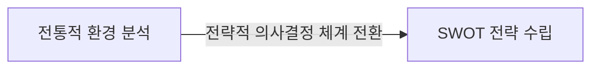
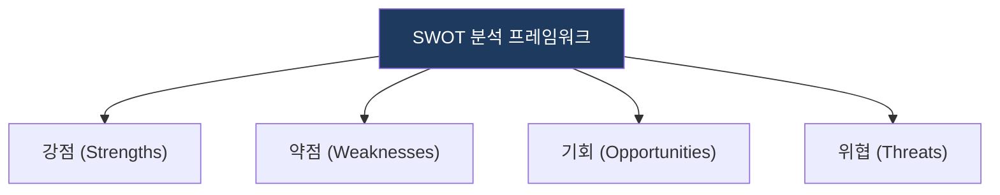
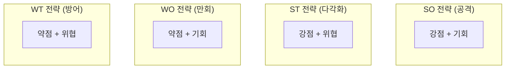

# SWOT Analysis

## 1. 개요

**개념**: 기업의 내부 역량(강점, 약점)과 외부 환경(기회, 위협)을 분석하여 전략적 대안을 도출하는 경영 환경 분석 도구.

**특징**: 
- 내/외부 환경을 동시에 고려한 입체적 분석.
- 전략 방향성을 결정하는 의사결정의 기초 자료.

---

## 2. SWOT 분석 모델 및 전략 체계

### 가. SWOT 환경분석 4대 요소
(기업 내부 역량과 외부 시장 환경의 다각적 분석)

* **내부 요인**: 강점(내부 우위), 약점(내부 취약점).
* **외부 요인**: 기회(시장 환경), 위협(리스크 요인).

### 나. SWOT 교차 전략 및 대응 체계
(4가지 영역을 결합한 전략적 의사결정 메커니즘)

| 구분 | 전략 방향 | 상세 대응 메커니즘 |
|---|---|---|
| **SO 전략** | 공격적 전략 | 강점(S)을 활용하여 기회(O)를 극대화하는 시장 선점 |
| **WO 전략** | 만회적 전략 | 약점(W)을 보완하여 기회(O)를 잡는 내실 강화 |
| **ST 전략** | 다각화 전략 | 강점(S)을 이용해 위협(T)을 방어하는 차별화 |
| **WT 전략** | 방어적 전략 | 약점(W) 최소화 및 위협(T) 제거를 위한 생존/철수 |

---

## 3. 기대효과 및 활용 방안
| 구분 | 기대효과 | 활용 방안 |
|---|---|---|
| **전략** | 전략적 포지셔닝 | 시장 내 차별적 경쟁 우위 도출 |
| **운영** | 리스크 선제 대응 | 위협 요인 조기 식별 및 내부 역량 보완 |
| **기술** | 자원 배분 최적화 | 강점 기반 IT 투자 및 약점 보완을 위한 IT 도입 |
