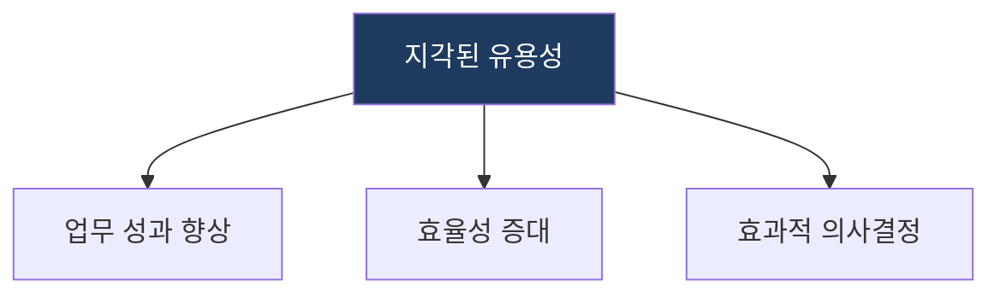
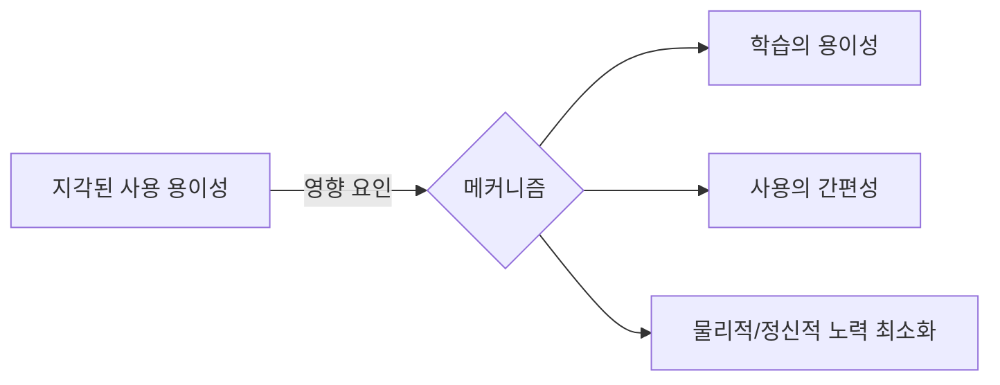

# 기술 수용 모델 (TAM: Technology Acceptance Model)

## 1. 유용성·사용 용이성으로 기술 수용 행동을 예측하는 사용자 모델, TAM의 개요

**정의**: 사용자가 새로운 기술을 수용하고 사용하는 과정을 '지각된 유용성'과 '지각된 사용 용이성'이라는 두 가지 핵심 변수를 통해 설명하는 모델.

**특징**: 
- 합리적 행위 이론(TRA)에 기반한 기술 수용 예측 모델.
- 외부 변수가 인지된 유용성과 사용 용이성을 통해 태도에 영향을 미치는 구조.

---

## 2. TAM의 수용 분석 모델 및 전략 체계

### 가. 지각된 유용성 (Perceived Usefulness)
(기술 사용이 업무 성과를 향상시킬 것이라는 믿음)

* **성능 향상**: 특정 시스템 도입이 업무 처리 속도나 정확도를 얼마나 높이는가.
* **효과성**: 조직의 목표 달성에 기술이 어느 정도 기여하는가.

### 나. 지각된 사용 용이성 (Perceived Ease of Use)
(기술을 사용하기 위해 노력할 필요가 없다는 믿음 - 전략적 메커니즘)

| 구성 항목 | 상세 대응 메커니즘 | 역할 |
|---|---|---|
| **학습 용이성** | UI/UX 직관성 및 매뉴얼 최적화 | 사용자 적응 시간 단축 |
| **사용 간편성** | 입력 데이터 최소화 및 자동화 | 반복 업무 부담 완화 |
| **노력 최소화** | 복잡한 기능의 추상화/간소화 | 거부감 감소 및 지속적 사용 유도 |

---

## 3. 기대효과 및 활용 방안
| 구분 | 기대효과 | 활용 방안 |
|---|---|---|
| **전략** | 기술 도입 성공률 제고 | 신규 시스템 도입 전 사용자 수용도 사전 진단 |
| **운영** | 사용자 저항 최소화 | 사용성 향상을 위한 UI/UX 개선 로드맵 수립 |
| **기술** | 기능 최적화 | 사용자가 느끼는 유용성을 극대화하는 핵심 기능 고도화 |
