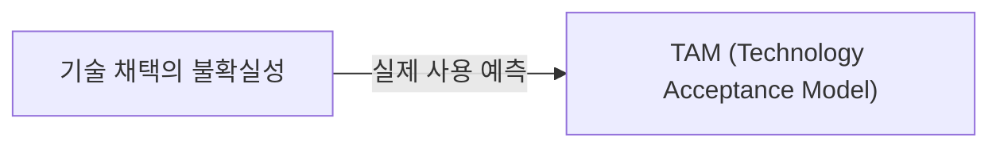
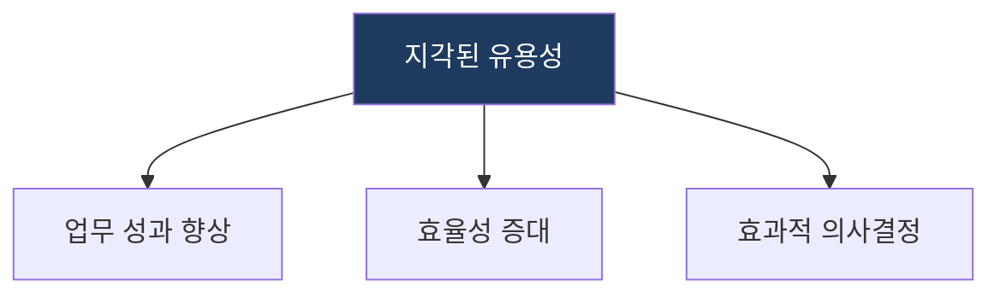
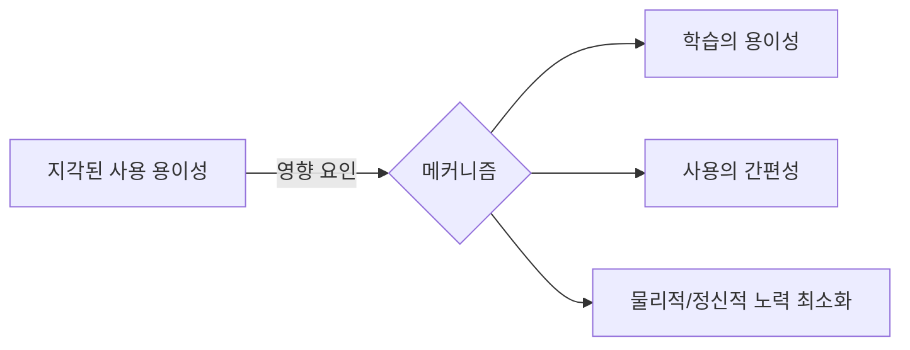

## 1. TAM: 기술 채택 예측 및 수용성 분석 모델

**핵심**: 사용자의 기술 수용 과정을 '지각된 유용성'과 '지각된 사용 용이성'을 중심으로 분석하여 실제 사용을 예측하는 모델.

**특징**:  
 **(핵심 요인 분석)** 기술 수용에 영향을 미치는 지각된 유용성·사용 용이성 두 핵심 변수를 분석.  
 **(태도·행동 예측)** 외부 변수 → 유용성·용이성 → 태도 → 행동의사 → 실제 사용으로 이어지는 인과 경로를 예측.  

---

## 2. TAM의 수용 분석 모델 및 전략 체계

### 가. 지각된 유용성 (Perceived Usefulness)
(기술 사용이 업무 성과를 향상시킬 것이라는 믿음)

* **성능 향상**: 특정 시스템 도입이 업무 처리 속도나 정확도를 얼마나 높이는가.
* **효과성**: 조직의 목표 달성에 기술이 어느 정도 기여하는가.

### 나. 지각된 사용 용이성 (Perceived Ease of Use)
(기술을 사용하기 위해 노력할 필요가 없다는 믿음 - 전략적 메커니즘)

| 구성 항목 | 상세 대응 메커니즘 | 역할 |
|---|---|---|
| **학습 용이성** | UI/UX 직관성 및 매뉴얼 최적화 | 사용자 적응 시간 단축 |
| **사용 간편성** | 입력 데이터 최소화 및 자동화 | 반복 업무 부담 완화 |
| **노력 최소화** | 복잡한 기능의 추상화/간소화 | 거부감 감소 및 지속적 사용 유도 |

---

## 3. 기대효과 및 활용 방안
| 구분 | 기대효과 | 활용 방안 |
|---|---|---|
| **전략** | 기술 도입 성공률 제고 | 신규 시스템 도입 전 사용자 수용도 사전 진단 |
| **운영** | 사용자 저항 최소화 | 사용성 향상을 위한 UI/UX 개선 로드맵 수립 |
| **기술** | 기능 최적화 | 사용자가 느끼는 유용성을 극대화하는 핵심 기능 고도화 |
