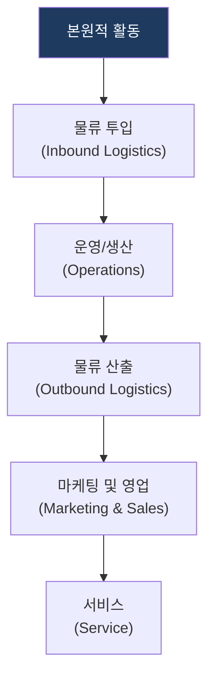
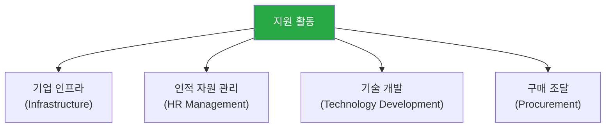

# 포터의 가치 사슬 (Value Chain)

## 1. 개요

**개념**: 기업 활동에서 부가가치가 생성되는 과정을 분석하여, 경쟁 우위의 원천을 파악하고 전략적으로 최적화하는 분석 모델.

**특징**: 
- 기업 활동을 가치 창출 단위로 분해.
- 원가 우위 및 차별화 전략 수립의 기반 제공.

---

## 2. 가치 사슬 분석 모델 및 전략 체계

### 가. 본원적 활동 (Primary Activities)
(제품의 물리적 생성, 판매, 인도, 지원과 관련된 직접적인 활동)

* **물류 투입**: 원자재 수령, 보관, 재고 관리 등 투입 단계 활동.
* **운영/생산**: 투입 자원을 최종 제품으로 변환하는 핵심 생산 활동.
* **물류 산출/영업/서비스**: 완제품 유통, 마케팅, 판매 및 사후 관리 활동.

### 나. 지원 활동 (Support Activities)
(본원적 활동을 가능하게 하고 조직 전체의 효율성을 지원하는 활동)

| 구분 | 주요 메커니즘 | 역할 |
|---|---|---|
| **기업 인프라** | 경영 지원 및 기획 관리 | 전사적 의사결정 및 자원 통합 관리 |
| **인적 자원** | 인적 역량 확보 및 개발 | 핵심 인재 확보를 통한 기업 경쟁력 강화 |
| **기술 개발** | R&D 및 정보 시스템 혁신 | 제품 혁신 및 생산 공정 고도화 |
| **구매 조달** | 공급망 관리 및 구매 프로세스 | 공급망 최적화를 통한 비용 효율성 확보 |

---

## 3. 기대효과 및 활용 방안
| 구분 | 기대효과 | 활용 방안 |
|---|---|---|
| **전략** | 경쟁 우위 원천 식별 | 타사 대비 강점/약점 분석 및 핵심 역량 강화 |
| **운영** | 비용 구조 최적화 | 밸류체인별 원가 분석을 통한 비효율 제거 |
| **기술** | 차별화 전략 수립 | IT 시스템을 활용한 공정 혁신 및 지원 활동 자동화 |
