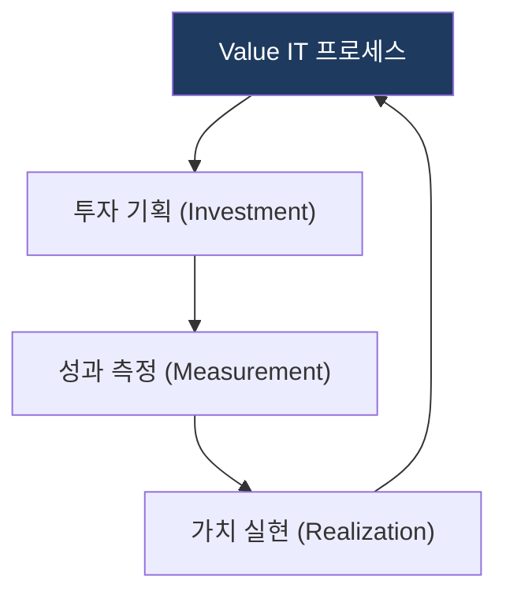
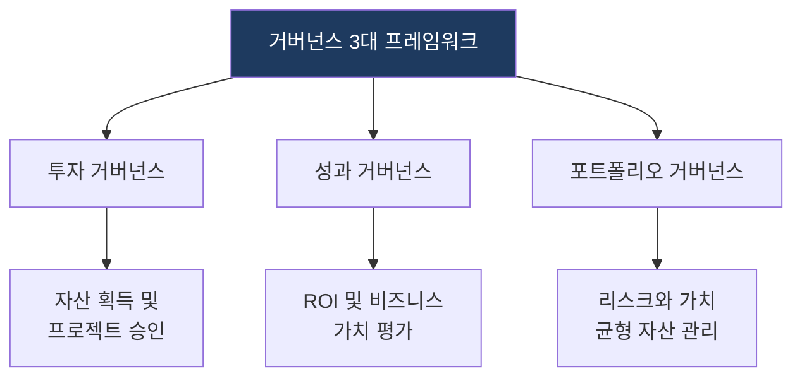

# Value IT (IT 가치 실현 프레임워크)

## 1. IT 투자를 비즈니스 가치로 전환하는 투자 포트폴리오 정렬 프레임워크, Value IT의 개요

**정의**: IT 투자가 단순한 비용 지출이 아닌 비즈니스 가치로 실현되도록 투자 포트폴리오, 프로젝트 성과, 비즈니스 목표를 정렬하는 프레임워크.

**특징**:  
 **(경제적 타당성)** 경제적 타당성 검증 및 재무적 평가.  
 **(거버넌스·성과 관리)** 거버넌스 기반의 IT 자산 관리 및 정량적 성과 관리.  

---

## 2. Value IT의 도메인 설계 모델 및 전략적 전술 체계

### 가. 가치 실현 프로세스 (핵심 구성 요소)
(IT 투자가 비즈니스 가치로 전환되는 순환 구조)

* **투자 기획**: 비즈니스 목표와 연계된 IT 투자 안 식별 및 우선순위 결정.
* **성과 측정**: IT 산출물의 성과를 KPI 기반으로 정량/정성 평가.
* **가치 실현**: 측정된 성과를 비즈니스 가치로 재투자 및 최적화.

### 나. 거버넌스 3대 프레임워크 (전략적 전술 체계)
(IT 투자 성과 극대화를 위한 3대 핵심 거버넌스 메커니즘)

* **투자 거버넌스**: IT 자산의 획득 및 프로젝트 승인, 우선순위 결정 체계.
* **성과 거버넌스**: ROI 및 비즈니스 가치 중심의 정량적 성과 평가 체계.
* **포트폴리오 거버넌스**: IT 투자 자산의 리스크와 가치 균형 관리 체계.

---

## 3. 기대효과 및 활용 방안
| 구분 | 기대효과 | 활용 방안 |
|---|---|---|
| **전략** | 비즈니스 가치 정렬 | 전사 경영 목표와 IT 예산의 실시간 정렬 |
| **운영** | IT 투자 효율성 증대 | 비효율적 IT 프로젝트의 조기 식별 및 폐기 |
| **기술** | 가치 중심 의사결정 문화 | 성과 데이터 기반의 객관적 IT 투자 우선순위 결정 |
