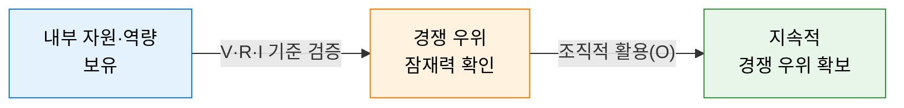
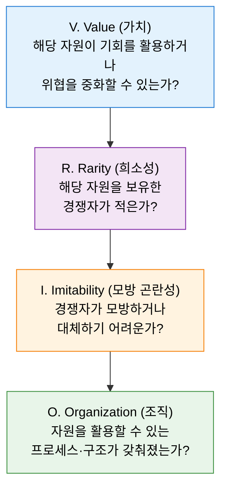
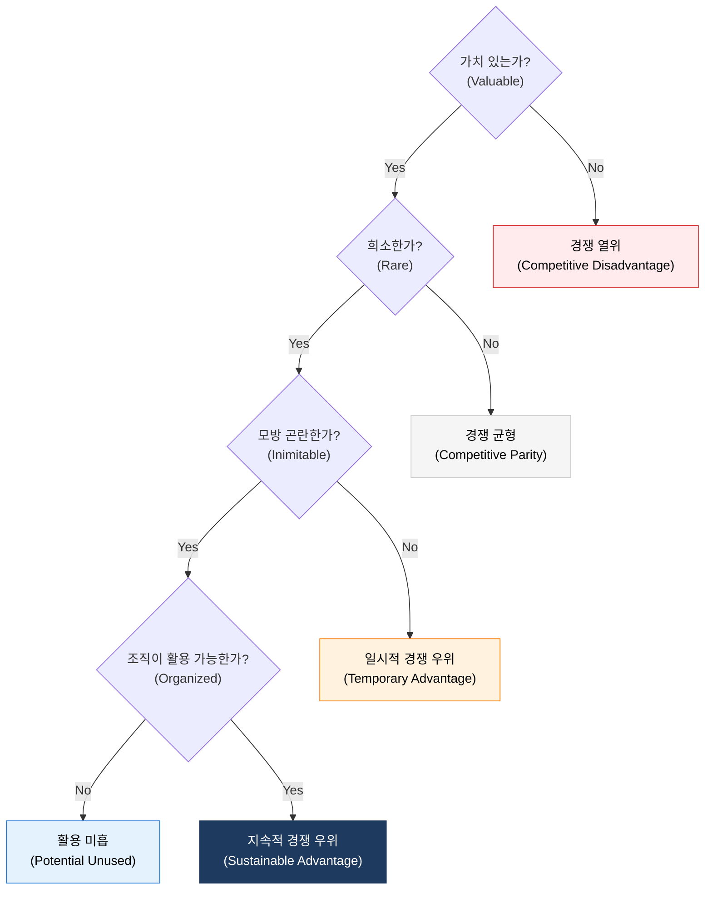

# VRIO 분석
**VRIO Framework**

## 1. 내부 자원의 전략적 가치를 판별하는 경쟁 우위 진단 도구, VRIO 분석의 개요

**개념**: 기업이 보유한 자원과 역량이 경쟁 우위의 원천이 될 수 있는지를 가치(Value), 희소성(Rarity), 모방 곤란성(Imitability), 조직(Organization)의 네 가지 기준으로 평가하는 **자원 기반 관점(RBV: Resource-Based View)** 의 전략 분석 프레임워크.

**특징**:
- 외부 환경 분석(Porter's 5 Forces) 중심의 산업 구조 분석을 보완하는 내부 자원 중심의 접근법.
- 네 가지 기준의 충족 여부에 따라 경쟁 열위 → 경쟁 균형 → 일시적 우위 → 지속적 우위로 단계적 분류.
- IT 시스템, 데이터, 인적 역량 등 무형 자원의 전략적 가치 평가에 효과적으로 적용 가능.

---

## 2. VRIO 분석의 구성 체계 및 평가 모델

### 가. 가치(Value), 희소성(Rarity), 모방 곤란성(Imitability), 조직(Organization)

| 기준 | 핵심 질문 | 모방 곤란성의 원천 |
|---|---|---|
| **가치 (Value)** | 외부 기회를 활용하거나 위협을 방어할 수 있는가? | 기본 조건 — 없으면 경쟁 열위 |
| **희소성 (Rarity)** | 현재 및 잠재 경쟁자가 동일 자원을 보유하지 않는가? | 희소한 자원만이 경쟁 우위를 가능케 함 |
| **모방 곤란성 (Imitability)** | 역사적 조건, 인과적 모호성, 사회적 복잡성으로 복제가 어려운가? | 지속성의 핵심 — 특허, 문화, 노하우 등 |
| **조직 (Organization)** | 가치 창출을 위한 구조, 프로세스, 통제 시스템이 정비되어 있는가? | 자원의 잠재력을 실제 성과로 전환하는 조건 |

---

### 나. 지속적 경쟁 우위 — VRIO 판정 매트릭스

| V | R | I | O | 경쟁적 함의 | 경제적 성과 |
|---|---|---|---|---|---|
| No | - | - | - | 경쟁 열위 | 평균 이하 |
| Yes | No | - | - | 경쟁 균형 | 평균 수준 |
| Yes | Yes | No | - | 일시적 경쟁 우위 | 평균 이상 (한시적) |
| Yes | Yes | Yes | No | 활용 미흡 | 평균 이상 (잠재) |
| Yes | Yes | Yes | Yes | **지속적 경쟁 우위** | **평균 이상 (지속)** |

---

## 3. VRIO 분석의 기대효과 및 활용 방안

| 구분 | 주요 기대효과 | 활용 및 실무 적용 방안 |
|---|---|---|
| **전략적 자원 선별** | 핵심 역량 집중 투자 | VRIO 매트릭스 기반으로 IT 자원의 전략적 우선순위 결정 |
| **IT 투자 타당성** | 무형 자산의 가치 정량화 | 데이터, AI 모델, 플랫폼 등의 전략적 자산 가치 평가에 적용 |
| **경쟁 전략 수립** | 지속 우위 원천 보호 | 모방 곤란성 강화를 위한 특허, 내재화 전략 수립 |
| **조직 역량 진단** | 자원-조직 정합성 확보 | 보유 자원을 실현할 수 있는 프로세스·구조 개선 과제 도출 |
