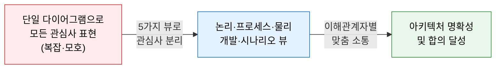
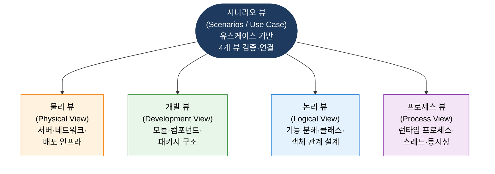
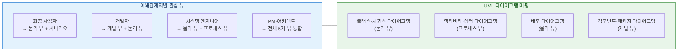

# 4+1 View Model
**Philippe Kruchten의 소프트웨어 아키텍처 다중 관점 모델**

## 1. 5가지 뷰로 이해관계자별 아키텍처 관심사를 분리하여 표현하는 모델, 4+1 View Model의 개요

**정의**: Philippe Kruchten이 제안한 소프트웨어 아키텍처 표현 프레임워크로, 복잡한 시스템을 **논리(Logical), 프로세스(Process), 물리(Physical), 개발(Development)** 의 4개 뷰와 이를 검증하는 **시나리오(Scenarios)** 뷰(+1)로 분리하여 이해관계자별 관심사를 체계적으로 전달하는 모델.

**특징**:  
 **(다관점 분리)** 단일 아키텍처를 **여러 관점(View)** 으로 분리하여 각 이해관계자가 필요한 관점만 집중적으로 이해.  
 **(UC 뷰 접착제)** 시나리오(Use Case) 뷰가 나머지 4개 뷰를 연결·검증하는 **접착제(Glue)** 역할 수행.  
 **(UML 연계)** UML 다이어그램과 자연스럽게 연계되어 소프트웨어 설계 문서화의 실무 표준으로 활용.  

---

## 2. 4+1 View Model의 핵심 구성 체계

### 가. 5가지 뷰 구성

| 뷰 | 관심사 | 주요 표현 요소 | 대상 이해관계자 |
|---|---|---|---|
| **논리 뷰** | 기능적 요구사항 충족 방법, 객체 지향 분해 | 클래스 다이어그램, 시퀀스 다이어그램 | 최종 사용자, 설계자 |
| **프로세스 뷰** | 런타임 동작, 동시성·성능·가용성 | 액티비티 다이어그램, 상태 다이어그램 | 시스템 통합자, 성능 엔지니어 |
| **물리 뷰** | 소프트웨어와 하드웨어의 매핑, 배포 구성 | 배포 다이어그램, 인프라 구성도 | 시스템 엔지니어, DevOps |
| **개발 뷰** | 소프트웨어 모듈 구성, 빌드·관리 용이성 | 컴포넌트 다이어그램, 패키지 구조 | 개발자, 프로젝트 관리자 |
| **시나리오 뷰** | 4개 뷰의 일관성 검증, 유스케이스 기반 검증 | 유스케이스 다이어그램, 시나리오 기술 | 모든 이해관계자 |

---

### 나. 뷰별 이해관계자 및 아키텍처 문서화

**아키텍처 문서화 실무 적용**

| 단계 | 활동 | 산출물 |
|---|---|---|
| **요구사항 분석** | 이해관계자 식별 및 관심사 목록화 | 이해관계자 목록, 유스케이스 목록 |
| **시나리오 도출** | 핵심 유스케이스 선정 (전체의 10~20%) | 유스케이스 다이어그램, 시나리오 기술서 |
| **뷰별 설계** | 4개 뷰를 시나리오 기반으로 순차 설계 | 뷰별 UML 다이어그램 세트 |
| **일관성 검증** | 시나리오로 4개 뷰 간 충돌·누락 검증 | 아키텍처 검토 보고서 |
| **문서화·배포** | 이해관계자별 맞춤 아키텍처 문서 제공 | SAD(소프트웨어 아키텍처 문서) |

---

## 3. 4+1 View Model 적용의 기대효과 및 활용 방안

| 구분 | 주요 기대효과 | 활용 및 실무 적용 방안 |
|---|---|---|
| **소통 명확화** | 이해관계자별 맞춤 관점 제공으로 오해 최소화 | EA 수립 시 TOGAF ADM과 연계하여 산출물 체계화 |
| **복잡성 관리** | 대형 시스템의 아키텍처를 관심사별로 분리·관리 | MSA 설계 시 서비스별 4+1 뷰 적용으로 의존성 가시화 |
| **품질 검증** | 시나리오 기반 검증으로 설계 누락·충돌 조기 탐지 | 아키텍처 리뷰 체크리스트에 5개 뷰 완전성 기준 반영 |
| **문서 표준화** | UML과의 자연스러운 연계로 일관된 아키텍처 문서 생산 | 프로젝트 착수 시 SAD 템플릿으로 4+1 뷰 구조 제공 |
