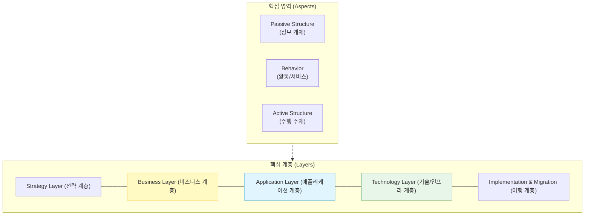
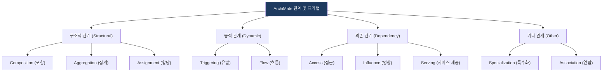

# ArchiMate
**Enterprise Architecture Modeling Language**

## 1. 아키텍처 시각화의 국제 표준, ArchiMate의 개요

**개념**: 전사 아키텍처(EA) 내의 비즈니스 프로세스, 조직 구조, 정보 흐름, IT 시스템 및 인프라 간의 관계를 시각적으로 표현하기 위한 개방형 모델링 언어.

**특징**: TOGAF와 높은 호환성을 가지며, 계층(Layer) 간 수직적 연관성과 영역(Aspect) 간 수평적 관계를 정형화된 표기법으로 제공.

---

## 2. ArchiMate의 계층 구조 및 핵심 프레임워크

### 가. ArchiMate 코어 프레임워크 (Layers & Aspects)

| 계층 (Layer) | 설명 | 주요 요소 |
|---|---|---|
| **Strategy** | 조직의 비전, 목표, 역량 및 가치 흐름 표현 | Resource, Capability, Course of Action |
| **Business** | 비즈니스 프로세스, 역할, 제품 및 서비스 모델링 | Business Actor, Role, Process, Product |
| **Application** | 소프트웨어 구성 요소 및 이들 간의 상호작용 표현 | Application Component, Service, Interface |
| **Technology** | 하드웨어, 소프트웨어 플랫폼, 네트워크 인프라 기술 | Node, System Software, Device, Path |

---

### 나. ArchiMate 요소 간의 관계 및 표기법

| 유형 | 명칭 | 기호 설명 |
|---|---|---|
| **Serving** | 서비스 제공 | 한 계층의 서비스가 다른 계층의 활동을 지원하는 관계 |
| **Realization** | 실체화 | 물리적/논리적 개체가 추상적 서비스를 구현하는 관계 |
| **Assignment** | 할당 | 액터(Actor)가 특정 활동(Behavior)을 수행하도록 지정 |

---

## 3. ArchiMate 도입 시 기대효과 및 활용 방안

| 구분 | 주요 기대효과 | 활용 및 실무 적용 방안 |
|---|---|---|
| **의사소통** | 가독성 높은 시각화 | 표준화된 다이어그램을 통해 비즈니스와 IT 부서 간 이해도 증진 |
| **추적성** | 계층 간 영향도 분석 | 전략부터 인프라까지 연결된 관계를 분석하여 변경 영향도 최소화 |
| **통합성** | TOGAF와 상호 보완 | TOGAF ADM의 각 단계에서 생성되는 아티팩트 모델링 표준으로 활용 |
