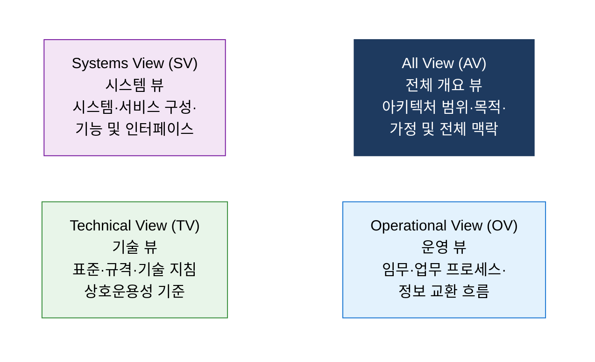

# DoDAF
**Department of Defense Architecture Framework**

## 1. 복잡한 국방 시스템을 다중 관점으로 표현하는 미 국방부 EA 프레임워크, DoDAF의 개요

**정의**: 미 국방부(DoD)가 복잡한 국방 시스템·사업·조직 간의 아키텍처를 **표준화된 뷰(View) 체계** 로 기술하여 상호운용성 확보, 시스템 획득 효율화, 의사결정 지원을 실현하는 엔터프라이즈 아키텍처 프레임워크.

**특징**:
- **All View(AV), Operational View(OV), Systems View(SV), Technical View(TV)** 의 4대 뷰 체계(DoDAF 1.0 기준)에서 DoDAF 2.0에서 8개 뷰 계층으로 확장.
- TOGAF·Zachman과 달리 **국방·군사·보안 도메인 특화** — 임무(Mission) 중심 아키텍처 설계.
- 미 국방부 JCIDS(합동능력통합개발시스템) 및 국내 국방 정보화 체계와 연계.

---

## 2. DoDAF의 핵심 구성 체계

### 가. 아키텍처 뷰 체계

| 뷰 | 핵심 질문 | 주요 산출물 | 대상 이해관계자 |
|---|---|---|---|
| **All View (AV)** | 이 아키텍처는 무엇을 위한 것인가? | AV-1(개요), AV-2(통합 사전) | 모든 이해관계자 |
| **Operational View (OV)** | 임무를 어떻게 수행하는가? | OV-1(고수준 개념), OV-5(운영 활동) | 작전·운영 기획자 |
| **Systems View (SV)** | 어떤 시스템이 운영을 지원하는가? | SV-1(시스템 인터페이스), SV-4(기능 설명) | 시스템 엔지니어 |
| **Technical View (TV)** | 어떤 표준·기술을 적용하는가? | TV-1(기술 표준 프로파일) | 기술 아키텍트 |

**DoDAF 2.0 확장 뷰 체계**

| 추가 뷰 | 설명 |
|---|---|
| **Capability View (CV)** | 능력(Capability) 요구사항과 현재 능력 간 갭 분석 |
| **Project View (PV)** | 프로그램·사업 일정 및 투자 계획 |
| **Services View (SvcV)** | SOA 기반 서비스 아키텍처 표현 |
| **Data & Information View (DIV)** | 데이터 모델 및 정보 구조 |

---

### 나. 국방 IT 아키텍처 적용 및 국내 연계

**DoDAF vs 타 EA 프레임워크 비교**

| 비교 항목 | DoDAF | TOGAF | Zachman |
|---|---|---|---|
| **주요 대상** | 국방·군사·정보 기관 | 민간 엔터프라이즈 전반 | EA 분류 체계 범용 |
| **중심 개념** | 임무(Mission)·능력(Capability) | 비즈니스 프로세스·IT 정렬 | 6×6 분류 매트릭스 |
| **방법론** | 다중 뷰 기반 아키텍처 기술 | ADM 순환 프로세스 | 분류 체계(비 방법론) |
| **강점** | 상호운용성·획득 일관성 | 변화 관리·재사용 | 완전성·체계적 분류 |
| **국내 연계** | 국방 EA, 합동참모 아키텍처 | 공공기관 EA, 금융 EA | EA 문서화 보조 |

---

## 3. DoDAF 적용의 기대효과 및 활용 방안

| 구분 | 주요 기대효과 | 활용 및 실무 적용 방안 |
|---|---|---|
| **상호운용성** | 이기종 국방 시스템 간 표준 인터페이스 확보 | OV·SV 산출물로 시스템 간 정보 교환 명세화 |
| **획득 효율화** | 중복 투자 방지 및 재사용 가능 컴포넌트 식별 | SV 기반 현행-목표 아키텍처 갭 분석 수행 |
| **의사결정 지원** | 아키텍처 데이터 기반의 투자 우선순위 결정 | CV(능력 뷰)로 현재 능력 대비 요구 능력 갭 가시화 |
| **국내 공공 적용** | 국방·공공 정보화 사업의 EA 수립 표준 기반 | 국방 EA 수립 시 DoDAF OV/SV 산출물 체계 준용 |
