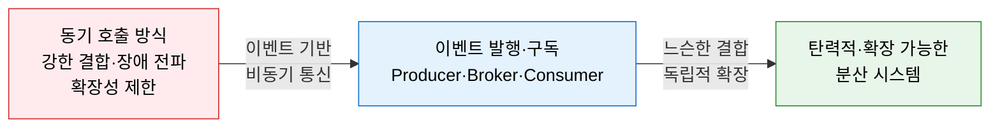
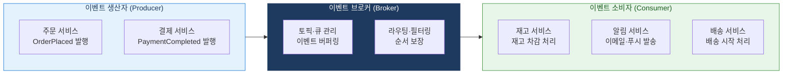
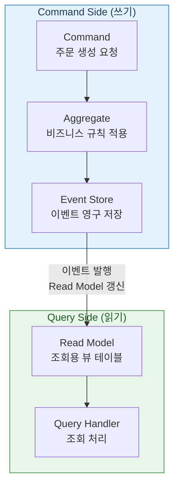

# EDA
**Event-Driven Architecture — 이벤트 주도 아키텍처**

## 1. 시스템 간 동기 호출 의존을 끊고 이벤트를 통해 느슨하게 연결하는 아키텍처, EDA의 개요

**개념**: 시스템 구성 요소들이 **이벤트(Event)** 를 생성·발행·구독·처리하는 방식으로 상호작용하는 아키텍처 패턴으로, 서비스 간 직접 호출 대신 이벤트 브로커를 통해 **비동기·느슨한 결합(Loose Coupling)** 으로 통신하여 확장성과 탄력성을 확보하는 아키텍처.

**특징**:
- 이벤트 생산자(Producer)는 소비자(Consumer)를 알 필요 없어 **서비스 간 독립성 극대화**.
- 비동기 처리로 트래픽 급증 시에도 **이벤트 버퍼링을 통한 탄력적 처리** 가능.
- MSA 환경에서 서비스 간 통신의 표준 패턴으로 Saga·CQRS·Event Sourcing과 결합.

---

## 2. EDA의 핵심 구성 체계

### 가. 이벤트 기반 통신 구조

| 구성 요소 | 역할 | 대표 기술 |
|---|---|---|
| **Event Producer** | 비즈니스 이벤트 발생 시 이벤트 생성·발행 | Spring ApplicationEvent, Kafka Producer |
| **Event Broker** | 이벤트 수신·저장·라우팅·전달 중개 | Apache Kafka, RabbitMQ, AWS EventBridge |
| **Event Consumer** | 관심 있는 이벤트를 구독하여 비즈니스 로직 처리 | Kafka Consumer, Spring @EventListener |
| **Event Schema** | 이벤트 구조 표준화 및 하위 호환성 관리 | Avro, JSON Schema, Protocol Buffers |

**이벤트 전달 방식 비교**

| 방식 | 특징 | 적합 유스케이스 |
|---|---|---|
| **Simple Event** | 상태 변화 사실만 통보 (최소 정보) | 알림·트리거 |
| **Event Carried State Transfer** | 이벤트에 변경된 상태 데이터 포함 | 서비스 간 데이터 동기화 |
| **Event Sourcing** | 상태 변경 이벤트를 순서대로 모두 저장 | 감사 로그·타임트래블 |

---

### 나. 이벤트 소싱(Event Sourcing) 및 CQRS 패턴

**이벤트 소싱 vs 전통적 상태 저장**

| 비교 항목 | 이벤트 소싱 | 전통적 상태 저장 |
|---|---|---|
| **저장 방식** | 상태 변경 이벤트를 순서대로 누적 저장 | 현재 상태(스냅샷)만 최신 값으로 덮어쓰기 |
| **이력 추적** | 전체 변경 이력 재생(Replay) 가능 | 이력 삭제·조회 어려움 |
| **감사(Audit)** | 완전한 감사 추적(Audit Trail) 내재화 | 별도 감사 로그 테이블 필요 |
| **복잡성** | 이벤트 설계·Replay 로직 필요 | 단순한 CRUD 패턴 |

**CQRS 핵심 원칙**

| 원칙 | 내용 | 장점 |
|---|---|---|
| **Command와 Query 분리** | 데이터 변경(Command)과 조회(Query)의 모델·저장소 분리 | 각각 독립적 최적화 가능 |
| **Write Model** | 비즈니스 규칙·불변 조건 중심의 Aggregate | 일관성·정합성 보장 |
| **Read Model** | 조회 성능 최적화된 비정규화 뷰 테이블 | 복잡한 조인 없이 빠른 조회 |
| **최종 일관성** | Write→Read 모델 동기화에 약간의 지연 허용 | 높은 확장성·가용성 확보 |

---

## 3. EDA 적용의 기대효과 및 활용 방안

| 구분 | 주요 기대효과 | 활용 및 실무 적용 방안 |
|---|---|---|
| **느슨한 결합** | 서비스 변경·장애가 타 서비스에 전파되지 않음 | MSA 서비스 간 통신을 REST 호출에서 이벤트로 전환 |
| **확장성** | 소비자 수를 늘려 처리량을 수평 확장 | Kafka Consumer Group으로 파티션별 병렬 처리 |
| **감사·추적** | 이벤트 소싱으로 전체 상태 변경 이력 보존 | 금융·의료 등 규제 도메인의 감사 추적 요건 충족 |
| **실시간 처리** | 이벤트 스트림 기반의 실시간 분석·대응 | Kafka Streams·Flink로 실시간 이상 탐지·알림 구현 |
