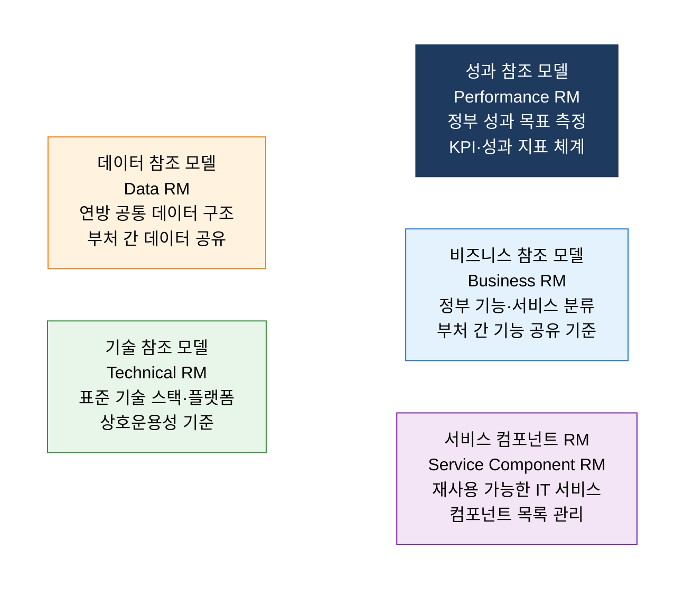
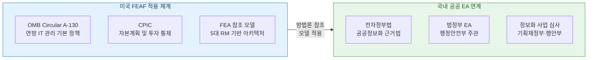

# FEAF
**Federal Enterprise Architecture Framework**

## 1. 미 연방정부 IT 투자를 전략 정렬하고 부처 간 재사용을 실현하는 EA, FEAF의 개요

**정의**: 미국 연방정부가 부처 간 IT 투자의 중복을 방지하고 비즈니스 목표와 IT를 정렬하기 위해 수립한 EA 프레임워크로, **성과·비즈니스·서비스 컴포넌트·데이터·기술** 의 5대 참조 모델(Reference Model)을 통해 정부 전체의 아키텍처를 표준화하는 체계.

**특징**:
- **공유 서비스(Shared Services)** 와 **재사용 가능한 컴포넌트** 식별을 통한 연방 IT 투자 최적화.
- OMB(행정관리예산처) 주도의 연방 IT 투자 심의(CPIC)와 연계하여 예산 배분의 근거로 활용.
- TOGAF·DoDAF와 달리 **정부·공공 부문 특화** — 시민 서비스 제공과 부처 간 협력 중심.

---

## 2. FEAF의 핵심 구성 체계

### 가. 5대 참조 모델 (Reference Models)

| 참조 모델 | 핵심 목적 | 주요 내용 | 활용 방안 |
|---|---|---|---|
| **성과 참조 모델 (PRM)** | 연방 IT 투자의 성과 측정 체계 수립 | 성과 측정 지표, KPI, 결과 연계 구조 | IT 예산 투자 심의 시 성과 연계 근거 |
| **비즈니스 참조 모델 (BRM)** | 정부 기능·서비스 분류 체계 표준화 | 서비스 영역, 비즈니스 기능 분류 | 부처 간 중복 기능 식별 및 통합 |
| **서비스 컴포넌트 RM (SRM)** | 재사용 가능한 IT 서비스 컴포넌트 목록 | 공통 서비스, 지원 서비스, 접근 채널 | 개별 구축 대신 공유 서비스 활용 |
| **데이터 참조 모델 (DRM)** | 연방 공통 데이터 구조 표준화 | 데이터 설명·맥락·공유 체계 | 부처 간 데이터 교환 표준 |
| **기술 참조 모델 (TRM)** | 연방 표준 기술 스택 및 플랫폼 정의 | 표준 기술, 인터페이스, 보안 규격 | 상호운용성 확보 및 벤더 종속 방지 |

---

### 나. 공공 EA 수립 및 국내 연계

**FEAF vs 국내 범정부 EA 비교**

| 비교 항목 | FEAF (미국) | 범정부 EA (한국) |
|---|---|---|
| **주관 기관** | OMB (행정관리예산처) | 행정안전부 |
| **법적 근거** | Clinger-Cohen Act, OMB A-130 | 전자정부법, 정보화촉진기본법 |
| **참조 모델** | 5대 RM (PRM·BRM·SRM·DRM·TRM) | 범정부 EA 참조 모델 (국내 변용) |
| **예산 연계** | CPIC 통해 IT 예산 배분과 직결 | 정보화 사업 심사·타당성 조사 |
| **성숙도** | 연방 전 부처 의무 적용 | 중앙부처 중심, 지자체 확산 중 |

---

## 3. FEAF 도입의 기대효과 및 활용 방안

| 구분 | 주요 기대효과 | 활용 및 실무 적용 방안 |
|---|---|---|
| **중복 투자 방지** | BRM·SRM 기반 부처 간 공통 기능 식별·통합 | 신규 정보화 사업 착수 전 공유 서비스 활용 가능성 검토 |
| **성과 정렬** | PRM으로 IT 투자와 정책 목표 간 연계 명확화 | 예산 요청 시 성과 지표(KPI) 기반 투자 타당성 입증 |
| **상호운용성** | TRM·DRM으로 부처 간 데이터·시스템 연계 표준화 | 행정 데이터 공동 활용 플랫폼 설계 시 DRM 참조 |
| **공공 서비스 혁신** | 시민 중심 통합 서비스 설계 및 디지털 전환 지원 | 범정부 EA와 연계하여 원스톱 민원 서비스 아키텍처 수립 |
