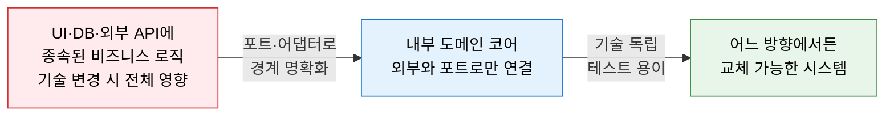
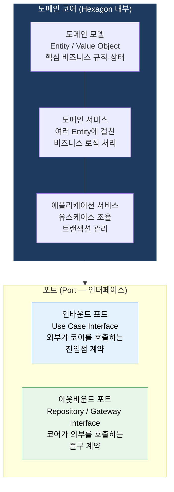
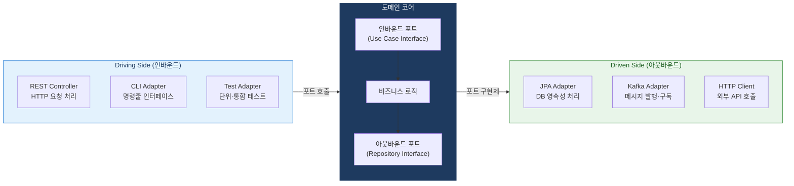

# Hexagonal Architecture
**Ports and Adapters Pattern — 포트와 어댑터 아키텍처**

## 1. 포트·어댑터로 비즈니스 로직을 외부 기술에서 완전히 격리하는 아키텍처, Hexagonal Architecture의 개요

**정의**: Alistair Cockburn이 제안한 아키텍처 패턴으로, 애플리케이션의 핵심 **비즈니스 로직(도메인 코어)** 을 육각형(Hexagon)의 중심에 배치하고, 외부 시스템(UI·DB·외부 API)과의 통신을 **포트(Port, 인터페이스)** 와 **어댑터(Adapter, 구현체)** 를 통해 연결하여 비즈니스 로직이 외부 기술에 전혀 의존하지 않도록 설계하는 아키텍처.

**특징**:  
 **(Driving Side(좌측))** 애플리케이션을 구동하는 외부 (UI·테스트·CLI) — 인바운드 어댑터.  
 **(Driven Side(우측))** 애플리케이션이 구동하는 외부 (DB·메시지·외부 API) — 아웃바운드 어댑터.  
 **(의존성 역전)** Clean Architecture의 개념적 선구자로, 의존성 역전(DIP)을 통해 내부와 외부를 완전히 분리.  

---

## 2. Hexagonal Architecture의 핵심 구성 체계

### 가. 내부 비즈니스 로직 (도메인 코어)

**도메인 코어 구성 요소**

| 요소 | 역할 | 의존 가능 대상 |
|---|---|---|
| **도메인 모델** | 핵심 비즈니스 개념·규칙·불변 조건 표현 | 없음 (가장 순수한 영역) |
| **도메인 서비스** | 단일 Entity에 속하지 않는 도메인 로직 수행 | 도메인 모델만 |
| **애플리케이션 서비스** | 유스케이스 흐름 조율, 포트를 통해 외부 호출 | 도메인 모델·서비스·포트(인터페이스) |
| **인바운드 포트** | 외부가 코어를 호출하기 위한 인터페이스 계약 | 없음 (코어가 정의) |
| **아웃바운드 포트** | 코어가 외부 자원을 사용하기 위한 인터페이스 계약 | 없음 (코어가 정의) |

---

### 나. 포트와 어댑터 연동

| 구분 | 포트 (Port) | 어댑터 (Adapter) |
|---|---|---|
| **정의** | 코어가 정의한 인터페이스 계약 | 포트 인터페이스를 구현하는 외부 기술 코드 |
| **위치** | 도메인 코어 내부 | 도메인 코어 외부 (인프라 계층) |
| **인바운드 예시** | `CreateOrderUseCase` 인터페이스 | `OrderRestController`, `OrderCLIAdapter` |
| **아웃바운드 예시** | `OrderRepository` 인터페이스 | `JpaOrderRepositoryAdapter`, `InMemoryOrderRepository` |
| **교체 방법** | 포트(인터페이스) 유지 | 어댑터(구현체)만 교체 — 코어 코드 무수정 |

**계층형 아키텍처 vs 헥사고날 아키텍처**

| 비교 항목 | 계층형 아키텍처 | 헥사고날 아키텍처 |
|---|---|---|
| **의존성 방향** | 위→아래 단방향 | 모두 코어 방향 (안쪽) |
| **외부 교체** | 하위 계층 전체 수정 | 어댑터만 교체 |
| **테스트** | DB·외부 API 없이 테스트 어려움 | 인메모리 어댑터로 코어 단독 테스트 |
| **복잡도** | 단순·직관적 | 포트·어댑터 설계 초기 비용 존재 |

---

## 3. Hexagonal Architecture 적용의 기대효과 및 활용 방안

| 구분 | 주요 기대효과 | 활용 및 실무 적용 방안 |
|---|---|---|
| **기술 독립성** | DB·UI·프레임워크 교체 시 비즈니스 로직 무수정 | MySQL→MongoDB 교체 시 JPA 어댑터만 교체 |
| **테스트 용이성** | 인메모리 어댑터로 외부 의존 없이 도메인 테스트 | InMemoryRepository로 DB 없이 비즈니스 로직 단위 테스트 |
| **DDD 연계** | Bounded Context 경계와 헥사고날 코어 경계 일치 | MSA 서비스별 독립 헥사고날 적용으로 자율성 확보 |
| **멀티 채널** | 동일 코어에 REST·GraphQL·CLI·메시징 동시 연결 | 하나의 비즈니스 로직으로 Web·Mobile·Batch 동시 서비스 |
