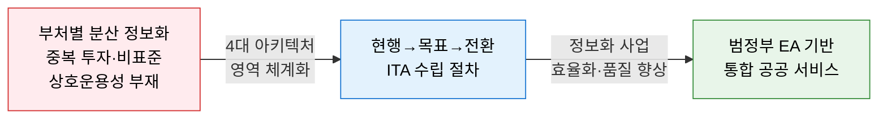
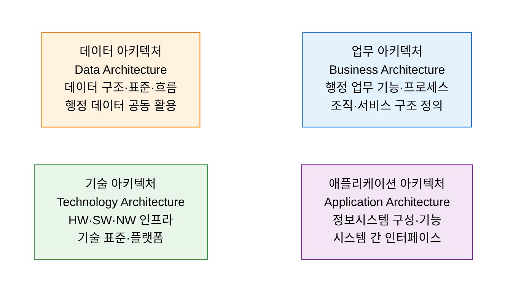
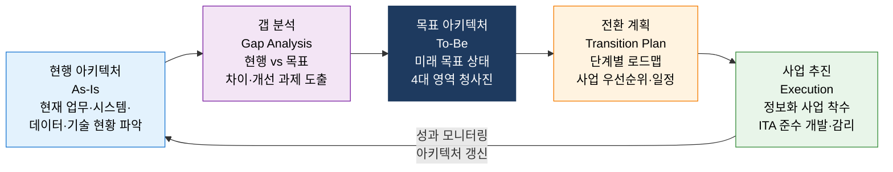

# ITA
**Information Technology Architecture — 정보기술 아키텍처**

## 1. 공공 정보화를 4대 아키텍처 영역으로 체계화하는 한국형 EA 프레임워크, ITA의 개요

**정의**: 「정보기술 아키텍처 도입·운영에 관한 법률」(ITA 법)에 근거하여 공공기관이 정보화 사업 추진 시 **업무(BA)·애플리케이션(AA)·데이터(DA)·기술(TA)** 의 4대 아키텍처 영역을 체계적으로 수립하고, 현행(As-Is)→목표(To-Be)→전환 계획을 통해 정보화 투자의 효율성과 상호운용성을 확보하는 국내 공공 EA 프레임워크.

**특징**:  
 **(법적 근거)** 행정안전부 주관, 공공기관 의무 적용 — 전자정부법·ITA 법 법적 근거.  
 **(범정부 참조 모델)** FEAF·TOGAF를 국내 공공 환경에 맞게 변용한 범정부 EA 참조 모델 기반.  
 **(공공 거버넌스 핵심)** 정보화 사업 심사·예산 배분·감리와 연계되어 공공 정보화 거버넌스의 핵심 체계.  

---

## 2. ITA의 핵심 구성 체계

### 가. ITA 4대 아키텍처 영역

| 아키텍처 영역 | 핵심 내용 | 주요 산출물 |
|---|---|---|
| **업무 아키텍처 (BA)** | 행정 기능 분류·업무 프로세스·서비스 흐름 정의 | 업무 기능 분류표, 업무 흐름도, 서비스 목록 |
| **애플리케이션 아키텍처 (AA)** | 정보시스템 목록·기능·시스템 간 연계 정의 | 애플리케이션 목록, 인터페이스 정의서 |
| **데이터 아키텍처 (DA)** | 데이터 구조·표준코드·데이터 흐름·공동 활용 정의 | 데이터 모델, 표준 용어·코드, 데이터 흐름도 |
| **기술 아키텍처 (TA)** | 하드웨어·소프트웨어·네트워크 인프라·기술 표준 정의 | 기술 참조 모델, 인프라 구성도, 기술 표준 목록 |

**ITA 참조 모델 체계**

| 참조 모델 | 역할 | 연계 영역 |
|---|---|---|
| **업무 참조 모델 (BRM)** | 행정 기능 분류 체계 표준화 | BA 수립의 기준 |
| **서비스 컴포넌트 참조 모델 (SRM)** | 공통 IT 서비스 컴포넌트 목록 | AA 재사용 기준 |
| **데이터 참조 모델 (DRM)** | 행정 데이터 표준 구조·공동 활용 기준 | DA 표준화 기반 |
| **기술 참조 모델 (TRM)** | 표준 기술 스택·플랫폼·인터페이스 규격 | TA 표준화 기반 |

---

### 나. 현행·목표·전환 아키텍처 수립 절차

| 단계 | 주요 활동 | 핵심 산출물 |
|---|---|---|
| **현행 아키텍처 수립** | 4대 영역별 현행 현황 조사·문서화 | 현행 아키텍처 정의서 (BA/AA/DA/TA) |
| **갭 분석** | 현행 대비 목표 차이·중복·비효율 식별 | 갭 분석 보고서, 개선 과제 목록 |
| **목표 아키텍처 수립** | 비전·전략 기반의 미래 4대 영역 청사진 수립 | 목표 아키텍처 정의서, 표준 준수 계획 |
| **전환 계획 수립** | 목표 달성을 위한 사업 로드맵·우선순위 계획 | 전환 계획서, 정보화 사업 포트폴리오 |
| **사업 추진·감리** | ITA 준수 개발 및 감리·성과 측정 | 아키텍처 준수 확인서, 감리 결과 보고서 |

---

## 3. ITA 도입의 기대효과 및 활용 방안

| 구분 | 주요 기대효과 | 활용 및 실무 적용 방안 |
|---|---|---|
| **중복 투자 방지** | 기관 내·기관 간 시스템 중복 구축 사전 식별 | 신규 사업 착수 전 AA 기반 유사 시스템 검토 의무화 |
| **상호운용성 확보** | 표준 인터페이스·데이터 기반 시스템 연계 | DRM·TRM 준수로 부처 간 데이터 공유 기반 마련 |
| **정보화 투자 효율** | 목표 아키텍처 기반의 중장기 사업 계획 | 정보화 사업 심사 시 ITA 산출물 활용으로 투자 타당성 입증 |
| **디지털 전환 지원** | 클라우드·AI 등 신기술 도입의 체계적 거버넌스 | TRM 갱신을 통한 클라우드 네이티브 전환 로드맵 수립 |
