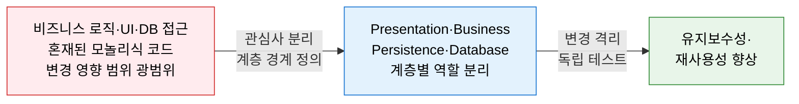
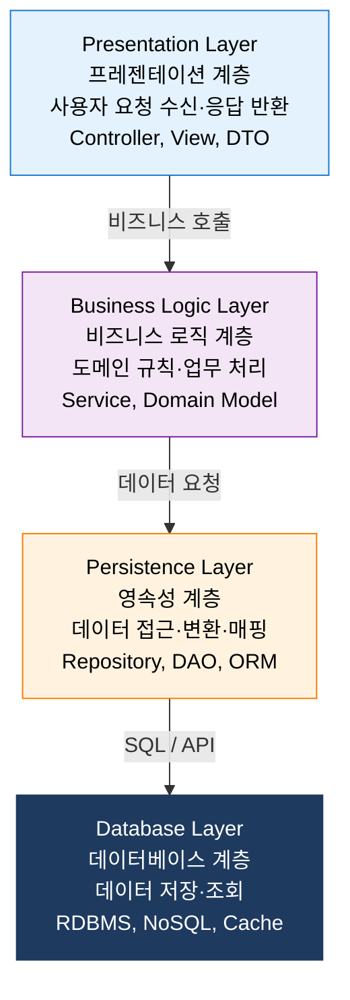
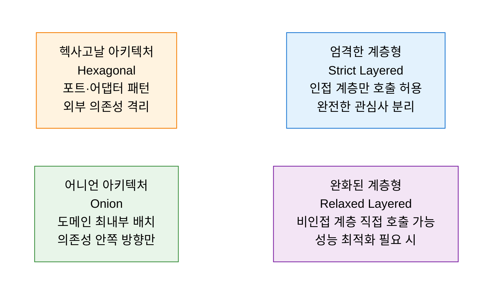

# Layered Architecture
**계층형 아키텍처 — 관심사 분리와 계층별 역할 정의**

## 1. 시스템을 관심사별로 수평 분리하여 변경 영향을 계층 내로 제한하는 아키텍처, 계층형 아키텍처의 개요

**개념**: 소프트웨어 시스템을 **관심사(Concern)** 에 따라 수평적인 계층(Layer)으로 분리하고, 각 계층이 바로 하위 계층에만 의존하도록 설계하는 가장 보편적인 아키텍처 패턴으로, 변경 영향을 계층 내로 제한하고 각 계층을 독립적으로 개발·테스트·교체 가능하게 하는 구조.

**특징**:
- **단방향 의존성**: 상위 계층은 하위 계층을 사용하지만 하위 계층은 상위 계층을 알지 못함.
- **관심사 분리(SoC)**: 각 계층은 하나의 역할에만 집중하여 응집도 향상·결합도 감소.
- 엔터프라이즈 Java(Spring MVC), .NET, Django 등 주요 프레임워크의 **기본 구조적 패턴**.

---

## 2. 계층형 아키텍처의 핵심 구성 체계

### 가. 계층 구조 및 역할 분리

| 계층 | 주요 책임 | 포함 요소 | 교체 가능 예시 |
|---|---|---|---|
| **Presentation** | HTTP 요청 처리, 입력 검증, 응답 직렬화 | Controller, REST API, View Template | Web → CLI → Mobile 교체 |
| **Business Logic** | 도메인 규칙 적용, 트랜잭션 조율, 유스케이스 수행 | Service, Domain Model, Use Case | 비즈니스 규칙 변경 시 이 계층만 수정 |
| **Persistence** | ORM 매핑, CRUD 추상화, 쿼리 최적화 | Repository, DAO, JPA Entity | JPA → MyBatis → JDBC 교체 |
| **Database** | 데이터 저장·조회·인덱싱 | MySQL, PostgreSQL, Redis, MongoDB | DB 교체 시 Persistence 계층만 수정 |

---

### 나. 계층 간 의존성 규칙 및 변형 패턴

**계층 간 의존성 안티패턴**

| 안티패턴 | 설명 | 해결 방법 |
|---|---|---|
| **Architecture Sinkhole** | 요청이 아무 처리 없이 계층을 통과만 함 | 계층 수 최소화, 처리 없는 단순 위임 제거 |
| **계층 건너뛰기** | Presentation이 Persistence를 직접 호출 | 완화된 계층형 도입 또는 인터페이스 경유 |
| **순환 의존** | 하위 계층이 상위 계층을 역참조 | DIP 적용으로 의존성 방향 교정 |
| **뚱뚱한 서비스** | Business Layer에 모든 로직이 집중 | DDD Aggregate로 도메인 모델에 로직 분산 |

**패턴 비교**

| 패턴 | 특징 | 적합 규모 |
|---|---|---|
| **전통적 계층형** | 단순·이해 쉬움·빠른 개발 | 중소 규모 CRUD 애플리케이션 |
| **헥사고날** | 포트·어댑터로 외부 기술 격리 | 테스트·교체가 중요한 복잡한 도메인 |
| **Clean Architecture** | 의존성 역전·도메인 최우선 | 장기 유지보수·대규모 엔터프라이즈 |
| **MSA** | 계층 대신 서비스 단위로 분리 | 독립 배포·확장이 필요한 대규모 시스템 |

---

## 3. 계층형 아키텍처 적용의 기대효과 및 활용 방안

| 구분 | 주요 기대효과 | 활용 및 실무 적용 방안 |
|---|---|---|
| **유지보수성** | 변경 영향이 계층 내로 제한되어 수정 비용 감소 | DB 교체 시 Persistence 계층만 수정, 상위 계층 무영향 |
| **테스트 용이성** | 계층별 독립 단위 테스트·통합 테스트 가능 | Mock 객체로 하위 계층 대체하여 Business Layer 단독 테스트 |
| **팀 분업** | 계층별 전담 팀 구성으로 병렬 개발 가능 | Frontend(Presentation)·Backend(Business)·DBA(DB) 역할 분리 |
| **기술 교체** | 계층 경계를 통한 기술 스택 독립적 교체 | ORM 교체, UI 프레임워크 변경 시 해당 계층만 수정 |
