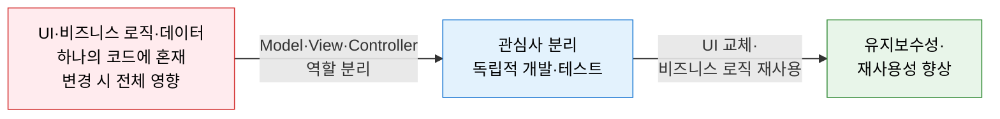
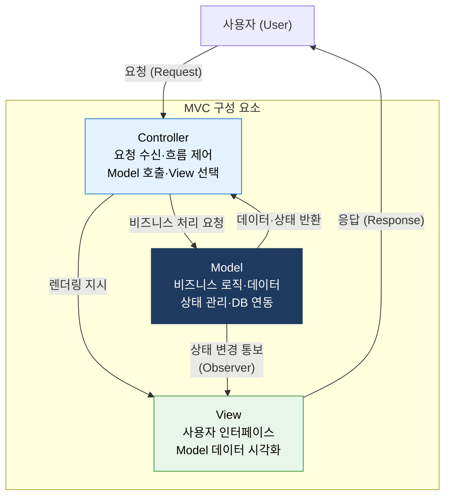
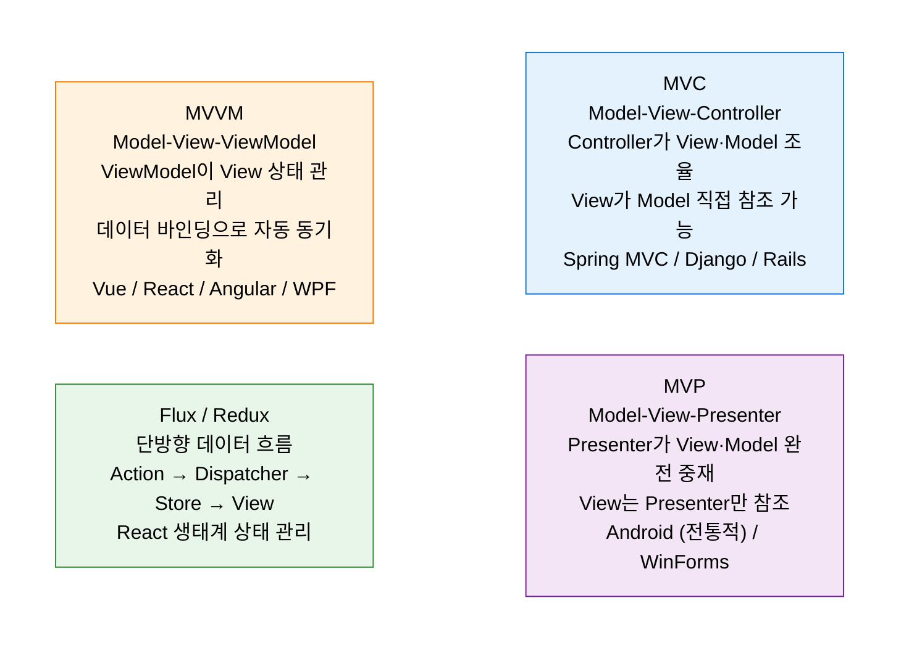

# MVC Pattern
**Model-View-Controller — 사용자 인터페이스와 비즈니스 로직의 관심사 분리 패턴**

## 1. UI·비즈니스 로직·데이터를 세 가지 역할로 분리하여 독립적 개발·변경을 실현하는 패턴, MVC의 개요

**개념**: 애플리케이션을 **Model(데이터·비즈니스 로직), View(사용자 인터페이스), Controller(요청 처리·흐름 제어)** 의 세 가지 역할로 분리하여, 각 컴포넌트가 독립적으로 개발·변경·테스트될 수 있도록 하는 소프트웨어 아키텍처 패턴.

**특징**:
- 1970년대 Smalltalk에서 기원하여 웹·모바일·데스크톱 애플리케이션 전반에 적용되는 **범용 UI 패턴**.
- Spring MVC, Django, Rails, ASP.NET 등 주요 웹 프레임워크의 기반 설계 패턴.
- View와 Model이 직접 통신하여 **View가 Model 변경을 관찰(Observer)** 하는 구조.

---

## 2. MVC 패턴의 핵심 구성 체계

### 가. Model, View, Controller 역할 분리

| 컴포넌트 | 핵심 책임 | 포함 요소 | 변경 유발 요인 |
|---|---|---|---|
| **Model** | 비즈니스 규칙 적용, 데이터 상태 관리, DB 연동 | Entity, Repository, Service, DTO | 비즈니스 규칙·데이터 구조 변경 |
| **View** | 사용자에게 데이터를 시각적으로 표현 | HTML Template, JSP, Thymeleaf, React | UI 디자인·화면 구성 변경 |
| **Controller** | 요청 수신·파라미터 검증·Model 호출·View 선택 | @Controller, @RestController | 요청 흐름·라우팅 변경 |

**MVC 요청 처리 흐름 (Spring MVC 예시)**

| 단계 | 처리 주체 | 설명 |
|---|---|---|
| 1 | **DispatcherServlet** | 모든 HTTP 요청의 진입점 (Front Controller) |
| 2 | **HandlerMapping** | URL 패턴에 맞는 Controller 메서드 탐색 |
| 3 | **Controller** | 비즈니스 로직 호출, ModelAndView 반환 |
| 4 | **ViewResolver** | 논리적 뷰 이름을 실제 View(Template)로 변환 |
| 5 | **View** | Model 데이터를 HTML/JSON으로 렌더링·응답 |

---

### 나. MVC 변형 패턴 (MVP, MVVM)

**MVC·MVP·MVVM 비교**

| 비교 항목 | MVC | MVP | MVVM |
|---|---|---|---|
| **중재자** | Controller | Presenter | ViewModel |
| **View-Model 관계** | View가 Model 직접 참조 가능 | Presenter가 완전 중재 | 데이터 바인딩으로 자동 동기화 |
| **테스트 용이성** | Controller 단위 테스트 용이 | Presenter 단위 테스트 용이 | ViewModel 단위 테스트 용이 |
| **View 독립성** | 보통 | 높음 (View는 인터페이스만) | 높음 (바인딩으로 분리) |
| **적합 환경** | 서버사이드 렌더링 웹 | Android·데스크톱 앱 | 클라이언트사이드 SPA·WPF |
| **대표 프레임워크** | Spring MVC, Django, Rails | Android MVP, WinForms | Vue, Angular, WPF, Kotlin |

---

## 3. MVC 패턴 적용의 기대효과 및 활용 방안

| 구분 | 주요 기대효과 | 활용 및 실무 적용 방안 |
|---|---|---|
| **관심사 분리** | UI 변경이 비즈니스 로직에 영향 없음 | 디자이너(View)·백엔드(Model)·풀스택(Controller) 병렬 개발 |
| **테스트 용이성** | Model을 UI 없이 독립 단위 테스트 가능 | JUnit으로 Service·Repository 단위 테스트, Mock View 활용 |
| **재사용성** | 동일 Model로 Web·API·모바일 뷰 제공 | REST API 설계 시 Model 재사용, View만 교체 |
| **유지보수성** | 화면 변경 시 View만, 로직 변경 시 Model만 수정 | 레거시 UI 현대화 시 View 교체로 점진적 마이그레이션 |
