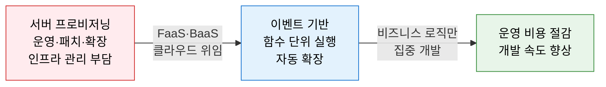
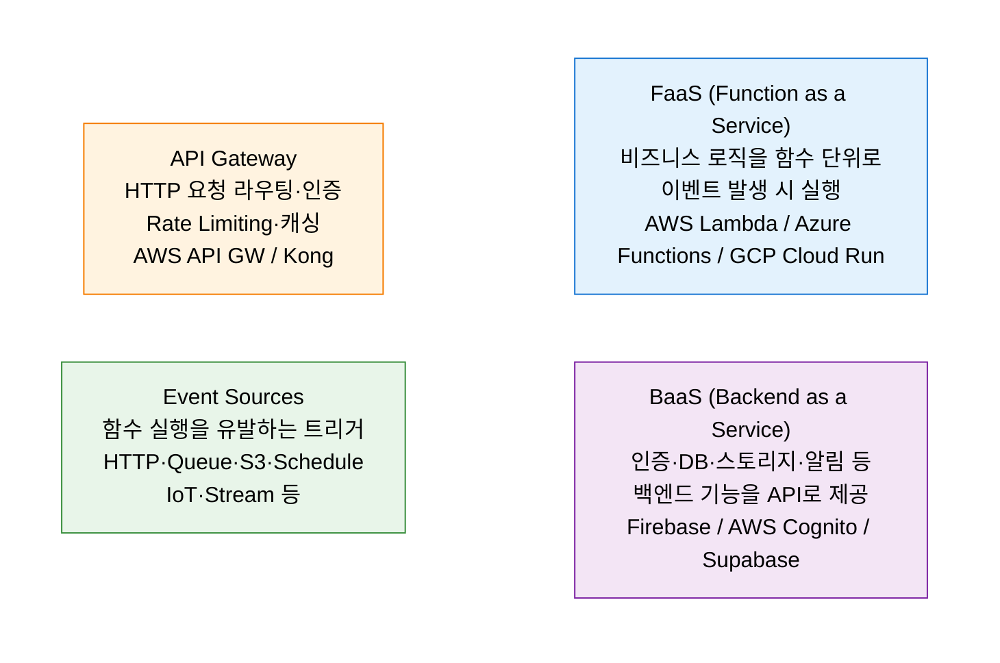
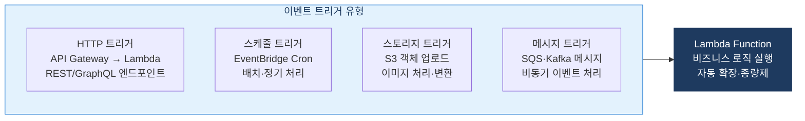

# Serverless Architecture
**서버리스 아키텍처 — 인프라 관리 없이 코드에만 집중하는 클라우드 네이티브 패턴**

## 1. 서버 프로비저닝·운영 없이 이벤트에 반응하는 함수 단위로 비즈니스 로직을 실행하는 아키텍처, Serverless의 개요

**개념**: 개발자가 서버 인프라를 직접 관리하지 않고, 클라우드 제공자가 실행 환경을 완전히 관리하는 아키텍처로, **FaaS(Function as a Service)** 와 **BaaS(Backend as a Service)** 를 결합하여 이벤트에 반응하는 함수 단위로 비즈니스 로직을 구현하는 클라우드 네이티브 패턴.

**특징**:
- **종량제 과금(Pay-per-use)**: 함수 실행 시간·횟수에 따라 과금 — 유휴 시간 비용 없음.
- **자동 확장(Auto-scaling)**: 요청 수에 따라 0→수천 인스턴스 자동 확장·축소.
- **Cold Start 문제**: 첫 호출 시 컨테이너 초기화 지연 발생 — 지속적 부하·Warm-up으로 완화.

---

## 2. Serverless Architecture의 핵심 구성 체계

### 가. FaaS와 BaaS 구성 요소

**서비스 모델 비교**

| 모델 | 관리 범위 | 서버리스 수준 | 대표 서비스 |
|---|---|---|---|
| **IaaS** | OS부터 직접 관리 | 없음 | EC2, GCE, Azure VM |
| **PaaS** | 런타임·OS 관리 위임 | 낮음 | Heroku, App Engine |
| **CaaS** | 컨테이너 오케스트레이션 위임 | 중간 | EKS, GKE, AKS |
| **FaaS** | 실행 환경 전체 위임 | 높음 | Lambda, Cloud Functions |
| **BaaS** | 백엔드 기능 전체 API 제공 | 완전 | Firebase, Supabase |

---

### 나. 확장성 및 이벤트 트리거 모델

**Cold Start 문제 및 완화 전략**

| 구분 | 설명 | 완화 방법 |
|---|---|---|
| **Cold Start 원인** | 첫 호출 또는 스케일아웃 시 컨테이너 초기화 지연 | 수백 ms~수 초 지연 발생 |
| **Warm-up 전략** | 정기적 핑(Ping) 요청으로 컨테이너 활성 상태 유지 | EventBridge 스케줄로 5분마다 호출 |
| **Provisioned Concurrency** | 미리 초기화된 실행 환경 예약 할당 | AWS Lambda Provisioned Concurrency |
| **런타임 최적화** | 경량 런타임(Node.js·Python)·GraalVM 네이티브 빌드 | JVM 대신 Node.js, 불필요한 패키지 제거 |

**Serverless 적합·부적합 유스케이스**

| 적합 유스케이스 | 부적합 유스케이스 |
|---|---|
| 이벤트 기반 비동기 처리 (파일 업로드·알림) | 장시간 실행 작업 (최대 15분 제한) |
| 트래픽 급변 서비스 (마케팅 이벤트) | 극저지연 요구 (Cold Start 부적합) |
| 정기 배치·스케줄 작업 | 상태(State) 유지가 필요한 서비스 |
| API 백엔드·마이크로서비스 | 고정 부하·비용 예측이 중요한 서비스 |

---

## 3. Serverless Architecture 적용의 기대효과 및 활용 방안

| 구분 | 주요 기대효과 | 활용 및 실무 적용 방안 |
|---|---|---|
| **비용 최적화** | 사용한 만큼만 과금 — 유휴 비용 제로 | 트래픽 불규칙한 이벤트 처리·스케줄 배치에 우선 적용 |
| **운영 부담 제거** | 서버 패치·모니터링·확장 관리 불필요 | 소규모 팀에서 인프라 없이 빠른 MVP 출시 |
| **자동 확장** | 트래픽 급증 시 자동 수천 인스턴스 확장 | 계절성·이벤트성 서비스의 탄력적 대응 |
| **MSA 연계** | 서비스별 독립 배포·확장 단위로 활용 | API Gateway + Lambda 조합으로 경량 마이크로서비스 구현 |
