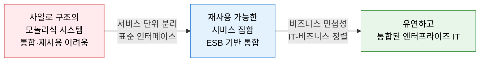
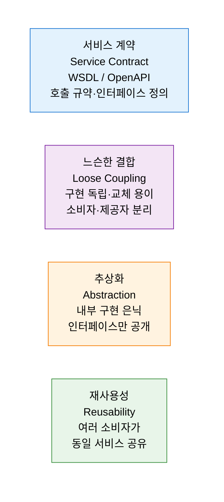
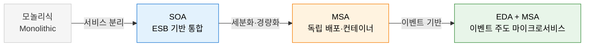

# SOA
**Service-Oriented Architecture — 서비스 지향 아키텍처**

## 1. 비즈니스 기능을 표준 서비스로 분리·재사용하는 엔터프라이즈 아키텍처, SOA의 개요

**정의**: 비즈니스 기능을 독립적으로 배포 가능하고 표준 인터페이스를 통해 호출 가능한 **서비스(Service)** 단위로 분리하고, ESB(Enterprise Service Bus)를 통해 이들을 느슨하게 결합하여 기업 전체의 IT 자산을 공유·재사용하는 엔터프라이즈 아키텍처 패러다임.

**특징**:
- **서비스 계약(Service Contract)**: WSDL·OpenAPI 등 표준 인터페이스로 서비스 간 통신 규약 정의.
- **느슨한 결합(Loose Coupling)**: 서비스 소비자와 제공자가 구현 세부 사항을 몰라도 통신 가능.
- 2000년대 엔터프라이즈 통합의 주류 → MSA로 진화하는 **아키텍처 진화의 중간 단계**.

---

## 2. SOA의 핵심 구성 체계

### 가. 서비스 공유 및 재사용

**SOA 8대 설계 원칙**

| 원칙 | 내용 |
|---|---|
| **서비스 계약** | 표준 인터페이스 문서(WSDL, OpenAPI)로 서비스 기능·입출력 명세 |
| **느슨한 결합** | 서비스 간 의존도 최소화 — 구현 변경이 소비자에게 영향 없음 |
| **추상화** | 내부 로직을 은닉하고 인터페이스만 공개 |
| **재사용성** | 하나의 서비스를 여러 소비자·프로세스가 공유 활용 |
| **자율성** | 서비스는 자신의 논리를 독립적으로 제어 |
| **무상태성** | 서비스 호출 간 상태를 유지하지 않아 확장성 확보 |
| **검색 가능성** | 서비스 레지스트리(UDDI)를 통한 서비스 탐색 |
| **조합성** | 여러 서비스를 조합하여 복합 서비스·프로세스 구성 |

---

### 나. ESB(Enterprise Service Bus) 및 MSA로의 진화

```mermaid
flowchart LR
    subgraph CONSUMERS["서비스 소비자"]
        direction TB
        C1["Web Application"]
        C2["Mobile App"]
        C3["B2B Partner"]
    end

    subgraph ESB_BOX["ESB (Enterprise Service Bus)"]
        direction TB
        E1["메시지 라우팅"]
        E2["프로토콜 변환<br/>SOAP / REST / JMS"]
        E3["오케스트레이션<br/>BPM / BPEL"]
        E4["보안·모니터링"]
    end

    subgraph SERVICES["서비스 제공자"]
        direction TB
        S1["주문 서비스"]
        S2["고객 서비스"]
        S3["재고 서비스"]
        S4["결제 서비스"]
    end

    CONSUMERS --> ESB_BOX --> SERVICES

    style CONSUMERS fill:#E3F2FD,stroke:#1976D2,color:#1E3A5F
    style ESB_BOX   fill:#1E3A5F,stroke:#1E3A5F,color:#fff
    style SERVICES  fill:#E8F5E9,stroke:#388E3C,color:#1B5E20
```

**SOA vs MSA 비교**

| 비교 항목 | SOA | MSA |
|---|---|---|
| **서비스 크기** | 비교적 큰 서비스 단위 (엔터프라이즈 기능) | 매우 작은 서비스 단위 (단일 책임) |
| **통신 방식** | ESB 중심의 중앙 집중 통합 | REST·메시지 큐 기반 직접 통신 |
| **데이터 관리** | 공유 데이터베이스 허용 | 서비스별 독립 DB (Database per Service) |
| **배포 단위** | 서비스 단위 (상대적으로 큼) | 독립 컨테이너·서비스 단위 |
| **결합도** | ESB를 통한 중앙 제어 (상대적 강결합) | 서비스 간 느슨한 결합 극대화 |
| **적합 환경** | 대규모 엔터프라이즈 레거시 통합 | 클라우드 네이티브·빠른 배포 환경 |

**아키텍처 진화 경로**

---

## 3. SOA 적용의 기대효과 및 활용 방안

| 구분 | 주요 기대효과 | 활용 및 실무 적용 방안 |
|---|---|---|
| **레거시 통합** | 이기종 시스템을 ESB로 표준 인터페이스 통합 | ERP·CRM·SCM 간 데이터 연계 허브 구축 |
| **재사용 극대화** | 공통 서비스를 여러 채널이 공유 | 인증·결제·고객 서비스를 공통 서비스로 제공 |
| **비즈니스 민첩성** | 서비스 조합으로 새로운 비즈니스 프로세스 신속 구성 | BPEL·BPM으로 신규 업무 프로세스를 서비스 조합으로 구현 |
| **MSA 전환 기반** | SOA 서비스를 점진적으로 세분화하여 MSA로 전환 | Strangler Fig 패턴으로 레거시 SOA를 MSA로 점진 전환 |
