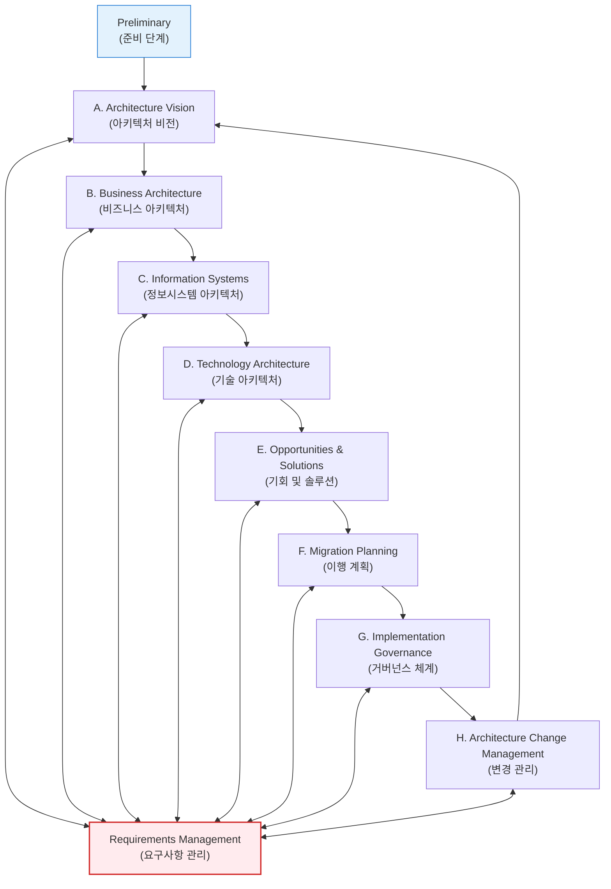
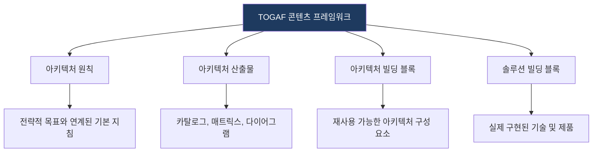

# TOGAF
**The Open Group Architecture Framework**

## 1. 전 세계에서 가장 많이 활용되는 EA 표준, TOGAF의 개요

**개념**: The Open Group에서 개발한 전사 아키텍처(EA) 설계를 위한 표준 프레임워크이자 상세 방법론.

**특징**: **ADM(Architecture Development Method)** 이라는 강력한 순환형 프로세스를 핵심으로 하며, 아키텍처 콘텐츠 프레임워크와 참조 모델을 함께 제공.

---

## 2. TOGAF의 핵심 구성 요소 및 ADM 프로세스

### 가. 아키텍처 개발 방법론 (ADM: Architecture Development Method)

| 단계 | 명칭 | 주요 활동 |
|---|---|---|
| **A** | Architecture Vision | 이해관계자 확인, 아키텍처 범위 설정 및 승인 확보 |
| **B** | Business | 현재/목표 비즈니스 프로세스 정의 및 갭(Gap) 분석 |
| **C** | Info Systems | 데이터 및 애플리케이션 아키텍처 설계 |
| **D** | Technology | 하드웨어, 네트워크 등 인프라 기술 아키텍처 설계 |
| **E-F** | Implementation | 이행 경로 식별 및 상세 로드맵 수립 |

---

### 나. TOGAF 콘텐츠 프레임워크 및 메타모델

| 구성 요소 | 설명 | 비고 |
|---|---|---|
| **Content Metamodel** | 아키텍처 구성 요소 간의 관계를 정의한 모델 | 일관된 문서화 지원 |
| **Enterprise Continuum** | 자산의 재사용을 위한 가상 리포지토리 분류 체계 | Foundation - Org Specific |
| **Capability Framework** | EA 조직 운영 및 역량 강화를 위한 프레임워크 | 조직 R&R 및 성숙도 관리 |

---

## 3. TOGAF 도입을 통한 기대효과 및 활용 방안

| 구분 | 주요 기대효과 | 활용 및 실무 적용 방안 |
|---|---|---|
| **체계적 접근** | 표준화된 아키텍처 수립 | ADM을 활용한 반복 가능하고 검증된 EA 수립 프로세스 정착 |
| **상호 운용성** | 시스템 간 연계성 강화 | 표준 참조 모델을 활용하여 이기종 시스템 간 통합성 제고 |
| **비즈니스 정렬** | IT 투자 효율성 증대 | 비즈니스 요구사항 중심의 IT 자산 포트폴리오 최적화 |
