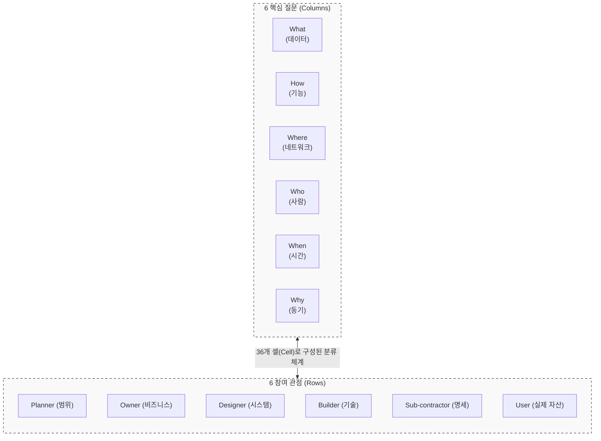
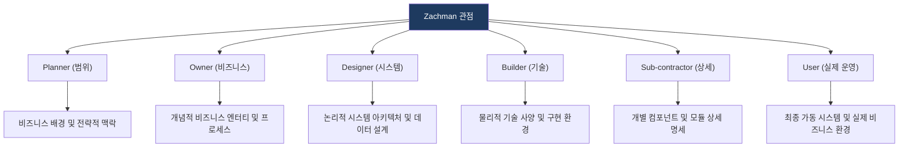

# Zachman Framework
**The Zachman Framework for Enterprise Architecture**

## 1. 전사 아키텍처(EA)의 시조, Zachman 프레임워크의 개요

**개념**: 기업의 복잡한 정보 인프라를 다각도에서 바라보고 분류하기 위해 6개의 관점(Rows)과 6개의 핵심 질문(Columns)으로 구성된 6x6 매트릭스 형태의 분류 체계(Taxonomy).

**특징**: 아키텍처 기술 방법론이 아닌 **분류 체계(Schema)** 로서의 성격이 강하며, 각 셀은 유일하고 상호 배타적인 속성을 가짐.

---

## 2. Zachman 프레임워크의 구성 체계 및 매트릭스 구조

### 가. 6x6 매트릭스 아키텍처 모델

| 구분 | 질문 (Columns) | 설명 |
|---|---|---|
| **What** | 데이터 (Data) | 비즈니스에 사용되는 중요한 개체 및 정보 (Entity) |
| **How** | 기능 (Function) | 비즈니스 프로세스 및 서비스 활동 (Process) |
| **Where** | 네트워크 (Network) | 비즈니스가 수행되는 지리적 위치 및 연결성 (Node) |
| **Who** | 사람 (People) | 비즈니스 주체 및 조직의 R&R (Agent) |
| **When** | 시간 (Time) | 비즈니스 이벤트 발생 시기 및 순서 (Time) |
| **Why** | 동기 (Motivation) | 비즈니스 목표, 전략 및 비즈니스 규칙 (Rule) |

---

### 나. 관점별(Rows) 상세 아키텍처 수준

---

## 3. Zachman 프레임워크의 기대효과 및 활용 방안

| 구분 | 주요 기대효과 | 활용 및 실무 적용 방안 |
|---|---|---|
| **표준화** | 전사 자산의 체계적 분류 | EA 정보의 일관성 유지 및 전사적 의사소통 표준으로 활용 |
| **완전성** | 아키텍처 누락 방지 | 6x6 매트릭스를 활용하여 EA 구축 시 누락된 영역(Gap) 식별 |
| **유연성** | 기술 독립적 아키텍처 | 비즈니스 논리와 구현 기술을 분리하여 변화에 대한 유연한 대응 |
