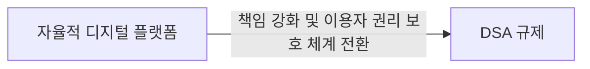

# DSA (Digital Services Act)
**디지털 서비스 책임 강화법**

## 1. 온라인 서비스의 책임 강화 및 이용자 보호, DSA의 개요

**개념**: 유럽 연합(EU)에서 온라인 플랫폼 및 중개 서비스 제공자의 책임성을 강화하고, 온라인 환경에서 이용자의 권리를 보호하며, 불법 콘텐츠 및 서비스 확산을 방지하기 위해 제정된 규제 법안.

**특징**: 서비스 유형별 차등 적용되는 의무, 초대형 온라인 플랫폼(VLOPs) 및 검색 엔진(VLOSEs)에 대한 엄격한 규제, 플랫폼 투명성 증대 및 사용자 권익 보호 강화.

---

## 2. DSA의 핵심 규정 및 구성 요소

### 가. 규제 대상 서비스 유형 및 의무
| 서비스 유형 | 주요 의무 | 비고 |
|---|---|---|
| **중개 서비스 (Intermediary Services)** | - 통지 절차 (Notice and Action) - 이용 약관 투명성  - 블랙리스트 게시 의무 | 단순 전송, 캐싱, DNS 등 |
| **호스팅 서비스 (Hosting Services)** | - 통지 절차 및 조치 의무 - 내부 불만 처리 절차 제공 - 불법 콘텐츠 게시물 신고 및 차단 시스템 | 웹 호스팅, 클라우드 서비스 등 |
| **온라인 플랫폼 (Online Platforms)** | - 위의 의무 +  - 사용자 인터페이스 투명성 - 온라인 분쟁 해결 절차 제공 - 허위 정보 확산 방지 조치 | 마켓플레이스, 소셜 미디어 등 |
| **VLOPs/VLOSEs** (매우 큰 온라인 플랫폼/검색 엔진) | - 위의 의무 +  - 연례 위험 평가 및 완화 조치 - 외부 독립 감사 의무 - 알고리즘 투명성 및 설명 의무 - 데이터 접근 권한 제공 (연구자 등) | 월간 활성 이용자 1,500만 명 이상 (EU 기준) |

### 나. 주요 규제 항목 및 책임 범위
*   **불법 콘텐츠 차단**: 플랫폼은 불법 상품, 서비스, 콘텐츠 유통을 방지하기 위한 조치를 취해야 합니다. 신고 접수 시 신속하게 처리하고, 이용자에게 결정에 대한 설명을 제공해야 합니다.
*   **온라인 플랫폼 책임**:
    *   **투명성**: 이용 약관, 콘텐츠 중재 정책, 알고리즘 추천 시스템 작동 방식 등을 명확히 공개해야 합니다.
    *   **이용자 보호**: 사용자에게 불이익 처분(콘텐츠 삭제 등) 시 명확한 이유를 설명하고, 자체적인 불만 처리 및 외부 분쟁 해결 절차를 제공해야 합니다.
    *   **VLOPs/VLOSEs 의무**: 이들 대형 플랫폼은 불법 콘텐츠 확산을 막기 위한 체계적인 위험 평가를 수행하고, 이를 완화하기 위한 조치를 취해야 합니다. 또한, 추천 시스템 작동 방식 공개 및 독립적인 감사 등 추가적인 투명성 의무가 부과됩니다.

---

## 3. DSA의 중요성 및 기대 효과

| 항목 | DSA의 중요성 | 기대 효과 |
|---|---|---|
| **온라인 생태계 건전성** | 디지털 공간 내 신뢰할 수 있는 환경 조성 | 불법 콘텐츠 감소, 이용자 보호 강화, 건전한 시장 경쟁 촉진 |
| **플랫폼 책임 강화** | 중개 서비스 제공자의 의무 명확화 및 책임 부여 | 온라인 플랫폼의 사회적 책임 증대, 이용자 권익 향상 |
| **소비자 보호** | 온라인 구매 및 서비스 이용 시 투명성 및 안전성 증대 | 허위/과장 광고 및 불공정 거래 관행 감소 |
| **혁신 촉진** | 명확한 규제 프레임워크 제공으로 예측 가능성 증대 | 법규 준수 기반의 공정한 경쟁 환경 조성, 새로운 서비스 등장 촉진 |
| **EU 단일 디지털 시장 강화** | EU 전역에 통일된 규제 적용으로 시장 접근성 및 효율성 증대 | EU 내 디지털 경제 활성화, 국가 간 규제 충돌 완화 |
