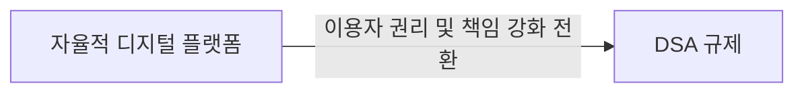
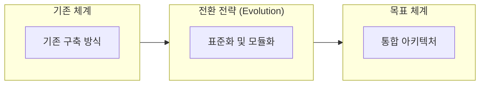

# DSA
**디지털 서비스 책임 강화법**

## 1. 개요

**개념**: 온라인 플랫폼의 불법 콘텐츠 유통을 방지하고 이용자의 기본권을 보호하기 위해 제정된 EU의 디지털 서비스 법안.

**특징**: 초대형 온라인 플랫폼(VLOP)에 대한 엄격한 책임 부과, 투명성 보고 의무화, 알고리즘 기반 추천 시스템의 공개 및 통제.

---

## 2. 핵심 체계 및 진화 관점

### 가. 핵심 원리 및 구성 요소
(프레임워크의 주요 구성 요소, 아키텍처 원리, 관계도 상세 기술)

### 나. 진화 및 전환 관점 (도식화)

## 3. 기대효과 및 활용 방안
| 구분 | 기대효과 | 활용 방안 |
|---|---|---|
| 전략 | 정렬 강화 | 의사결정 지원 |
| 운영 | 체계성 확보 | 유지보수 효율화 |
