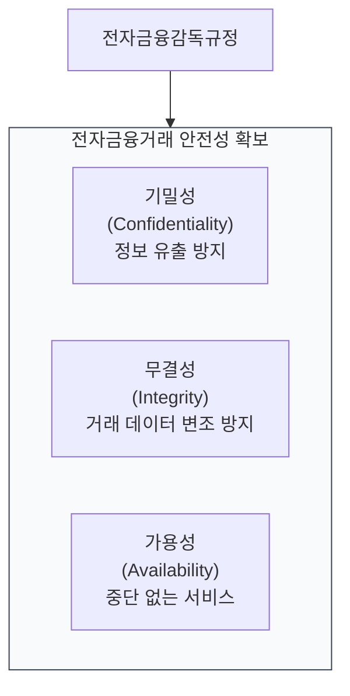
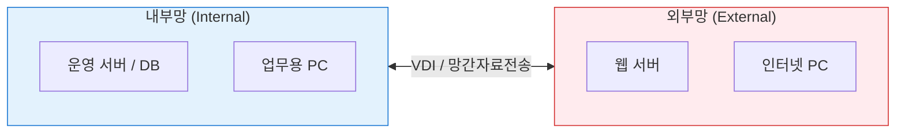

# 전자금융거래법
**Electronic Financial Transactions Act**

## 1. 디지털 금융의 안전성 및 신뢰 확보, 전자금융거래법의 개요

**개념**: 전자금융거래의 법률관계를 명확히 하고, 안전성과 신뢰성을 확보하여 금융산업의 발전을 도모하기 위해 제정된 법률.

**특징**: 전자금융업자의 진입 규제, 이용자 보호 의무, **금융보안** 관련 기술적/관리적 기준 제시(전자금융감독규정 상위법).

---

## 2. 전자금융거래법의 구성 및 주요 규제 체계

### 가. 전자금융 보안의 3대 핵심 기둥

| 핵심 영역 | 주요 요구 사항 | 관련 기술/절차 |
|---|---|---|
| **인증 (Auth)** | 이용자 본인 확인 및 거래 의사 확인 | 공인인증서(대체수단 포함), OTP, 생체인증 |
| **보안 (Security)** | 해킹 방지 및 전산 자료 보호 | 방화벽, IPS, 망분리(Logical/Physical) |
| **추적 (Trace)** | 거래 기록의 생성 및 보존 | 로그 분석, 위변조 방지 기술 |

---

### 나. 망분리 및 금융 보안 거버넌스

| 주요 제도 | 상세 내용 | 비고 |
|---|---|---|
| **망분리** | 업무망과 인터넷망을 분리하여 외부 공격 차단 | 물리적/논리적 망분리 의무 |
| **책임 보안** | 사고 발생 시 금융회사의 무과실 책임 원칙 | 이용자 보호 강화 |
| **CISO** | 정보보안 업무를 총괄하는 최고정보보호책임자 | 일정 규모 이상 선임 의무 |

---

## 3. 전자금융거래법의 활용 및 대응 방향

| 구분 | 주요 대응 방안 | 기대 효과 및 활용 |
|---|---|---|
| **컴플라이언스** | 정기적 보안 취약점 점검 및 감사 | 감독기구의 검사(Inspection) 대응 및 제재 방지 |
| **신기술 수용** | 오픈뱅킹, 클라우드 활용 기준 준수 | 핀테크/테크핀 기업의 시장 진입 및 서비스 혁신 지원 |
| **사고 대응** | 재해복구센터(DR) 구축 및 훈련 | 비상 시 비즈니스 연속성(BCP) 확보 및 고객 신뢰 유지 |
