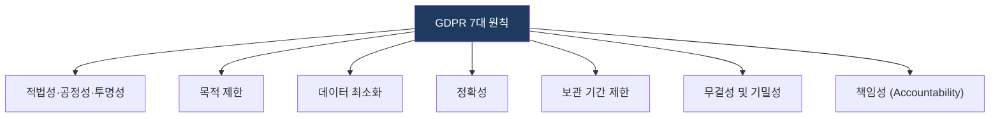
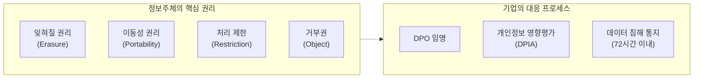

# GDPR
**General Data Protection Regulation**

## 1. 유럽연합의 강력한 개인정보 보호 규범, GDPR의 개요

**개념**: 유럽 연합(EU) 시민의 개인정보 보호를 강화하고 EU 역내외로 이전되는 개인정보를 통제하기 위해 제정된 통합 법령.

**특징**: **역외 적용(Extraterritoriality)** 원칙에 따라 EU 시민에게 서비스를 제공하는 모든 글로벌 기업에 적용되며, 위반 시 막대한 과징금(전 세계 매출액의 최대 4%) 부과.

---

## 2. GDPR의 핵심 원칙 및 정보주체 권리 체계

### 가. 개인정보 처리의 7대 원칙

| 원칙 | 상세 내용 | 비고 |
|---|---|---|
| **적법성/공정성** | 법적 근거에 기반하여 투명하게 처리 | 동의, 계약 이행 등 |
| **목적 제한** | 구체적이고 명확하며 적법한 목적으로만 수집 | 수집 목적 외 사용 금지 |
| **데이터 최소화** | 목적 달성에 필요한 최소한의 데이터만 처리 | 필요성 입증 책임 |
| **책임성** | 컨트롤러의 원칙 준수 입증 책임 강조 | DPO 임명, DPIA 수행 |

---

### 나. 정보주체의 권리 강화 및 대응 메커니즘

| 권리 항목 | 주요 내용 | 기업의 의무 |
|---|---|---|
| **잊혀질 권리** | 목적 달성 시 또는 동의 철회 시 삭제 요청 권리 | 지체 없는 삭제 및 파기 |
| **데이터 이동성** | 본인의 데이터를 다른 컨트롤러에게 전송 요청 권리 | 기계 판독 가능한 형식 제공 |
| **침해 통지 의무** | 개인정보 유출 시 감독기구 및 정보주체에게 통지 | **72시간 이내** 보고 |

---

## 3. GDPR 준수를 위한 기업의 대응 전략 및 효과

| 구분 | 주요 대응 방안 | 기대 효과 및 활용 |
|---|---|---|
| **조직적 대응** | DPO(개인정보 보호책임자) 선임 | EU 진출 기업의 법적 리스크 사전 차단 |
| **기술적 대응** | 가명화(Pseudonymization) 및 암호화 적용 | 데이터 활용과 보호의 균형 확보 (Privacy by Design) |
| **행정적 대응** | 데이터 처리 활동 기록(RoPA) 유지 | 감독기구 조사 시 투명성 및 책임성 입증 근거로 활용 |
