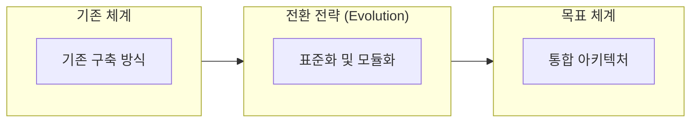

# HIPAA
**의료 정보 보안 규정**

## 1. 개요

**개념**: 의료 정보의 개인정보 보호 및 보안을 강화하고 전자 의료 기록의 표준화된 교환을 지원하는 미국의 의료 관련 법령.

**특징**: PHI(Protected Health Information) 보호, 기술적/물리적/관리적 보안 지침 제공, 의료 데이터의 신뢰성 확보.

---

## 2. 핵심 체계 및 진화 관점

### 가. 핵심 원리 및 구성 요소
(프레임워크의 주요 구성 요소, 아키텍처 원리, 관계도 상세 기술)

### 나. 진화 및 전환 관점 (도식화)

## 3. 기대효과 및 활용 방안
| 구분 | 기대효과 | 활용 방안 |
|---|---|---|
| 전략 | 정렬 강화 | 의사결정 지원 |
| 운영 | 체계성 확보 | 유지보수 효율화 |
