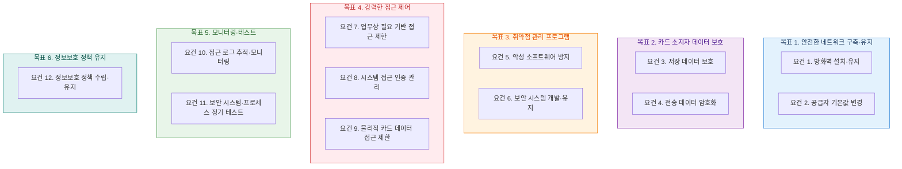
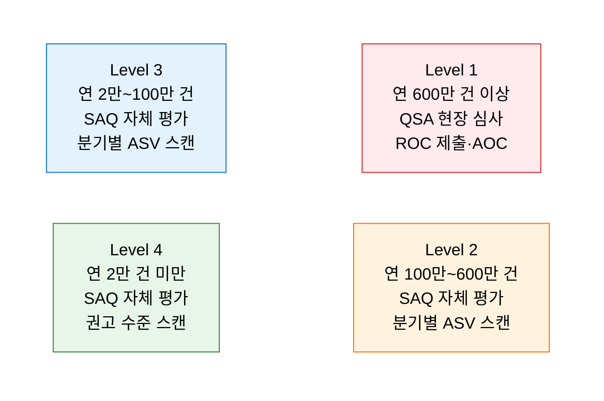

# PCI-DSS
**Payment Card Industry Data Security Standard**

## 1. 카드 결제 데이터를 처리하는 모든 기업이 준수해야 하는 국제 보안 표준, PCI-DSS의 개요

**개념**: Visa·Mastercard·AmEx 등 카드 브랜드가 공동 설립한 PCI SSC(Payment Card Industry Security Standards Council)가 제정한 국제 보안 표준으로, 카드 소지자 데이터(CHD: Cardholder Data)를 처리·저장·전송하는 모든 조직이 준수해야 하는 **6대 목표·12개 보안 요건** 체계.

**특징**:
- 법정 의무가 아닌 **계약 의무** — 미준수 시 카드 브랜드와의 계약 해지·과징금 부과.
- 카드 처리 거래량에 따라 **Level 1~4** 로 구분하며 검증 방식(QSA·SAQ) 상이.
- 2022년 PCI-DSS v4.0 발표 — 목표 기반 접근, 다중 인증 강화, 지속적 보안 문화 강조.

---

## 2. PCI-DSS의 핵심 구성 체계

### 가. 6대 목표 및 12개 요건

**카드 소지자 데이터 보호 핵심 요건**

| 요건 | 핵심 통제 | 주요 구현 방법 |
|---|---|---|
| **요건 3. 저장 데이터 보호** | 민감 인증 데이터(SAD) 저장 금지, PAN 마스킹·암호화 | 토큰화(Tokenization), AES-256 암호화 |
| **요건 4. 전송 암호화** | 공중망 전송 시 강력한 암호화 적용 | TLS 1.2+ 사용, SSL·초기 TLS 사용 금지 |
| **요건 7. 접근 제한** | 업무상 필요(Need-to-Know) 기반 최소 권한 적용 | RBAC, 직무 분리(SoD) |
| **요건 8. 인증 관리** | 개인별 고유 ID, MFA 적용 | 다중 인증(MFA), 패스워드 정책 강화 |
| **요건 10. 로그 모니터링** | 모든 카드 데이터 접근 로그 수집·보관 | SIEM 연동, 로그 최소 1년 보관 |
| **요건 11. 취약점 테스트** | 정기적 침투 테스트 및 취약점 스캔 | 분기별 ASV 스캔, 연 1회 침투 테스트 |

---

### 나. 준수 수준 및 검증 절차

**검증 도구 및 절차**

| 검증 방법 | 설명 | 대상 |
|---|---|---|
| **QSA 심사** | 공인 보안 평가사(Qualified Security Assessor)의 현장 심사 | Level 1 가맹점·서비스 제공자 |
| **ROC** | 준수 보고서(Report on Compliance) — QSA가 작성 | Level 1 필수 제출 |
| **AOC** | 준수 확인서(Attestation of Compliance) | 모든 레벨 제출 |
| **SAQ** | 자체 평가 설문지(Self-Assessment Questionnaire) — A·B·C·D 등 유형별 | Level 2~4 |
| **ASV 스캔** | 공인 스캐닝 업체(Approved Scanning Vendor)의 외부 취약점 스캔 | 분기별 필수 |
| **침투 테스트** | 내부·외부 네트워크 대상 연 1회 이상 침투 테스트 수행 | Level 1~2 |

---

## 3. PCI-DSS 준수의 기대효과 및 활용 방안

| 구분 | 주요 기대효과 | 활용 및 실무 적용 방안 |
|---|---|---|
| **카드 데이터 보호** | 결제 데이터 유출·위변조 리스크 최소화 | 토큰화·암호화 적용으로 저장 최소화 및 민감 데이터 보호 |
| **계약 유지** | 카드 브랜드 가맹 자격 유지 및 처리 비용 절감 | 연 1회 인증 갱신으로 가맹 자격·우대 수수료율 유지 |
| **보안 수준 향상** | 12개 요건이 조직 전반의 보안 기준선 역할 | ISO 27001·ISMS-P와 통합 운영으로 시너지 효과 |
| **디지털 결제 확장** | 간편결제·BNPL·핀테크 서비스의 신뢰 기반 마련 | PCI-DSS 준수 환경에서 신규 결제 서비스 안전하게 출시 |
