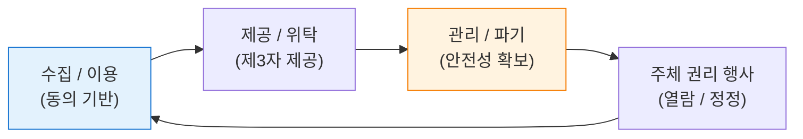
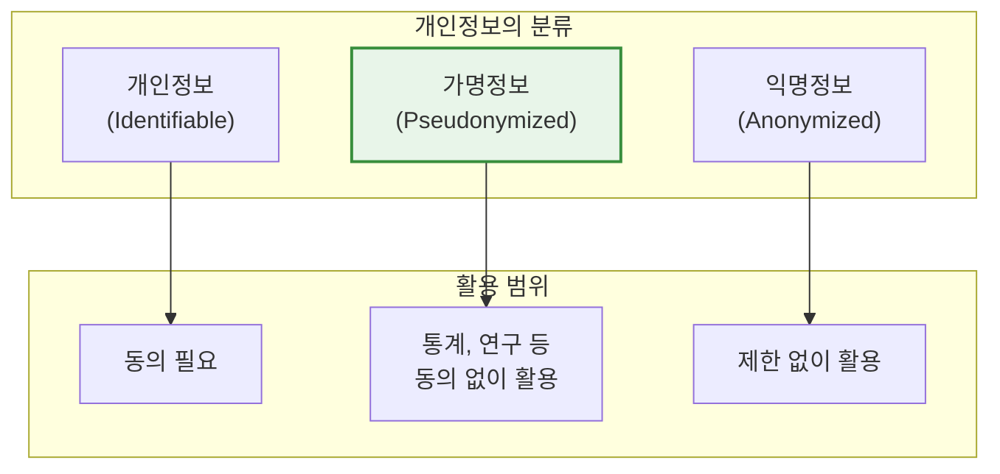

# 개인정보 보호법
**Personal Information Protection Act (PIPA)**

## 1. 대한민국 개인정보 보호의 기본법, 개인정보 보호법의 개요

**정의**: 개인정보의 수집, 유출, 오남용으로부터 국민의 권리와 이익을 보호하기 위해 제정된 일반법.

**특징**: 온-오프라인 통합 적용, 개인정보 보호위원회 중심의 거버넌스, **가명정보** 도입을 통한 데이터 경제 활성화 지원(데이터 3법 개정 반영).

---

## 2. 개인정보 보호법의 구성 체계 및 핵심 제도

### 가. 개인정보 처리 생애주기별 보호 모델

| 단계 | 핵심 준수 사항 | 관련 제도 |
|---|---|---|
| **수집/이용** | 최소 수집의 원칙, 동의 거부권 고지 | 법정 필수 고지 사항 |
| **제공/위탁** | 제3자 제공 동의, 위탁 업무 범위 제한 | 위탁 관리·감독 의무 |
| **보관/파기** | 유효기간제, 즉시 파기 원칙 | 파기 사실 통보 |

---

### 나. 데이터 경제 활성화를 위한 가명정보 처리

| 구분 | 정의 | 활용 가능 범위 |
|---|---|---|
| **가명정보** | 추가 정보 없이는 특정 개인을 알 수 없는 정보 | 통계 작성, 과학적 연구, 공익적 기록 보전 |
| **익명정보** | 시간·비용·기술을 고려해도 개인을 식별할 수 없는 정보 | 법적 제한 없이 자유롭게 활용 가능 |
| **결합전문기관** | 가명정보 간의 결합을 수행하는 지정 기관 | 데이터 결합을 통한 가치 창출 지원 |

---

## 3. 개인정보 보호법 위반 리스크 관리 및 대응

| 구분 | 주요 준수 사항 | 기대 효과 및 활용 |
|---|---|---|
| **기술적 조치** | 접근 통제, 암호화, 접속기록 보관 | 유출 사고 발생 시 과징금 감경 및 법적 책임 완화 |
| **조직적 조치** | CPO 임명, 정기적 임직원 교육 | 조직 내 개인정보 보호 문화 정착 및 오남용 방지 |
| **사고 대응** | 유출 통지 및 신고 (5일 이내) | 피해 확산 방지 및 감독기구와의 신속한 협력 체계 구축 |
