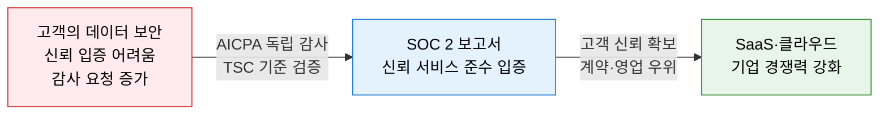
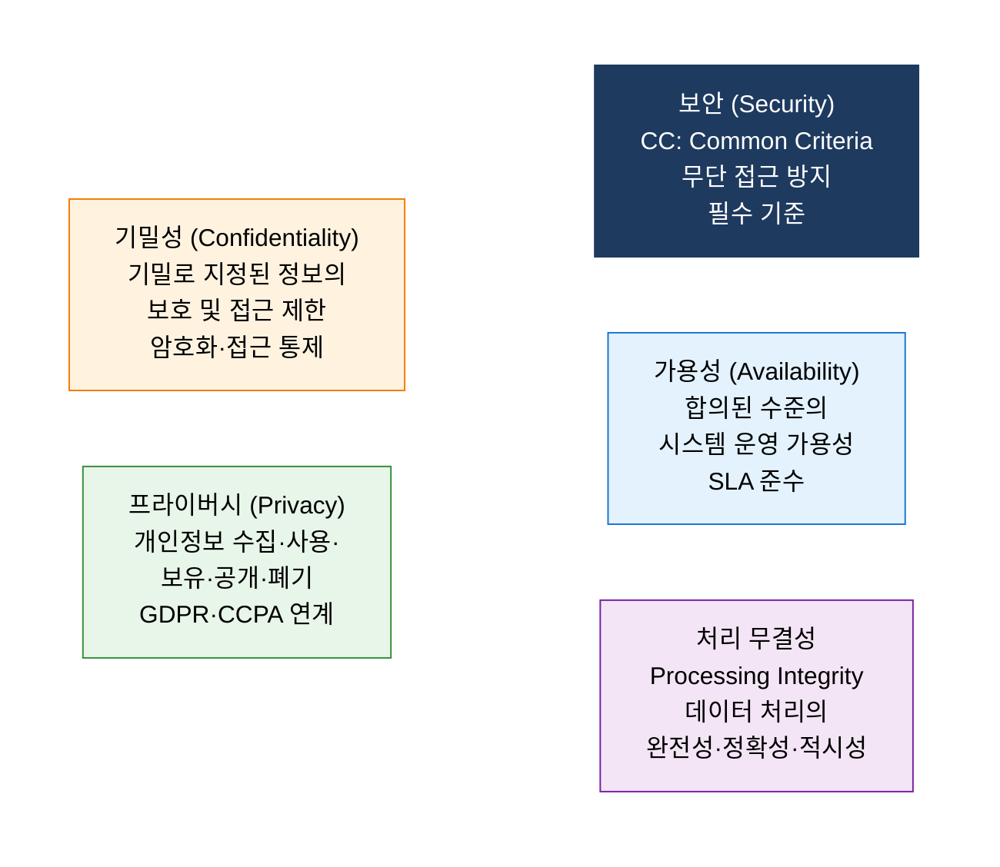
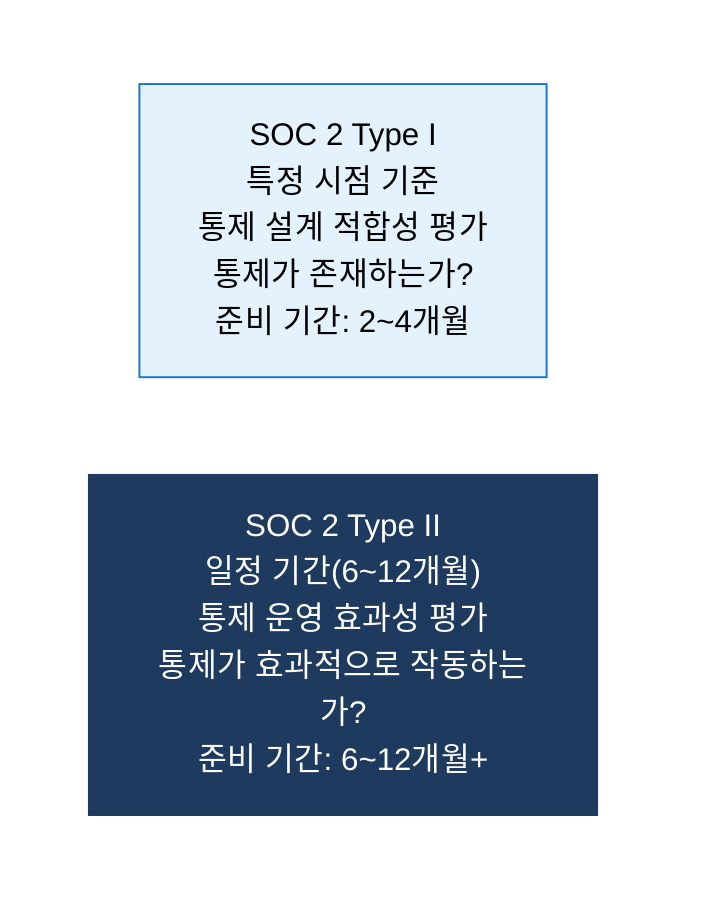
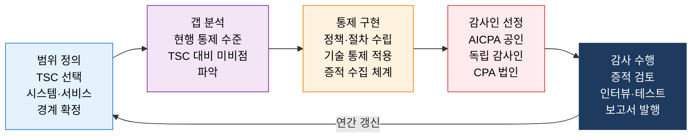

# SOC 2
**Service Organization Control 2 — 서비스 조직 보안 신뢰성 감사 프레임워크**

## 1. 5대 신뢰 기준을 독립 감사로 검증하는 서비스 조직 보안 보증 체계, SOC 2의 개요

**정의**: 미국 공인회계사협회(AICPA)가 개발한 감사 표준으로, 서비스 조직(SaaS·클라우드·데이터 처리 기업)이 고객 데이터를 처리할 때 **보안(Security), 가용성(Availability), 처리 무결성(Processing Integrity), 기밀성(Confidentiality), 프라이버시(Privacy)** 의 5가지 신뢰 서비스 기준(TSC)을 얼마나 잘 준수하는지 독립된 감사인이 검증·보고하는 프레임워크.

**특징**:
- **자발적 인증**: 법적 의무는 없으나 B2B SaaS·클라우드 기업의 **고객사 요구 사항**으로 사실상 필수화.
- **보안(CC) 필수**: 5가지 TSC 중 보안(Common Criteria)은 필수이며 나머지 4개는 선택적 추가.
- SOC 1(재무 내부통제)·SOC 3(공개 요약 보고)과 달리 SOC 2는 **운영 및 보안 통제** 전반을 대상으로 함.

---

## 2. SOC 2의 핵심 구성 체계

### 가. 5대 신뢰 서비스 기준 (TSC: Trust Services Criteria)

**5대 TSC 상세 및 주요 통제 항목**

| TSC | 핵심 목적 | 주요 통제 항목 | 적용 대상 |
|---|---|---|---|
| **보안 (Security)** | 무단 접근·유출·훼손으로부터 시스템 보호 | 접근 관리·MFA·암호화·취약점 관리·로그 모니터링 | **모든 SOC 2 필수** |
| **가용성 (Availability)** | 합의된 SLA 수준의 시스템 운영 가용성 유지 | DR·BCP·성능 모니터링·장애 대응 절차 | SaaS·클라우드 서비스 |
| **처리 무결성** | 데이터 처리의 완전성·정확성·적시성 보장 | 입력 검증·오류 처리·처리 이력 추적 | 데이터 처리·핀테크 |
| **기밀성** | 기밀 지정 데이터의 보호 및 접근 제한 | 암호화·NDA·데이터 분류·폐기 정책 | 기업 간 기밀 데이터 |
| **프라이버시** | 개인정보의 수집~폐기 전 생애주기 보호 | 동의 관리·최소 수집·접근 제한·파기 절차 | 개인정보 처리 서비스 |

---

### 나. Type I · Type II 감사 및 준수 절차

**SOC 2 인증 취득 절차**

**SOC 2 vs 주요 보안 인증 비교**

| 비교 항목 | SOC 2 | ISO 27001 | ISMS-P |
|---|---|---|---|
| **개발 기관** | AICPA (미국) | ISO/IEC (국제) | KISA (국내) |
| **범위** | 서비스 조직 신뢰성 | 전사 정보보호 관리체계 | 정보보호 + 개인정보보호 |
| **주요 시장** | 미국·글로벌 B2B SaaS | 전 세계 기업 | 국내 기업·공공기관 |
| **감사 방식** | 독립 감사인 보고서 | 인증기관 심사 | 인증기관 심사 |
| **갱신 주기** | 연간 (Type II 권장) | 3년 (연간 사후심사) | 3년 (연간 사후심사) |
| **국내 활용** | 해외 고객 대상 SaaS·클라우드 기업 | 글로벌 사업 + 국내 기업 | 국내 법적 의무 기업 |

---

## 3. SOC 2 인증의 기대효과 및 활용 방안

| 구분 | 주요 기대효과 | 활용 및 실무 적용 방안 |
|---|---|---|
| **고객 신뢰** | 독립 감사 보고서로 보안 수준 객관적 입증 | 엔터프라이즈 영업·계약 시 SOC 2 보고서 제출로 보안 질의 대응 |
| **글로벌 시장** | 미국·북미 시장 진출 시 사실상 필수 요건 | SaaS 수출 전 SOC 2 Type II 취득으로 해외 고객 신뢰 확보 |
| **내부 보안** | 인증 준비 과정에서 실질적 보안 통제 체계 구축 | 접근 관리·로그·암호화·DR 등 보안 인프라 고도화 |
| **규제 대응** | GDPR·CCPA·개인정보 보호 요건과 SOC 2 통제 연계 | 프라이버시 TSC 추가로 개인정보 처리 컴플라이언스 동시 대응 |
