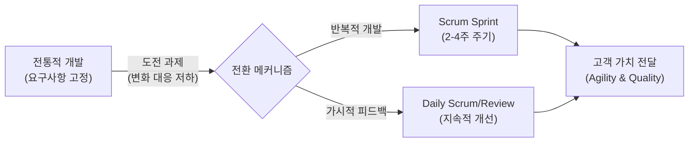
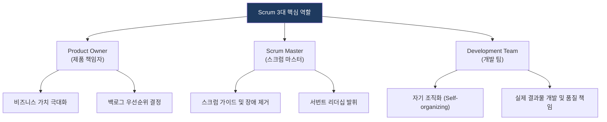

# Agile & Scrum
**Agile Software Development & Scrum Framework**

## 1. 변화에 유연한 SW 개발 패러다임, Agile과 Scrum의 개요

**개념**:
- **Agile**: 계획과 문서 중심이 아닌, 사람과 소통, 변화에 대한 대응을 중시하는 반복적(Iterative) 소프트웨어 개발 방법론의 총칭.
- **Scrum**: 복잡한 프로젝트를 진행하기 위해 작은 단위(Sprint)로 개발을 진행하는 애자일의 대표적인 프레임워크.

**특징**: 빠른 피드백 반영, 짧은 개발 주기(2~4주), 지속적인 가치 전달 및 품질 향상.

---

## 2. Scrum 프레임워크의 프로세스 및 핵심 역할

### 가. Scrum 개발 프로세스 (Sprint Cycle)

| 구분 | 주요 활동 | 목적 |
|---|---|---|
| **Sprint Planning** | 스프린트 목표 수립 및 백로그 선정 | 스프린트 기간 내 수행할 작업 정의 |
| **Daily Scrum** | 어제 한 일, 오늘 할 일, 장애 요인 공유 | 팀원 간 동기화 및 즉각적 문제 해결 |
| **Sprint Review** | 개발 결과물 시연 및 피드백 수집 | 이해관계자 검토 및 비즈니스 가치 확인 |
| **Retrospective** | 프로세스 및 협업 방식 개선점 도출 | 지속적 팀 역량 강화 및 프로세스 최적화 |

---

### 나. Scrum의 3대 핵심 역할 (Roles)

| 역할 | 책임 및 권한 | 비고 |
|---|---|---|
| **Product Owner** | '무엇(What)'을 만들지 결정, 제품 백로그 관리 | ROI 및 비즈니스 성과 책임 |
| **Scrum Master** | '어떻게(How)' 잘 협업할지 가이드, 스크럼 프로세스 보호 | 촉진자(Facilitator) 역할 |
| **Development Team** | 기술적 구현 및 품질 보증, 기능 교차 팀(Cross-functional) | 5~9명의 전문가 그룹 권장 |

---

## 3. Agile 도입의 기대효과 및 성공 고려사항

| 구분 | 주요 기대효과 | 활용 및 실무 적용 방안 |
|---|---|---|
| **품질 향상** | 짧은 주기의 테스트와 리뷰 | 지속적 통합(CI) 및 테스트 자동화와 병행하여 결함 조기 발견 |
| **고객 만족** | 요구사항 변화의 유연한 수용 | 잦은 릴리스를 통해 시장 요구에 즉각 대응 및 고객 경험 개선 |
| **생산성 제고** | 팀의 자기 주도적 업무 수행 | 가시성 확보(Kanban Board 등)를 통한 병목 현상 제거 및 몰입 환경 조성 |
