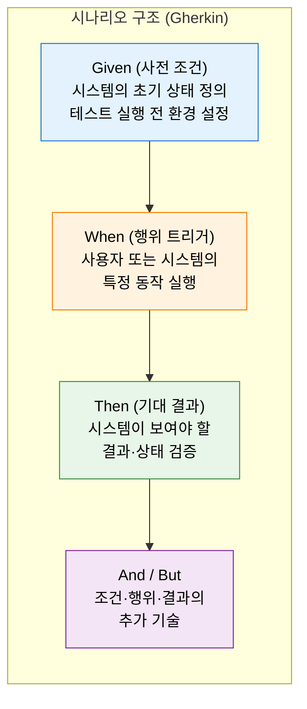
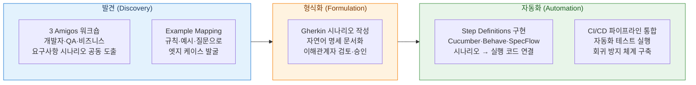

# BDD
**Behavior-Driven Development — 행위 주도 개발**

## 1. 시나리오 명세로 협업과 품질을 내재화하는 행위 주도 개발 방법론, BDD의 개요


**정의**: TDD를 비즈니스 관점으로 확장한 개발 방법론으로, 시스템이 수행해야 할 **행위(Behavior)** 를 비즈니스 이해관계자가 읽을 수 있는 **Given-When-Then 자연어 시나리오**로 명세하고, 이를 자동화 테스트로 연결함으로써 개발자·QA·비즈니스 전문가 간의 공통 이해를 형성하는 협업 중심 개발 방법론.

**특징**:
- **공통 언어(Ubiquitous Language)**: Gherkin 등 자연어에 가까운 언어로 시나리오를 작성하여 비기술 이해관계자도 검토 가능.
- **실행 가능한 명세**: 시나리오가 자동화 테스트 코드와 직결되어 요구사항·구현·테스트가 항상 일치.
- **협업 기반 발견(Discovery)**: 3 Amigos(개발자·QA·비즈니스) 워크숍으로 요구사항 모호성을 개발 전에 해소.

---

## 2. BDD의 핵심 구성 체계

### 가. Given-When-Then 시나리오 명세



**Gherkin 시나리오 작성 예시**

```gherkin
Feature: 온라인 쇼핑몰 장바구니 관리

  Scenario: 재고가 있는 상품을 장바구니에 추가
    Given 고객이 로그인한 상태이고
    And   상품 "무선 키보드"의 재고가 10개 있을 때
    When  고객이 "무선 키보드"를 장바구니에 2개 담으면
    Then  장바구니에 "무선 키보드" 2개가 담겨 있어야 하고
    And   재고는 8개로 감소해야 한다

  Scenario: 재고 초과 수량 요청 시 오류 안내
    Given 상품 "무선 키보드"의 재고가 1개 있을 때
    When  고객이 "무선 키보드"를 3개 담으려 하면
    Then  "재고 부족" 오류 메시지가 표시되어야 한다
```

**Given-When-Then 구성 요소 상세**

| 요소 | 역할 | 코드 대응 | 작성 원칙 |
|---|---|---|---|
| **Feature** | 테스트할 기능의 비즈니스 목적 기술 | 테스트 파일 단위 | 사용자 가치 중심으로 서술 |
| **Scenario** | 하나의 구체적인 사용 케이스 | 테스트 메서드 단위 | 독립적·재현 가능해야 함 |
| **Given** | 시나리오 실행 전 초기 상태 설정 | `@Before` / setUp | 최소한의 필요 상태만 기술 |
| **When** | 테스트 대상 행위·이벤트 실행 | 실제 동작 호출 | 단일 행위만 기술 (복수 지양) |
| **Then** | 기대 결과의 검증 조건 명세 | `assert` / `expect` | 측정 가능한 결과로 명확히 |
| **And / But** | 이전 키워드의 연속 기술 | 동일 역할 계속 | 가독성 향상에 활용 |

---

### 나. 협업 기반 요구사항 발견 및 자동화 적용



**BDD 주요 도구 스택**

| 도구 | 언어 | 역할 | 특징 |
|---|---|---|---|
| **Cucumber** | Java·Ruby·JS | Gherkin 시나리오 실행 | 가장 널리 사용, 다언어 지원 |
| **Behave** | Python | Python 환경 BDD | Django·Flask 연계 용이 |
| **SpecFlow** | C# (.NET) | .NET 환경 BDD | Visual Studio 통합 |
| **Jest + Cucumber** | TypeScript | Node.js 프론트엔드 | React·Angular 테스트 연계 |
| **Playwright BDD** | JS/TS | E2E BDD 테스트 | 브라우저 자동화 시나리오 |

**TDD vs BDD 비교**

| 비교 항목 | TDD | BDD |
|---|---|---|
| **초점** | 코드 단위(메서드·클래스) 동작 | 시스템 행위·비즈니스 시나리오 |
| **작성 주체** | 개발자 | 개발자·QA·비즈니스 협업 |
| **언어** | 프로그래밍 언어 | 자연어에 가까운 Gherkin |
| **테스트 단위** | 단위 테스트 | 인수 테스트·기능 테스트 |
| **상호 관계** | BDD 시나리오 내부를 TDD로 구현 ||

---

## 3. BDD 적용의 기대효과 및 활용 방안

| 구분 | 주요 기대효과 | 활용 및 실무 적용 방안 |
|---|---|---|
| **요구사항 품질** | 개발 전 모호성 제거로 재작업·오해 비용 최소화 | 스프린트 착수 전 3 Amigos 워크숍으로 수용 기준(AC) 시나리오화 |
| **협업 효율** | 비기술 이해관계자도 테스트 시나리오 직접 검토·승인 가능 | Feature 파일을 살아있는 명세(Living Specification)로 활용 |
| **테스트 자동화** | 시나리오가 곧 테스트 코드 — 요구사항·구현 일치성 항상 보장 | CI/CD 파이프라인에 BDD 시나리오 실행 게이트 통합 |
| **회귀 방지** | 비즈니스 행위 기준 테스트로 기능 변경 시 영향도 즉각 탐지 | 스프린트 회고 시 실패 시나리오 분석으로 결함 패턴 관리 |
