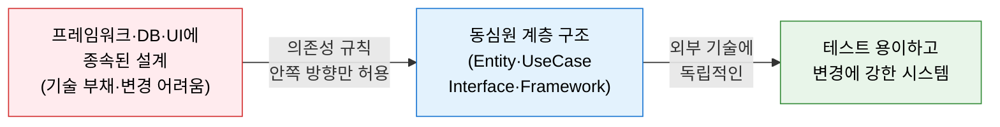
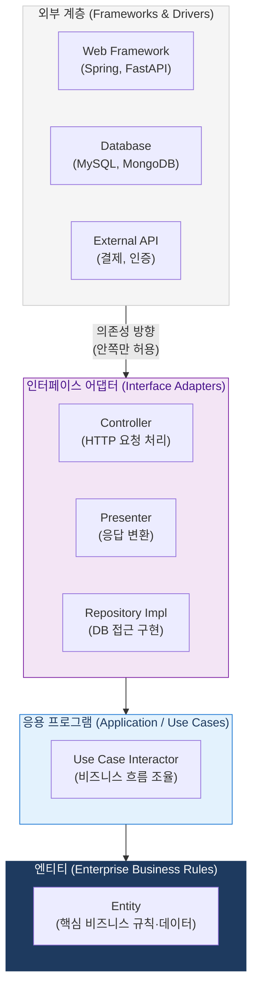
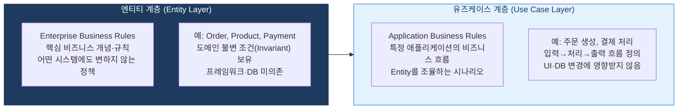

# Clean Architecture
**Robert C. Martin (Uncle Bob)의 클린 아키텍처**

## 1. 비즈니스 규칙을 외부 기술 변화로부터 보호하는 의존성 관리 아키텍처, Clean Architecture의 개요

**개념**: Robert C. Martin이 제안한 아키텍처로, **"소스 코드의 의존성은 반드시 안쪽(정책)을 향해야 한다"** 는 의존성 규칙(Dependency Rule)을 핵심 원칙으로, 비즈니스 규칙을 프레임워크·DB·UI 등 외부 세부사항으로부터 격리하는 동심원(Concentric Circles) 계층 구조 아키텍처.

**특징**:
- **프레임워크 독립**: 특정 프레임워크에 의존하지 않아 Spring→FastAPI 교체 시 비즈니스 로직 불변.
- **테스트 용이성**: 외부 의존 없이 비즈니스 규칙을 단독으로 테스트 가능.
- **UI·DB·외부 에이전시 독립**: 비즈니스 규칙 변경 없이 UI(Web→CLI)나 DB(MySQL→MongoDB) 교체 가능.

---

## 2. Clean Architecture의 핵심 구성 체계

### 가. 의존성 규칙 (Dependency Rule)

**의존성 규칙의 핵심 원칙**

| 원칙 | 내용 | 위반 예시 |
|---|---|---|
| **단방향 의존** | 외부 계층은 내부 계층을 알 수 있지만, 내부 계층은 외부를 몰라야 함 | Entity에서 Spring 어노테이션 사용 |
| **의존성 역전(DIP)** | 내부 계층은 인터페이스만 정의, 구현체는 외부 계층이 담당 | UseCase가 JpaRepository를 직접 의존 |
| **경계 횡단 규칙** | 계층 경계를 넘을 때는 인터페이스·DTO를 활용 | Entity를 Controller에서 직접 반환 |
| **데이터 전달** | 계층 간 데이터 전달은 단순 DTO(Data Transfer Object) 사용 | DB Entity를 외부 계층까지 그대로 전달 |

---

### 나. 엔티티 및 유즈케이스 계층

| 계층 | 역할 | 변경 유발 요인 | 예시 |
|---|---|---|---|
| **Entity** | 전사 비즈니스 규칙 — 어떤 애플리케이션에서도 동일하게 적용 | 핵심 사업 정책 변경 시에만 수정 | `Order`, `Product`, 주문 최대 수량 정책 |
| **Use Case** | 애플리케이션별 비즈니스 흐름 조율 | 애플리케이션 동작 방식 변경 시 | `CreateOrderUseCase`, `ProcessPaymentUseCase` |
| **Interface Adapters** | 외부 형식(HTTP·JSON·SQL)과 내부 모델 간 변환 | UI·DB 기술 교체 시 | `OrderController`, `OrderRepositoryImpl` |
| **Frameworks & Drivers** | 프레임워크·DB·외부 API 등 세부 기술 구현 | 기술 스택 교체 시 | Spring Boot, JPA, MySQL, Redis |

---

## 3. Clean Architecture 적용의 기대효과 및 활용 방안

| 구분 | 주요 기대효과 | 활용 및 실무 적용 방안 |
|---|---|---|
| **테스트 용이성** | 외부 의존 없이 비즈니스 로직 단독 테스트 | Use Case 계층을 Mock 없이 단위 테스트 가능 |
| **기술 독립성** | 프레임워크·DB 교체 시 비즈니스 로직 불변 | 레거시 마이그레이션 시 비즈니스 규칙 보존 |
| **MSA 연계** | 서비스 경계(DDD Bounded Context)와 자연스럽게 결합 | 마이크로서비스별 독립적인 Clean Architecture 적용 |
| **유지보수성** | 변경 영향 범위를 계층 내로 제한 | 신규 요구사항 추가 시 외부 계층만 수정으로 내부 보호 |
