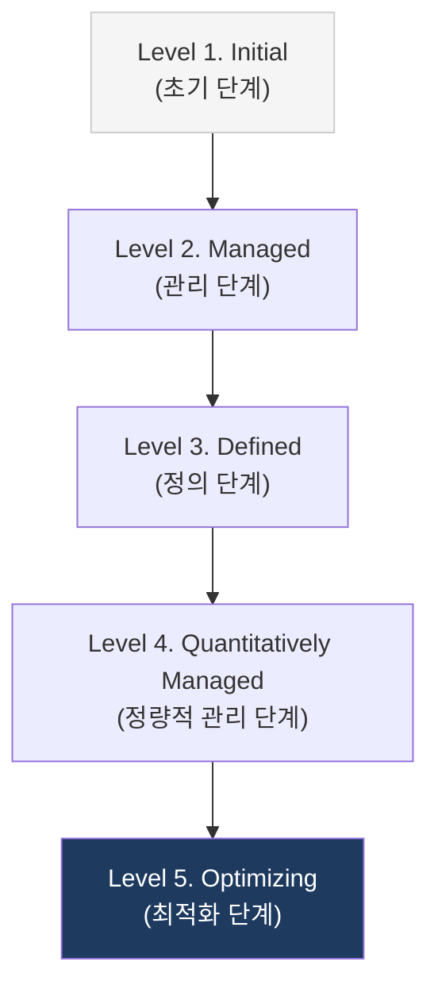
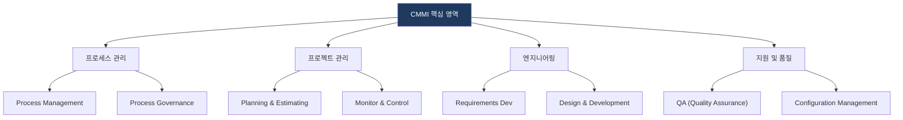

# CMMI
**Capability Maturity Model Integration**

## 1. 조직의 프로세스 역량 강화 표준, CMMI의 개요

**개념**: 조직의 소프트웨어 개발 및 서비스 프로세스 능력을 평가하고 개선하기 위한 단계별 가이드라인이자 통합 프로세스 성숙도 모델.

**특징**: 프로세스 개선을 통한 품질 향상 및 비용 절감, **성숙도 수준(Maturity Levels)** 에 따른 조직의 역량 정량화.

---

## 2. CMMI의 성숙도 모델 및 핵심 영역

### 가. CMMI 5단계 성숙도 수준 (Maturity Levels)

| 수준 | 명칭 | 주요 특징 | 핵심 목표 |
|---|---|---|---|
| **1** | **Initial** | 비정형화, 개인의 역량에 의존 | 프로세스 예측 불가능 |
| **2** | **Managed** | 프로젝트 단위의 프로세스 관리 | 기본적 프로젝트 통제 확보 |
| **3** | **Defined** | 조직 차원의 표준 프로세스 확립 | 프로세스 표준화 및 자산화 |
| **4** | **Quantitatively Managed** | 데이터 기반의 정량적 통제 | 프로세스 품질 및 성과 예측 |
| **5** | **Optimizing** | 지속적인 프로세스 혁신 및 개선 | 프로세스 성능 최적화 |

---

### 나. CMMI의 핵심 프랙티스 영역 (V2.0 기준)

| 카테고리 | 핵심 활동 | 비고 |
|---|---|---|
| **정렬 (Align)** | 비즈니스 목표와 프로세스의 일치성 확보 | 전략적 프로세스 개선 |
| **실행 (Perform)** | 실제 개발 및 서비스 전달 프로세스 준수 | 엔지니어링 역량 강화 |
| **관리 (Manage)** | 위험, 계획, 자원 및 성능 모니터링 | 프로젝트 성공률 제고 |
| **지속 (Sustain)** | 성숙된 프로세스의 조직 내 정착 및 유지 | 거버넌스 및 자산 관리 |

---

## 3. CMMI 인증 및 도입의 기대효과

| 구분 | 주요 기대효과 | 활용 및 실무 적용 방안 |
|---|---|---|
| **대외 신인도** | 글로벌 품질 인증 확보 | 공공 및 국방 사업 수주 시 가점 활용 및 고객 신뢰 확보 |
| **품질 안정성** | 결함률 감소 및 예측 가능성 증대 | 정량적 데이터 기반의 품질 관리 체계 수립 |
| **비용 최적화** | 재작업(Rework) 감소 및 효율성 제고 | 성숙된 프로세스를 통한 개발 비용 및 기간 단축 |
