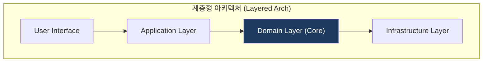
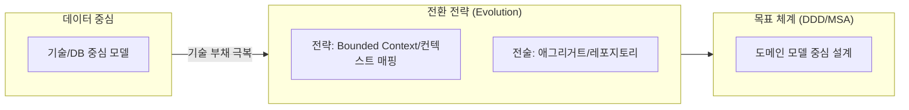

# DDD (Domain-Driven Design, 도메인 주도 설계)

## 1. 개요
**개념**: 복잡한 비즈니스 문제를 해결하기 위해, 기술적 구현보다 비즈니스 도메인(업무 영역)의 모델과 로직을 중심에 두는 설계 및 개발 방법론.

**특징**: 
- **현장 중심**: 도메인 전문가와 개발자 간의 간극 최소화.
- **언어 통합**: 유비쿼터스 언어(Ubiquitous Language)를 통한 소통의 효율화.
- **경계 명확화**: 복잡한 시스템을 독립된 컨텍스트(Bounded Context)로 분리.

---

## 2. DDD의 도메인 설계 모델 및 전략적 전술 체계

### 가. DDD의 도메인 설계 모델 (계층형 아키텍처)
(도메인 핵심 로직을 격리하는 4계층 아키텍처 구조)

* **Domain Layer(Core)**: 비즈니스 규칙과 업무 상태 정보를 포함하는 핵심 로직 계층.
* **계층 간 분리**: 인프라 기술로부터 도메인 모델을 격리하여 테스트와 유지보수성 극대화.

### 나. 전략적 전술 체계
(기존 데이터 중심 체계에서 DDD 기반의 전략/전술 체계로의 진화)

* **전략적 설계**: Bounded Context를 활용한 비즈니스 경계(MSA의 기준) 정의.
* **전술적 설계**: 애그리거트(Aggregate) 단위의 정합성 보장 및 엔티티 중심 모델 구현.

---

## 3. 기대효과 및 활용 방안
| 구분 | 기대효과 | 활용 방안 |
|---|---|---|
| **전략** | 비즈니스 가치 정렬 | MSA 서비스 경계 획정 시 Bounded Context 활용 |
| **운영** | 유지보수 용이성 | 도메인 로직과 외부 인프라 분리를 통한 독립성 확보 |
| **기술** | 복잡성 관리 | 클린 아키텍처 기반의 확장성 있는 설계 지향 |
