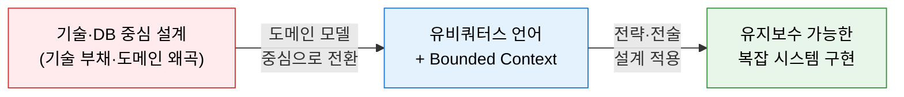
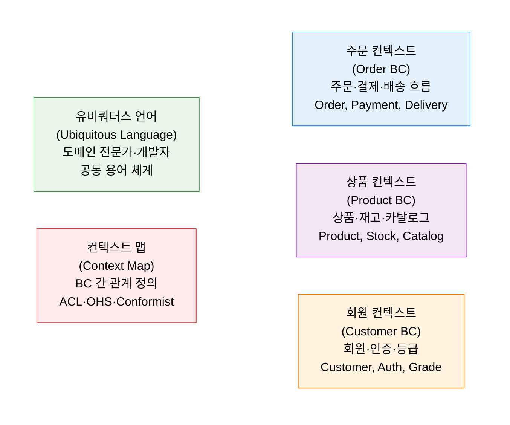
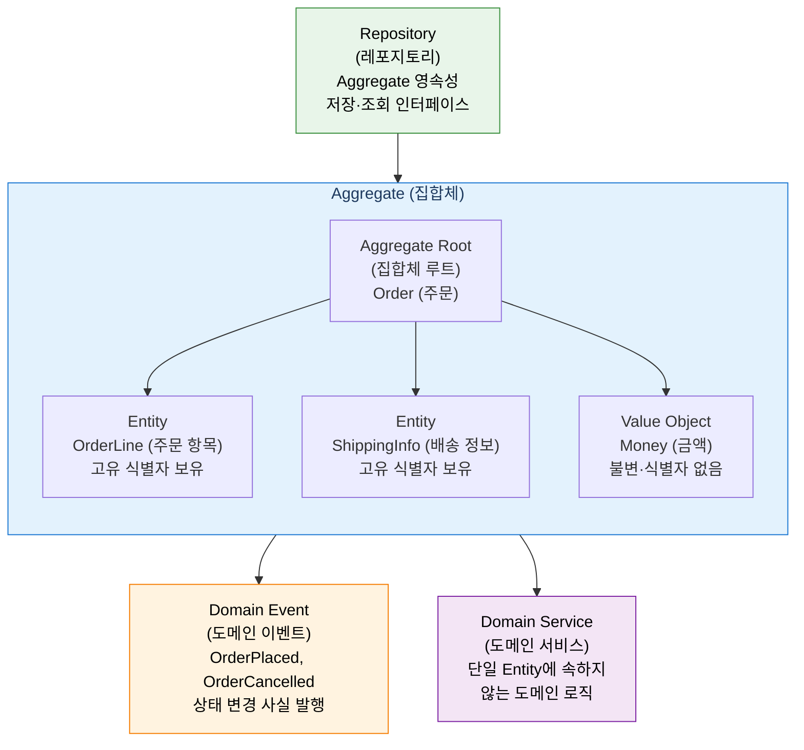

# DDD (Domain-Driven Design)
**도메인 주도 설계**

## 1. 비즈니스 도메인을 중심으로 복잡한 소프트웨어를 설계하는 방법론, DDD의 개요

**개념**: 복잡한 비즈니스 문제를 해결하기 위해 기술적 구현보다 **비즈니스 도메인(업무 영역)의 모델과 로직** 을 설계의 중심에 두고, 도메인 전문가와 개발자 간의 공통 언어(유비쿼터스 언어)를 기반으로 소프트웨어를 설계·개발하는 방법론.

**특징**:
- **유비쿼터스 언어(Ubiquitous Language)**: 도메인 전문가와 개발자가 동일한 용어를 코드·문서·대화에서 일관되게 사용.
- **전략적 설계**: Bounded Context와 Context Map으로 복잡한 도메인을 독립된 경계로 분리.
- **전술적 설계**: Aggregate·Entity·Value Object·Domain Event로 도메인 모델을 정밀하게 구현.

---

## 2. DDD의 핵심 구성 체계

### 가. 전략적 설계 — Bounded Context와 Context Map

| 개념 | 정의 | MSA 연계 |
|---|---|---|
| **Bounded Context** | 하나의 도메인 모델이 일관되게 적용되는 경계 영역 | MSA 마이크로서비스의 서비스 경계 분리 기준 |
| **유비쿼터스 언어** | BC 내에서 모든 구성원이 일관되게 사용하는 공통 용어 체계 | 코드·API·DB 컬럼명을 도메인 언어로 통일 |
| **Context Map** | Bounded Context 간의 관계와 통합 방식 정의 | ACL(부패 방지 계층), OHS(공개 호스트 서비스), Conformist |
| **Shared Kernel** | 두 BC가 공유하는 공통 모델 영역 | 공통 도메인 라이브러리로 분리·관리 |

---

### 나. 전술적 설계 — Aggregate, Entity, Value Object

| 빌딩 블록 | 정의 | 특징 |
|---|---|---|
| **Aggregate** | 데이터 변경의 단위로 묶인 관련 객체의 집합 | Aggregate Root를 통해서만 내부 접근 허용 |
| **Aggregate Root** | Aggregate의 진입점이자 일관성 보장 책임자 | 외부에서 참조 가능한 유일한 객체 |
| **Entity** | 고유 식별자(ID)를 가지며 생애주기 동안 상태 변화 | 동일 ID면 속성이 달라도 동일 Entity |
| **Value Object** | 식별자 없이 속성 값으로만 정의되는 불변 객체 | Money, Address, DateRange 등 |
| **Domain Event** | 도메인에서 발생한 중요한 사건(과거형으로 명명) | OrderPlaced, PaymentCompleted |
| **Repository** | Aggregate의 저장·조회를 추상화한 인터페이스 | 영속성 기술(DB)로부터 도메인 격리 |
| **Domain Service** | 특정 Entity에 속하지 않는 도메인 로직 | 이체(Transfer) 등 여러 Aggregate 연관 로직 |

---

## 3. DDD 적용의 기대효과 및 활용 방안

| 구분 | 주요 기대효과 | 활용 및 실무 적용 방안 |
|---|---|---|
| **MSA 설계** | Bounded Context 기반의 명확한 서비스 경계 획정 | Event Storming 워크숍으로 도메인 경계 협의 후 MSA 서비스 분리 |
| **유지보수성** | 도메인 로직과 인프라 기술의 분리로 변경 영향 최소화 | Clean Architecture와 결합하여 외부 의존성 역전(DIP) 적용 |
| **협업 효율** | 유비쿼터스 언어로 도메인 전문가-개발자 소통 간극 해소 | API 명세·DB 스키마·코드 변수명 도메인 언어 통일 |
| **복잡성 관리** | Aggregate 경계로 트랜잭션 범위와 정합성 책임 명확화 | Saga 패턴과 결합하여 분산 환경에서의 결과적 일관성 구현 |
