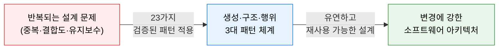
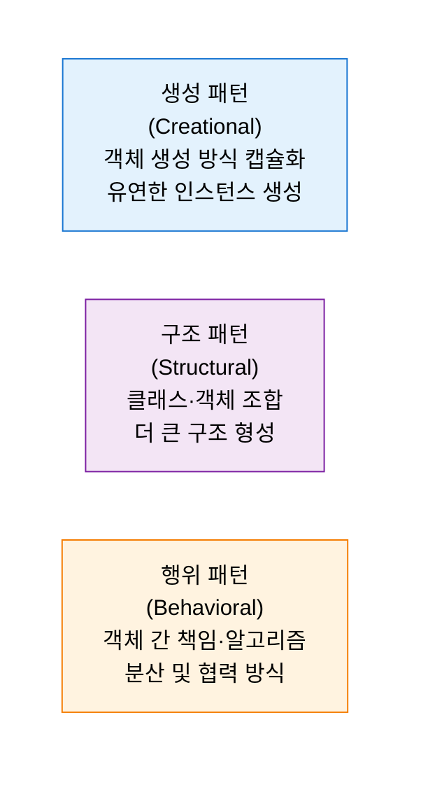
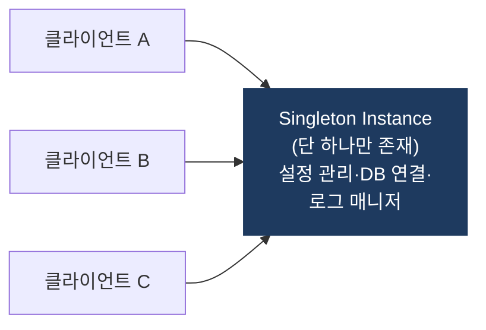
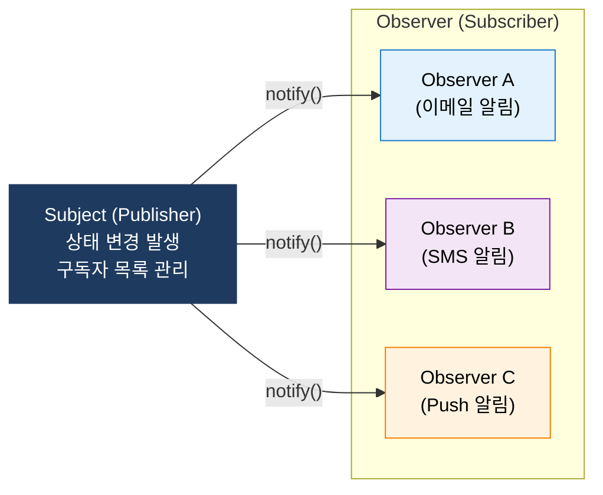

# Design Patterns (GoF)
**Gang of Four 소프트웨어 디자인 패턴**

## 1. 반복 설계 문제에 대한 검증된 재사용 가능한 해결책 체계, GoF 디자인 패턴의 개요

**정의**: Erich Gamma 외 4인(Gang of Four)이 정리한 **23가지 소프트웨어 디자인 패턴**으로, 객체지향 설계에서 반복적으로 발생하는 문제에 대한 검증된 해결책을 생성(Creational), 구조(Structural), 행위(Behavioral) 패턴으로 분류한 설계 지식 체계.

**특징**:
- 특정 언어·기술에 종속되지 않는 **설계 수준의 재사용 가능한 솔루션**.
- 개발자 간 **공통 설계 언어(Pattern Name)** 로 소통 효율 향상.
- SOLID 원칙, Clean Architecture와 상호 보완적으로 활용.

---

## 2. GoF 디자인 패턴의 핵심 구성 체계

### 가. 생성(Creational), 구조(Structural), 행위(Behavioral) 패턴

**생성 패턴 (5가지)**

| 패턴 | 목적 | 핵심 특징 |
|---|---|---|
| **Singleton** | 클래스 인스턴스를 하나만 보장 | 전역 접근점 제공, 리소스 공유 |
| **Factory Method** | 객체 생성을 서브클래스에 위임 | 생성 코드와 사용 코드 분리 |
| **Abstract Factory** | 관련 객체 집합을 일관되게 생성 | 플랫폼 독립적 UI 컴포넌트 생성 |
| **Builder** | 복잡한 객체를 단계별로 생성 | 동일 과정으로 다양한 결과물 생성 |
| **Prototype** | 기존 객체를 복제하여 새 객체 생성 | 초기화 비용이 큰 객체 복사 |

**구조 패턴 (7가지)**

| 패턴 | 목적 | 핵심 특징 |
|---|---|---|
| **Adapter** | 호환되지 않는 인터페이스를 연결 | 레거시 시스템 통합, 래퍼 역할 |
| **Decorator** | 객체에 동적으로 기능 추가 | 상속 없이 책임 확장, 스택 구성 |
| **Facade** | 복잡한 서브시스템에 단순 인터페이스 제공 | API Gateway, 라이브러리 래핑 |
| **Proxy** | 다른 객체에 대한 대리·제어 접근 | 지연 로딩, 접근 제어, 캐싱 |
| **Composite** | 트리 구조로 객체 부분-전체 계층 표현 | 파일 시스템, UI 컴포넌트 트리 |
| **Bridge** | 추상화와 구현을 독립적으로 변형 | 플랫폼별 다른 구현체 분리 |
| **Flyweight** | 많은 수의 유사 객체를 효율적으로 공유 | 게임 파티클, 문자 폰트 캐싱 |

**행위 패턴 (11가지)**

| 패턴 | 목적 | 핵심 특징 |
|---|---|---|
| **Observer** | 상태 변화를 다수의 객체에 자동 통지 | 이벤트 드리븐, Pub/Sub 기반 |
| **Strategy** | 알고리즘을 캡슐화하여 교체 가능하게 | if-else 제거, 런타임 알고리즘 교체 |
| **Command** | 요청을 객체로 캡슐화 | 실행 취소(Undo), 큐·로그 저장 |
| **Template Method** | 알고리즘 골격 정의, 세부 구현 위임 | 공통 흐름 유지, 변형 지점 분리 |
| **Iterator** | 컬렉션 순회를 표준화 | 내부 구현 노출 없이 순차 접근 |
| **Chain of Responsibility** | 요청을 처리자 체인에 따라 전달 | 미들웨어, 필터 파이프라인 |
| **State** | 객체 상태에 따라 행동 변화 | 상태 기계(FSM) 구현 |

---

### 나. 핵심 패턴 예시 — Singleton, Observer

**Singleton — 유일 인스턴스 보장**

| 구분 | 내용 |
|---|---|
| **적용 시점** | 전역 상태 관리가 필요하고 인스턴스가 하나임을 보장해야 할 때 |
| **장점** | 리소스 공유, 메모리 절약, 일관된 상태 접근 |
| **주의사항** | 멀티스레드 환경에서 이중 검사 잠금(Double-Checked Locking) 필요, 테스트 어려움 |
| **대표 사례** | 설정(Config), DB Connection Pool, Logger, Thread Pool |

**Observer — 상태 변화 자동 통지**

| 구분 | 내용 |
|---|---|
| **적용 시점** | 한 객체의 상태 변화가 다른 여러 객체에 전파되어야 할 때 |
| **장점** | 느슨한 결합, 동적 구독자 추가/제거, 이벤트 드리븐 아키텍처 구현 |
| **대표 사례** | GUI 이벤트 핸들링, Kafka Pub/Sub, 상태 관리(Redux), Spring ApplicationEvent |

---

## 3. GoF 디자인 패턴 적용의 기대효과 및 활용 방안

| 구분 | 주요 기대효과 | 활용 및 실무 적용 방안 |
|---|---|---|
| **코드 품질** | 검증된 패턴 적용으로 결합도 감소·응집도 향상 | Strategy 패턴으로 조건문 제거, Decorator로 책임 분리 |
| **유지보수성** | 변경 영향 범위를 최소화하는 유연한 설계 | Observer·Command 패턴으로 이벤트 기반 확장 구현 |
| **소통 효율** | 패턴 이름으로 설계 의도를 간결하게 전달 | 코드 리뷰·설계 문서에서 패턴명 활용으로 소통 비용 절감 |
| **아키텍처 연계** | MSA·Clean Architecture와 결합하여 확장성 강화 | Factory로 의존성 주입, Facade로 마이크로서비스 API 단순화 |
